# 数字图像处理-(整理后的试题)

## Page 1

一、 单项选择题 
1.一幅灰度级均匀分布的图象，其灰度范围在[0，255]，则该图象的信息量为：D  
A. 0   B.255  C.6    D.8 
2.图象与灰度直方图间的对应关系是： B    
A.一一对应 B.多对一   C.一对多   D.都不对 
3. 下列算法中属于图象锐化处理的是： C   
A.低通滤波  B.加权平均法 C.高通滤   D. 中值滤波 
4.下列算法中属于点处理的是： B   
A.梯度锐化  B.二值化    C.傅立叶变换   D.中值滤波 
5、计算机显示器主要采用哪一种彩色模型 A   
 A、RGB    B、CMY 或CMYK    C、HSI  D、HSV 
6. 下列算法中属于图象平滑处理的是： C  
A.梯度锐化B.直方图均衡 C. 中值滤波 D.Laplacian 增强 
7.采用模板［-1  1］主要检测__C_方向的边缘。A.水平   B.45°  C.垂直   D.135° 
8.对一幅100100 像元的图象，若每像元用８bit表示其灰度值，经霍夫曼编码后压缩图象的数据量为
40000bit，则图象的压缩比为： A   A.2:1         B.3:1        C.4:1        D.1:2 
  9.维纳滤波器通常用于  C     
A、去噪     B、减小图像动态范围  C、复原图像   D、平滑图像 
10.图像灰度方差说明了图像哪一个属性。 B   
A 平均灰度 B 图像对比度 C 图像整体亮度  D 图像细节 
11、下列算法中属于局部处理的是：( D )  
   A.灰度线性变换 B.二值化   C.傅立叶变换   D.中值滤波 
12、数字图像处理研究的内容不包括  D。 
A、图像数字化 B、图像增强 C、图像分割D、数字图像存储 
13、将灰度图像转换成二值图像的命令为  C   
A．ind2gray   B．ind2rgb     C．im2bw    D．ind2bw  
14.像的形态学处理方法包括（   D ）   A.图像增强    B.图像锐化    C 图像分割      D 腐蚀 
15.一曲线的方向链码为12345，则曲线的长度为  D  
    a.5           b.4           c.5.83      d.6.24 
16.下列图象边缘检测算子中抗噪性能最好的是： B  
     a.梯度算子  b.Prewitt 算子  c.Roberts 算子d. Laplacian 算子 
17.二值图象中分支点的连接数为： D  
    a.0           b.1           c.2         d.3 
 
二、 填空题 
1.图像锐化除了在空间域进行外，也可在 频率域 进行。 
2.对于彩色图像，通常用以区别颜色的特性是   色调   、  饱和度   、  亮度     。 
3.依据图像的保真度，图像压缩可分为   无损压缩   和   有损压缩     
4.存储一幅大小为1024×1024，256 个灰度级的图像，需要    8M   bit。 
5、一个基本的数字图像处理系统由图像输入、图像存储、图像输出、图像通信、图像处理和分析5个模
块组成。 
6、低通滤波法是使    高频成分       受到抑制而让   低频成分   顺利通过，从而实现图像平滑。 
7、一般来说，采样间距越大，图像数据量 少    ，质量 差    ；反之亦然。 
8、多年来建立了许多纹理分析法，这些方法大体可分为     统计分析法   和结构分析法两大类。 
9、直方图修正法包括    直方图均衡      和  直方图规定化  两种方法。 
10、图像压缩系统是有   编码器           和 解码器         两个截然不同的结构块组成的。 
11、图像处理中常用的两种邻域是   4-邻域      和   8-邻域      。 
12. 若将一幅灰度图像中的对应直方图中偶数项的像素灰度均用相应的对应直方图中奇数项的像素灰
度代替（设灰度级为256），所得到的图像将亮度增加 ，对比度减少 。 
13、数字图像处理，即用计算机 对图像进行处理。

## Page 2

14、图像数字化过程包括三个步骤：采样、量化和扫描 
15、MPEG4 标准主要编码技术有DCT变换、小波变换等 
16、灰度直方图的横坐标是 灰度级，纵坐标是 该灰度出现的频率 
17、数据压缩技术应用了数据固有的 冗余性和 不相干性，将一个大的数据文件转换成较小的文件。 
18、基本的形态学运算是腐蚀和膨胀。先腐蚀后膨胀的过程为开运算，先膨胀后腐蚀的过程为闭运算。 
19、在RGB彩色空间的原点上，三个基色均没有亮度，即原点为黑色，三基色都达到最高亮度时则表现
为白色。 
20.列举数字图像处理的三个应用领域  医学   、天文学   、 军事  。 
21.机器（视觉）的目的是发展出能够理解自然景物的系统。 
22.计算机图形学目前的一个主导研究方向是（虚拟现实技术）。 
23.数字图像是（图像）的数字表示，（像素）是其最小的单位。 
24.（灰度图像）是指每个像素的信息由一个量化的灰度级来描述的图像，没有彩色信息。 
25. （彩色图像）是指每个像素的信息由RGB 三原色构成的图像，其中RGB 是由不同的灰度级来描述的。 
26.图像的数字化包括了空间离散化即（采样）和明暗表示数据的离散化即（量化）。 
27.（分辨率）是指映射到图像平面上的单个像素的景物元素的尺寸。 
28.（直方图均衡化）方法的基本思想是，对在图像中像素个数多的灰度级进行展宽，而对像素个数少
的灰度级进行缩减。从而达到清晰图像的目的。 
29.图像锐化的目的是加强图像中景物的（细节边缘和轮廓）。 
30.因为图像分割的结果图像为二值图像，所以通常又称图像分割为图像的（二值化处理）。 
31.将相互连在一起的黑色像素的集合称为一个(连通域),通过统计(连通域)的个数，即可获得提取的目
标物的个数. 
32.(腐蚀) 是一种消除连通域的边界点，使边界向内收缩的处理。 
33.(膨胀)是将与目标区域的背景点合并到该目标物中，使目标物边界向外部扩张的处理。 
34.对于(椒盐)噪声，中值滤波效果比均值滤波效果好。 
35.直方图均衡化方法的基本思想是，对在图像中像素个数多的灰度级进行(展宽)，而对像素个数少的
灰度级进行(缩减)。因为灰度分布可在直方图中描述，所以该图像增强方法是基于图像的(灰度直方图)。 
36.图象增强按增强处理所在空间不同分为   空域     和    频域    两种方法。 
37. 常用的彩色增强方法有真彩色增强技术、假彩色增强技术和 伪彩色    增强三种。 
38.常用的灰度内插法有  最近邻元法        、      双线性内插法   和    （双）三次内插法    。 
39. 在形态学处理中，使用结构元素B对集合A进行开操作就是用B对A腐蚀，然后用B对结果进行膨胀。
使用结构元素B对集合A进行闭操作就是用B对A膨胀，然后用B对结果进行腐蚀。 
 
三 判断（10 分） 
( √ ) 1. 灰度直方图能反映一幅图像各灰度级像元占图像的面积比。 
( × ) 2. 直方图均衡是一种点运算，图像的二值化则是一种局部运算。 
改正：直方图均衡是一种点运算，图像的二值化也是一种点运算。 
        或：直方图均衡是一种点运算，图像的二值化不是一种局部运算。 
( × ) 3. 有选择保边缘平滑法可用于边缘增强。 
        改正：有选择保边缘平滑法不可用于边缘增强。   
或：有选择保边缘平滑法用于图象平滑（或去噪）。 
( √ )  4. 共点直线群的Hough 变换是一条正弦曲线。 
( √ ) 5. 边缘检测是将边缘像元标识出来的一种图像分割技术。 
(× ) 6. 开运算是对原图先进行膨胀处理，后再进行腐蚀的处理。 
(× ) 7. 均值平滑滤波器可用于锐化图像边缘。

## Page 3

一． 
名词解释 
1. 数字图像：是将一幅画面在空间上分割成离散的点（或像元），各点（或像元）的灰度值经量化用离
散的整数来表示，形成计算机能处理的形式。 
2. 图像：是自然生物或人造物理的观测系统对世界的记录，是以物理能量为载体，以物质为记录介质
的信息的一种形式。 
3. 数字图像处理：采用特定的算法对数字图像进行处理，以获取视觉、接口输入的软硬件所需要数字
图像的过程。 
4. 图像增强：通过某种技术有选择地突出对某一具体应用有用的信息，削弱或抑制一些无用的信息。 
5. 无损压缩：可精确无误的从压缩数据中恢复出原始数据。 
6. 灰度直方图：灰度直方图是灰度级的函数，描述的是图像中具有该灰度级的像素的个数。或：灰度
直方图是指反映一幅图像各灰度级像元出现的频率。 
7. 细化：提取线宽为一个像元大小的中心线的操作。 
8、8-连通的定义：对于具有值V 的像素p 和q ,如果q 在集合N8(p)中,则称这两个像素是8-连通的。 
9、中值滤波：中值滤波是指将当前像元的窗口（或领域）中所有像元灰度由小到大进行排序，中间值
作为当前像元的输出值。 
10、像素的邻域： 邻域是指一个像元（x，y）的邻近（周围）形成的像元集合。即{（x=p,y=q）}p、q
为任意整数。像素的四邻域：像素p(x,y)的4-邻域是:(x+1,y),(x-1,y) ,(x,y+1), (x,y-1) 
11、灰度直方图：以灰度值为自变量，灰度值概率函数得到的曲线就是灰度直方图。 
12.无失真编码：无失真编码是指压缩图象经解压可以恢复原图象，没有任何信息损失的编码技术。 
13.直方图均衡化：直方图均衡化就是通过变换函数将原图像的直方图修正为平坦的直方图，以此来修正
原图像之灰度值。 
14.采样：对图像f(x,y)的空间位置坐标（x,y）的离散化以获取离散点的函数值的过程称为图像的采样。 
15.量化：把采样点上对应的亮度连续变化区间转换为单个特定数码的过程，称之为量化，即采样点亮度的离散化。 
16.灰度图像：指每个像素的信息由一个量化的灰度级来描述的图像，它只有亮度信息，没有颜色信息。 
17.色度：通常把色调和饱和度通称为色度，它表示颜色的类别与深浅程度。 
18.图像锐化：是增强图象的边缘或轮廓。 
19.直方图规定化（匹配）：用于产生处理后有特殊直方图的图像的方法 
20. 数据压缩：指减少表示给定信息量所需的数据量。 
 
二． 
简答题（20=5×4） 
1. 图像锐化滤波的几种方法。 
答：（1）直接以梯度值代替；（2）辅以门限判断；（3）给边缘规定一个特定的灰度级；（4）给背景
规定灰度级；（5）根据梯度二值化图像。 
2. 伪彩色增强和假彩色增强有何异同点。 
答：伪彩色增强是对一幅灰度图像经过三种变换得到三幅图像，进行彩色合成得到一幅彩色图像；
假彩色增强则是对一幅彩色图像进行处理得到与原图象不同的彩色图像；主要差异在于处理对象不
同。相同点是利用人眼对彩色的分辨能力高于灰度分辨能力的特点，将目标用人眼敏感的颜色表示。 
3. 图像编码基本原理是什么？数字图像的冗余表现有哪几种表现形式？ 
答：虽然表示图像需要大量的数据，但图像数据是高度相关的， 或者说存在冗余（Redundancy）信
息，去掉这些冗余信息后可以有效压缩图像，同时又不会损害图像的有效信息。 
数字图像的冗余主要表现为以下几种形式：空间冗余、时间冗余、视觉冗余、 信息熵冗余、结构冗
余和知识冗余。 
4. 什么是中值滤波，有何特点？ 
答：中值滤波是指将当前像元的窗口（或领域）中所有像元灰度由小到大进行排序，中间值作为当
前像元的输出值。特点：它是一种非线性的图像平滑法，它对脉冲干扰级椒盐噪声的抑制效果好，
在抑制随机噪声的同时能有效保护边缘少受模糊。 
5.什么是直方图均衡化？ 
将原图象的直方图通过变换函数修正为均匀的直方图，然后按均衡直方图修正原图象。图象均衡化处理
后，图象的直方图是平直的，即各灰度级具有相同的出现频数，那么由于灰度级具有均匀的概率分布，

## Page 4

图象看起来就更清晰了。 
6、图像增强的目的是什么？ 
答：图像增强目的是要改善图像的视觉效果，针对给定图像的应用场合，有目的地强调图像的整体或局
部特性，将原来不清晰的图像变得清晰或强调某些感兴趣的特征，扩大图像中不同物体特征之间的差别，
抑制不感兴趣的特征，使之改善图像质量、丰富信息量，加强图像判读和识别效果，满足某些特殊分析
的需要。  
7、什么是中值滤波及其它的原理？ 
答：中值滤波法是一种非线性平滑技术，它将每一象素点的灰度值设置为该点某邻域窗口内的所有象素
点灰度值的中值。 
   中值滤波是基于排序统计理论的一种能有效抑制噪声的非线性信号处理技术，中值滤波的基本原理
是把数字图像或数字序列中一点的值用该点的一个邻域中各点值的中值代替，让周围的像素值接近的真
实值，从而消除孤立的噪声点。 
8、图像锐化与图像平滑有何区别与联系？  
答：区别：图像锐化是用于增强边缘，导致高频分量增强，会使图像清晰；图像平滑用于消除图像噪声，
但是也容易引起边缘的模糊。联系：都属于图像增强，改善图像效果。 
9、在彩色图像处理中，常使用HSI 模型，它适于做图像处理的原因有: 
1、在HIS 模型中亮度分量与色度分量是分开的；2、色调与饱和度的概念与人的感知联系紧密。 
10、图像复原和图像增强的主要区别是： 
图像增强主要是一个主观过程，而图像复原主要是一个客观过程；图像增强不考虑图像是如何退化
的,而图像复原需知道图像退化的机制和过程等先验知识 
11、图像增强时，平滑和锐化有哪些实现方法？ 
平滑的实现方法：邻域平均法，中值滤波，多图像平均法，频域低通滤波法。 
锐化的实现方法：微分法，高通滤波法。 
12.简述直方图均衡化的基本原理。 
直方图均衡化方法的基本思想是，对在图像中像素个数多的灰度级进行展宽，而对像素个数少的灰度级进行缩减。
从而达到清晰图像的目的。因为灰度分布可在直方图中描述，所以该图像增强方法是基于图像的灰度直方图。 
13、当在白天进入一个黑暗剧场时，在能看清并找到空座位时需要适应一段时间，试述发生这种现象的
视觉原理。 
人的视觉绝对不能同时在整个亮度适应范围工作，它是利用改变其亮度适应级来完成亮度适应的。即所
谓的亮度适应范围。同整个亮度适应范围相比，能同时鉴别的光强度级的总范围很小。因此，白天进入
黑暗剧场时，人的视觉系统需要改变亮度适应级，因此，需要适应一段时间，亮度适应级才能被改变。 
14、说明一幅灰度图像的直方图分布与对比度之间的关系 
答：直方图的峰值集中在低端，则图象较暗，反之，图象较亮。直方图的峰值集中在某个区域，图象昏
暗，而图象中物体和背景差别很大的图象，其直方图具有双峰特性，总之直方图分布越均匀，图像对比
度越好。 
15、简述梯度法与Laplacian 算子检测边缘的异同点？ 
答：梯度算子和Laplacian 检测边缘对应的模板分别为 
 
-1 
 
-1 
1 
 
 
1 
 
1 
 
 
 
 
1 
-4 
1 
 
 
 
 
 
 
1 
 
                         （梯度算子）             （Laplacian 算子）            
梯度算子是利用阶跃边缘灰度变化的一阶导数特性，认为极大值点对应于边缘点；而Laplacian 算子检
测边缘是利用阶跃边缘灰度变化的二阶导数特性，认为边缘点是零交叉点。（2 分）相同点都能用于检测
边缘，且都对噪声敏感。 
16.对于椒盐噪声，为什么中值滤波效果比均值滤波效果好？ 
椒盐噪声是复制近似相等但随机分布在不同的位置上，图像中又干净点也有污染点。中值滤波是选择适
当的点来代替污染点的值，所以处理效果好。因为噪声的均值不为0，所以均值滤波不能很好地去除噪
声。 
17.什么是区域？什么是图像分割？

## Page 5

区域可以认为是图像中具有相互连通、一致属性的像素集合。图像分割时把图像分成互不重叠的区
域并提取出感兴趣目标的技术。 
18.什么是图像运算？具体包括哪些？ 
图像的运算是指以像素点的幅度值为运算单元的图像运算。这种运算包括点运算、代数运算和几何运算。 
19.图像处理与计算机图形学的区别与联系是什么？ 
答：所谓数字图像处理，就是指有数字计算机及其他有关的数字技术，对图像施加某种运算和处理，从而达到某种预
期的目的。而计算机图形学是研究用计算机生成、处理和显示图形的一门科学。 
二者区别：①研究对象不同。计算机图形学的研究对象是能在人的视觉系统中产生视觉印象的事物，包括自然景物、
拍摄到的图片、用数学方法描述的图形等。而数字图像处理研究对象是图像。②研究内容不同。计算机图形学研究内
容为图形生成、透视、消阴等。而数字图像处理研究内容为图像处理、图像分割、图像分析等。③过程不同。计算机
图形学是由数学公式生成仿真图形或图像。而数字图像处理是由原始图像处理出分析结果。计算机图形学与图像处理
是逆过程。 
二者联系：虽然二者目前仍然是两个相对独立的学科分支，但它们的重叠之处越来越多。如，它们都是用计算机进行
点、面处理，都使用光栅显示器等。在图像处理中，需要用计算机图形学中的交互技术和手段输入图形、图像和控制
相应的过程。计算机图形学中，也经常采用图像处理操作来帮助合成模型的图像。图形和图像处理算法的结合是促进
计算机图形学和图像处理技术发展的重要趋势之一。 
20.试述图像退化的基本模型，并画出框图且写出数学表达式。 
图像复原处理的关键是建立退化模型，原图像f(x,y)是通过一个系统H 及加入一来加性噪声n(x,y)而退化成一幅图像
g(x ,y)的，如下图所示 
f(x,y) 
n(x,y)
H 
 
   这样图像的退化过程的数学表达式可写为： 
   g(x,y)=H[f(x,y)]+n(x,y) 
 21．图像都有哪些特征？ 
 ①幅度特征。在所有的图像特征中最基本的是图像的幅度特征。可以在某一像素点或其邻域内作出幅度的测量，可以
直接从图像像素的灰度值，或从某些线性、非线性变换后构成新的图像幅度的空间来求得各式各样的图像的幅度特征
图。②直方图特征。一幅数字图像可以看作是一个二维随机过程的一个样本，可以用联合概率分布来描述。通过对图
像的各像素幅度值可以设法估计出图像的概率分布，从而形成图像的直方图特征。③变换系数特征。由于图像的二维
变换得出的系数反映了二维变换后图像在频率域的分布情况，因此常常用二维的傅里叶变换作为一种图像特征的提取
方法。④点和线条的特征。图像中点的特征含义是，其幅度与其邻区的幅度有显著的不同；图像中线条的特征意味着
它在截面上的幅度分布出现凹凸状，也就是说在线段的法向上幅度有明显的起伏。⑤灰度边沿特征。图像的灰度、纹
理的改变或不连续是图像的重要特征，它可以指示图像内各种物体的实际情况。⑥纹理特征。纹理可以分为人工纹理
和自然纹理。人工纹理是由自然背景上的符号排列组成，这些符号可以是线条、点、字母、数字等。自然纹理是具有
重复性排列现象的自然景象。 
22．简述基于边缘检测的霍夫变换的原理。 
把直线上点的坐标变换到过点的直线的系数域，通过利用共线和直线相交的关系，使直线的提取问题转
化为计数问题。 
23.  假彩色增强和伪彩色增强的区别是什么？  
假彩色增强是将一幅彩色图像映射到另一幅彩色图像，从而达到增强彩色对比，使某些图像达到更加醒
目的目的。伪彩色增强是把一幅黑白域不同灰度级映射为一幅彩色图像的技术手段。

## Page 6

24.  图像编码基本原理是什么？数字图像的冗余表现有哪几种表现形式？  
虽然表示图像需要大量的数据，但图像数据是高度相关的， 或者说存在冗余（Redundancy）信息，去
掉这些冗余信息后可以有效压缩图像， 同时又不会损害图像的有效信息。数字图像的冗余主要表现为
以下几种形式：空间冗余、时间冗余、视觉冗余、 信息熵冗余、结构冗余和知识冗余。 
25. 什么是中值滤波？中值滤波有何特点？给出下图采用3×3 中值滤波的结果。 
中值滤波法是一种非线性平滑技术，它将每一象素点的灰度值设置为该点某邻域窗口内的所有象素点灰
度值的中值. 中值滤波能够较好的处理脉冲状噪声，其优点主要在于去除图像噪声的同时，还能保护图
像的边缘信息。 
 
1 
1 
1 
1 
1 
1 
1 
1 
1 
5 
5 
5 
5 
5 
5 
1 
1 
5 
7 
5 
5 
5 
5 
1 
1 
5 
5 
8 
8 
5 
5 
1 
1 
5 
5 
8 
9 
5 
5 
1 
1 
5 
5 
5 
5 
5 
5 
1 
1 
5 
5 
5 
5 
5 
5 
1 
1 
1 
1 
1 
1 
1 
1 
1 
1
1
1
1
1
1
1 
1 
1
1
5
5
5
5
1 
1 
1
5
5
5
5
5
5 
1 
1
5
5
7
5
5
5 
1 
1
5
5
5
5
5
5 
1 
1
5
5
5
5
5
5 
1 
1
1
5
5
5
5
1 
1 
1
1
1
1
1
1
1 
1 
 
 
 
 
 
 
 
 
 
 
 
 
三． 
画图题（10） 
根据所给结构元素，对原图像进行腐蚀、膨胀。 
 
 
四． 
计算题（50）

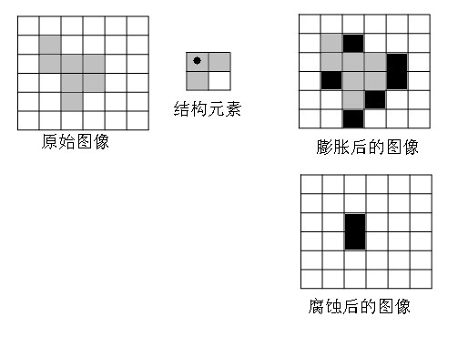

## Page 7

1. 计算所给图中的连通域个数？（分别用4 连接求8 连接求）（5） 
解：4 连接意义下有6 个连通域；8 连接意义下有2 个连通域。 
2. 用模板
，对所给图像进行一阶微分锐化。（水平方向）（10） 














1
2
1
0
0
0
1
2
1
H
 
1 
2 
3 
2 
1 
2 
1 
2 
6 
2 
3 
0 
8 
7 
6 
1 
2 
7 
8 
6 
2 
3 
2 
6 
9 
0
0
0 
0 
0 
0
-3
-13
-20
0 
0
-6
-13
-13
0 
0
1
12
5 
0 
0
0
0 
0 
0 
 
解：（1）边缘取0   
（2）其他行、列均做如下处理 
以第二行第二列的1 为例，其经锐化后得： 
3
)1
(
8
)
2
(
0
)1
(
3
0
2
0
1
0
2
1
3
2
2
1
1






















 
3. 假定有64X64 大小的图像，灰度为8 级，概率分布如下表，试用直方图均衡化方法处理之并画出处
理前后的直方图。  （20） 
 
kr  
kn  
P  
0
0 
r
 
790 
0.19 
7
1
1 
r
 
1023 
0.25 
7
2
2 
r
 
850 
0.21 
7
3
3 
r
 
656 
0.16 
7
4
4 
r
 
329 
0.08 
7
5
5 
r
 
245 
0.06 
7
6
6 
r
 
122 
0.03

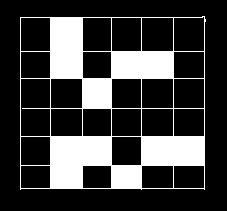

## Page 8

1
1 
r
 
81 
0.02 
 
解：（1）计算各灰度级的
： 
ks
19
.0
)
(
)
(
)
(
0
0
0
0
0






r
P
r
P
r
T
s
r
j
j
r
 
44
.0
25
.0
19
.0
)
(
)
(
)
(
)
(
1
0
1
0
1
1









r
P
r
P
r
P
r
T
s
r
r
j
j
r
 
依次计算可得：
、
、
65
.0
2 
s
81
.0
3 
s
89
.0
4 
s
、
95
.0
5 
s
、
98
.0
6 
s
、
。 
1
7 
s
（2）对
进行舍入处理，由于原图像的灰度级只有8 级，因此上述各
需以1/7 为量化单位进行舍入
运算，得到如下结果： 
ks
ks
7
1
0

舍入
s
、
7
3
1

舍入
s
、
7
5
2

舍入
s
、
7
6
3

舍入
s
、
7
6
4

舍入
s
 
1
5

舍入
s
、
、
1
6

舍入
s
1
7

舍入
s
 
（3）
的最终确定，由
舍入结果可见，均衡化后的灰度级仅有5 个级别，分别是： 
ks
ks
7
1
0 
s
、
7
3
1 
s
、
7
5
2 
s
、
7
6
3 
s
、
 
1
4 
s
（4）计算对应每个
的像元数目，因为
ks
0
0 
r
映射到
7
1
0 
s
，所以有790 个像元取
这个灰度级；同
样
0s
7
1
1 
r
映射到
7
3

1s
，所以有1023 个像元取
这个灰度级；同理有850 个像元取值
1s
7
5
2 
s
；又因
为
和
都映射到
3r
4r
7
6
3 
s
，所以有656+329=985 个像元取此灰度值；同样有245+122+81=448 个像元取
的灰度值。结果见表1。 
1
4s 
    均衡化后直方图如图（b）。 
 
表1  图像的灰度级分布表 
原始直方图数据 
均衡化后的直方图数据 
kr  
kn  
P  
ks  
kn  
P  
0
0 
r
 
790 
0.19 
0 
0 
0.00 
7
1
1 
r
 
1023 
0.25 
7
1
0 
s
 
790 
0.19 
7
2
2 
r
 
850 
0.21 
0 
0 
0.00 
7
3
3 
r
 
656 
0.16 
7
3
1 
s
 
1023 
0.25 
7
4
4 
r
 
329 
0.08 
0 
0 
0.00

## Page 9

7
5
5 
r
 
245 
0.06 
7
5
2 
s
 
850 
0.21 
7
6
6 
r
 
122 
0.03 
7
6
3 
s
 
985 
0.24 
1
1 
r
 
81 
0.02 
1
4 
s
 
448 
0.11 
 
 
（a）原始图像                         （b）均衡化的图像 
 
4. 设有一信源
，对应概率


6
5
4
3
2
1
,
,
,
,
,
x
x
x
x
x
x
X 

08
.0
,
09
.0,
11
.0,
12
.0,
20
.0,
40
.0

P
。进行霍夫曼编码(要
求大概率的赋码字0，小概率的赋码字1)，给出码字，平均码长，编码效率。 
解：（1）所得码字： 
（2）平均码长： 
37
.2
08
.0
4
09
.0
4
11
.0
3
12
.0
3
20
.0
3
40
.0
1
(
6
1















i
i
i
w
P
R

 
（3）编码效率：

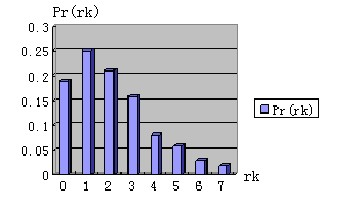

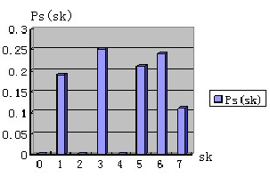

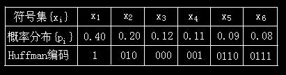

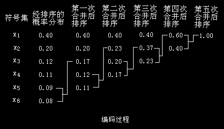

## Page 10

275
.2
08
.0
log
08
.0
09
.0
log
09
.0
11
.0
log
11
.0
12
.0
log
12
.0
20
.0
log
20
.0
40
.0
log
40
.0
(
log
2
2
2
2
2
2
6
1
2

















i
i
i
P
P
H
%
96
37
.2
275
.2


R
H

 
 
 
 
 
2、对下列信源符号进行Huffman 编码，并计算其冗余度和压缩率。（15 分） 
符号 a1 
a2 
a3 
a4 
a5 
a6 
概率 0.1 0.4 0.06 0.1 0.04 0.3 
解：霍夫曼编码： 
原始信源                        信源简化 
符号      概率           1        2          3          4 
     a2        0.4           0.4       0.4        0.4         0.6
     a6        0.3           0.3       0.3        0.3         0.4
     a1        0.1           0.1       0.2        0.3        
     a4        0.1           0.1       0.1       
     a3        0.06          0.1 
     a5        0.04                 
霍夫曼化简后的信源编码： 
从最小的信源开始一直到原始的信源 
 
编码的平均长度： 
 
(0.4)(1)
(0.3)(2)
(0.1) 3
(0.1)(4)
(0.06)(5)
(0.04)(5)
2.2
/
avg 






（）
符号
 L
bit
 
1
3
1.364
2.2
R
avg
n
C
L



压缩率： 
 
1
1
1
1
0.2669
1.364
D
R
R
C



冗余度： 
 
 
4.已知一图像为
，现用模板
对其进行卷积操作，求输出图像（输
出图像尺寸与原图像一致即可）。 











8
2
9
1
8
5
3
7
2
)
,
(
y
x
f















0
1
0
1
4
1
0
1
0
)
,
(
y
x
h

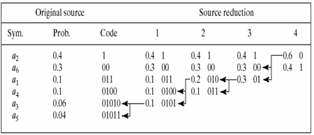

## Page 11

解：结果：
。中间过程：先补上一圈的0：
，然后和模板
作卷积，例如y 中的-4 是这样得到的：
.
=-4(即对应元
素相乘相加)，其他的数同理。 











29
17
29
15
17
1
y








0
1
0
1
4
1
0
1
0


4
15
4
















0
0
0
0
0
0
8
2
9
0
0
1
8
5
0
0
3
7
2
0
0
0
0
0
0





8
5
0
7
2
0
0
0
0








0
4
1
0







)
,
(
y
x
h











0
1
1
0
1
1、如图为一幅16 级灰度的图像。请写出均值滤波和中值滤波的3x3 滤波器；说明这两种滤波器各自的
特点；并写出两种滤波器对下图的滤波结果（只处理灰色区域，不处理边界）。（15 分） 
 
题5 图 
答：均值滤波：
（2 分） 
    中值滤波：
（2 分） 
    均值滤波可以去除突然变化的点噪声，从而滤除一定的噪声，但其代价是图像有一定程度的模糊；中
值滤波容易去除孤立的点、线噪声，同时保持图像的边缘。（5 分） 
    均值滤波：
（3 分） 
       中值滤波：
（3 分）
2. 设有编码输入
X={x1,x2,x3,x4,x5,x6}, 其频率分布分别为
p(x1)=0.4,p(x2)=0.3, p(x3)=0.1,p(x4)=0.1, 
p(x5)=0.06,p(x6)=0.04, 现求其最佳霍夫曼编码。 
3 对数字图像f(i,j)(图象1)进行以下处理，要求： 
1) 计算图像f(i,j)的信息量。（10 分） 
2) 按下式进行二值化，计算二值化图象的欧拉数。  
0  1 
3 
2 
1 
3
2 
1 
0 
5 
7 
6 
2 
5
7 
6 
1 
6 
0 
6 
1 
6
3 
1 
2 
6 
7 
5 
3 
5
6 
5 
3 
2 
2 
7 
2 
6
1 
6 
2 
6 
5 
0 
2 
3
5 
2 
1 
2 
3 
2 
1 
2
4 
2 
3 
1 
2 
3 
1 
2
0 
1

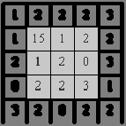

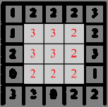

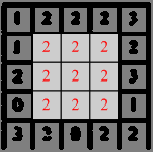

## Page 12

解：1)统计图象1 各灰度级出现的频率结果为 
p(0)=5/640.078； p(1)=12/640.188;   p(2)=16/64=0.25;     p(3)=9/640.141 
p(4)=1/640.016;   P(5)=7/640.109;    p(6)=10/640.156;    p(7)=4/640.063 
信息量为 




7
0
2
)
(
log
)
(
i
i
P
i
P
H
                    2.75(bit) 
  2）对于二值化图象， 
  若采用4-连接，则连接成分数为4，孔数为1，欧拉数为4-1=3；    
  若采用8-连接，则连接成分数为2，孔数为2，欧拉数为2-2=0； 
1 给出一维连续图像函数傅里叶变换的定义，并描述空间频率的概念。 
解：1）一维连续图像函数
的傅立叶变换定义为： 
       
 
2）空间频率是指单位长度内亮度作周期变化的次数，对于傅立叶变换基函数
， 
考虑
的最大值直线在坐标轴上的截距为
，则
表示空间周期，
即为空间频率。 
2、试给出把灰度范围（0，10）拉伸为（0，15），把灰度范围（10，20）移到（15，25），并把灰度范围（20，30）压
缩为（25，30）的变换方程。 
解：如图所示，由公式 























f
f
g
M
y)
f(x,
b
d
]
b
)
y
,x
(
f
)][
b
M
/(
)
d
M
[
b
y)
f(x,
a
c
]
a
)
y
,x
(
f
)][
a
b
/(
)c
d
[(
)
,
(
0
)
y
,x
(
f)
a
/
c(
)
y
,x
(
g
a
y
x
f
 
 

















25
]
20
)
,
(
[
20
30
25
30
15
]
10
)
,
(
[
10
20
15
25
)
,
(
10
15
)
,
(
y
x
f
y
x
f
y
x
f
y
x
g
 
化简得：

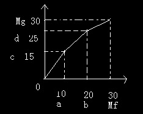

## Page 13













25
]
20
)
,
(
[
2
1
15
]
10
)
,
(
[
)
,
(
2
3
)
,
(
y
x
f
y
x
f
y
x
f
y
x
g
 
3、给定一幅图像的灰度级概率密度函数为： 
   Pr(r)={ 
-2r+2  0≦r≦1 
       0 其他   要求其直方图均匀化，计算出变换函数T(r)。 
解：由公式
 
dr
)r(
P
)r(
T
s
r
0
r



得其变换函数T（r）为
 










r
0
2
r
0
r
2r
r
dr
)
2
2r
(
dr
)r(
P
)r(
T
s
5、 计算存储一幅800×600 的24 位彩色图象所需的字节数。 （10 分） 
答：800*600 = 480000 像素 
480000*24 = 11520000 bit 
11520000/8 = 1440000 字节(Byte) 
 
 
2. 已知某信源发出的8 个信息，其信源概率分布式不均匀的，分别为{0.1，0.18，0.4，0.05，0.06，0.1，
0.07，0.04}，请对信源进行霍夫曼编码，并求出三个参数：平均码长、熵及编码效率。 
平均码长为：R=1×0.4+3×（0.18+0.10）+4×（0.10+0.06+0.07）+5×（0.05+0.04）=2.61 
熵为：H=2.55 
编码效率为：2.55/2.61=97.8% 
 
 
图5.2.1 哈夫曼编码过程

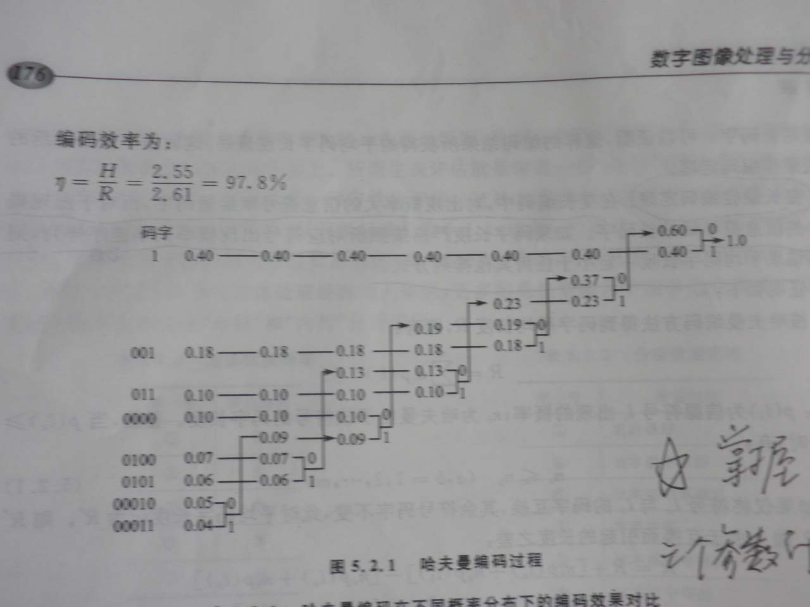

## Page 14

1.在MATLAB 环境中，实现一幅图像的傅立叶变换。 
解：MATLAB 程序如下： 
A=break('rice.tif'); 
imshow(A); 
A2=fft(A); 
A2=fftshift(A2); 
Figure,imshow(log(abs(A2)+1),[0,10]);
