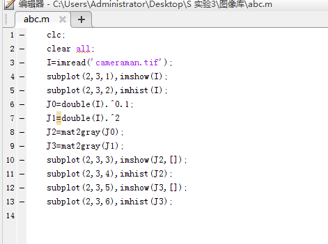
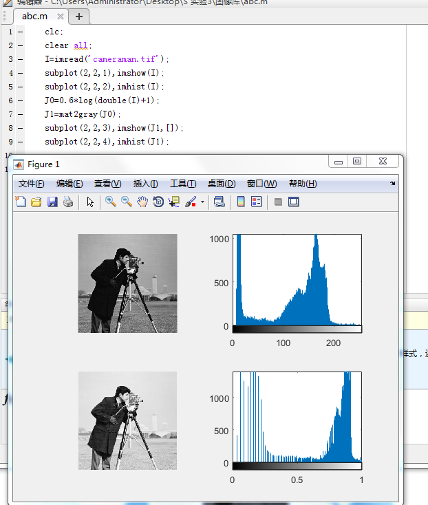
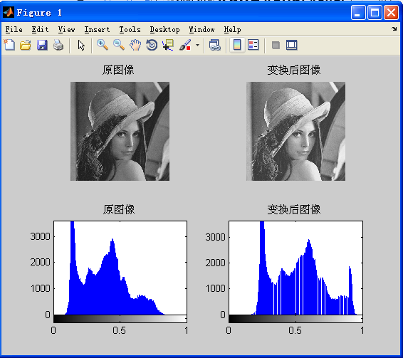
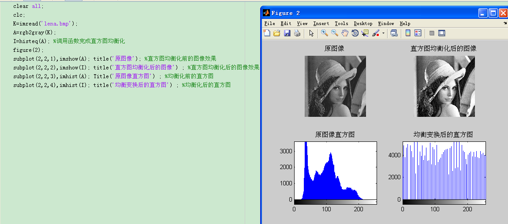
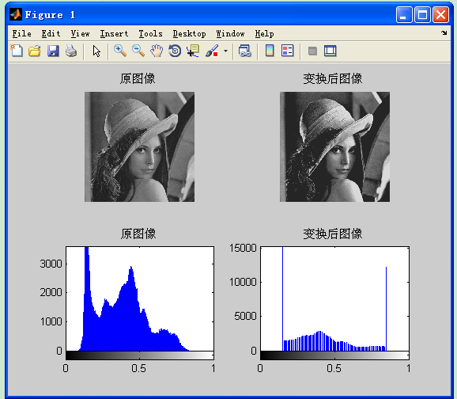
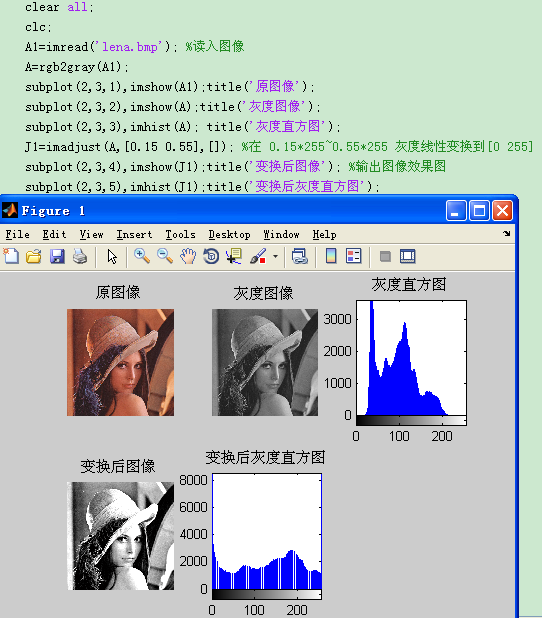
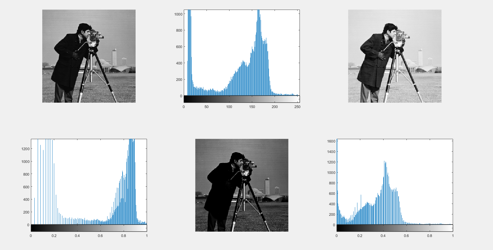

# 答案 实验三图像增强1

实验三 图像增强(点运算增强)

实验目的

1、掌握直方图点运算增强图像的基本原理；

2、利用MATLAB程序对图像进行点运算增强。

实验原理

图像增强是指按特定的需要突出一幅图像中的某些信息，同时，消弱或去除某些不需要的信息的处理方法。其主要目的是处理后的图像对某些特定的应用比原来的图像更加有效。图像增强技术主要有直方图修改处理、图像平滑化处理、图像尖锐化处理和彩色处理技术等。本实验以直方图均衡化增强图像对比度的方法为主要内容，其他方法同学们可以在课后自行联系。

直方图是多种空间城处理技术的基础。直方图操作能有效地用于图像增强。除了提供有用的图像统计资料外，直方图固有的信息在其他图像处理应用中也是非常有用的，如图像压缩与分割。直方图在软件中易于计算，也适用于商用硬件设备，因此，它们成为了实时图像处理的一个流行工具。

直方图是图像的最基本的统计特征，它反映的是图像的灰度值的分布情况。直方图均衡化的目的是使图像在整个灰度值动态变化范围内的分布均匀化，改善图像的亮度分布状态，增强图像的视觉效果。灰度直方图是图像预处理中涉及最广泛的基本概念之一。

图像的直方图事实上就是图像的亮度分布的概率密度函数，是一幅图像的所有象素集合的最基本的统计规律。直方图反映了图像的明暗分布规律，可以通过图像变换进行直方图调整，获得较好的视觉效果。

直方图均衡化是通过灰度变换将一幅图像转换为另一幅具有均衡直方图，即在每个灰度级上都具有相同的象素点数的过程。

表3-1 图像处理工具箱中的点运算增强函数

实验内容

1、灰度线性变换增强图像对比度的MATLAB程序和结果：

（要求：1、输出原图和原图直方图 2、要求输出线性变换后的图像和变换后的直方图）

实验程序：

实验结果和线性变换的特点：

图像灰度经过线性拉伸后，图像变亮了。

2、灰度分段线性变换增强图像对比度的MATLAB程序和结果：

（要求：1、输出原图和原图直方图 2、要求输出分段线性变换后的图像和变换后的直方图）

提示：[M N]=size(I);

I=im2double(J)

Z=zeros(M,N);

for i=1:M

for j=1:N

if

实验程序：

实验结果和分段线性变换的特点：

clear all;

clc;

X=imread('lena.bmp');

I=rgb2gray(X);

subplot(2,2,1);

imshow(I);%显示原图像

title('原图像');

%分段线性变换

[M,N]=size(I);

I=im2double(I);

out=zeros(M,N);

X1=0.3;Y1=0.15;x1=0.1;y1=0.2;

X2=0.7;Y2=0.85;x2=0.7;y2=0.9;

% 方法1

% for i=1:M

%     for j=1:N

%         if I(i,j)<X1

%             out(i,j)=Y1;

%         elseif I(i,j)>X2

%             out(i,j)=Y2;

%         else

%             out(i,j)=(I(i,j)-X1)*(Y2-Y1)/(X2-X1)+Y1;

%         end

%     end

% end

% 方法2

for i=1:M

for j=1:N

if I(i,j)<x1

out(i,j)=y1*(I(i,j))/x1;

elseif I(i,j)>x2

out(i,j)=y2+(1-y2)*(I(i,j)-x2)/(1-x2);

else

out(i,j)=(I(i,j)-x1)*(y2-y1)/(x2-x1)+y1;

end

end

end

subplot(2,2,2);

imshow(out);

title('变换后图像')

%绘制直方图

subplot(2,2,3);

imhist(I);

title('原图像');

subplot(2,2,4);

imhist(out);

title('变换后图像')

灰度非线性变换增强图像对比度的MATLAB程序和结果：

（要求：1、输出原图和原图直方图 2、要求输出非线性变换后的图像和变换后的直方图）

1） 图像的对数运算J=0.6* log(1+double(I));

实验程序：

实验结果和对数变换的特点：

2)  图像的幂次变换 J= double(I).^0.1;

实验程序：

实验结果和幂次变换的特点：

4直方图均衡化增强图像对比度的MATLAB程序和结果：

（要求：1、输出原图和原图直方图 2、要求输出均衡化后的图像和变换后的直方图）

实验程序：

实验结果和均衡化变换的特点：

思考题

直方图是什么概念？它反映了图像的什么信息？

直方图是一种概率密度统计函数，直方图表示图像中不同灰度级像素出现的相对频率。

直方图均衡化是什么意思？它的主要用途是什么？

直方图均衡化是通过对原图像进行变换后，使得图像的直方图变为均匀分布的的直方图，从而达到增强图像对比度的效果。

| 函数名 | 功能描述 |
| --- | --- |
| imhist() | 获取图像直方图 |
| imadjust() | 对图像直方图进行线性变换 |
| double( ) | 将图像灰度矩阵数据转换为double 型 |
| im2double() | 将图像灰度矩阵转换为double型并归一化 |
| log() | 对图像矩阵数据进行对数运算（先将矩阵数据转化为double 类型） |
| .^ | 对图像矩阵数据进行幂次运算（先将矩阵数据转化为double 类型） |
| histeq | 图像的直方图均衡化 |
| title(‘’) | 给显示的图片加标题 |
| subplot( , , ) | 将图像窗口划分区间 |
