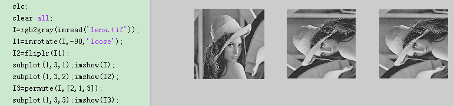
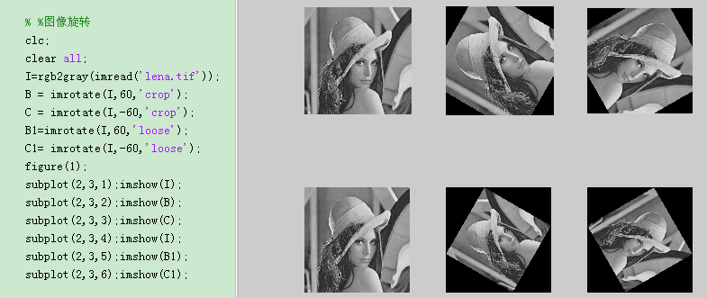
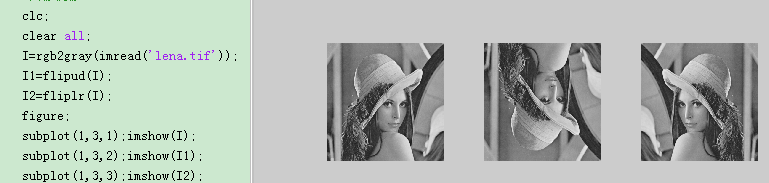
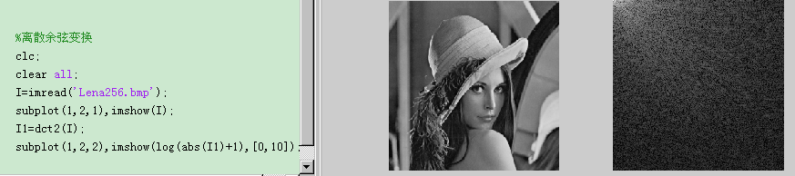
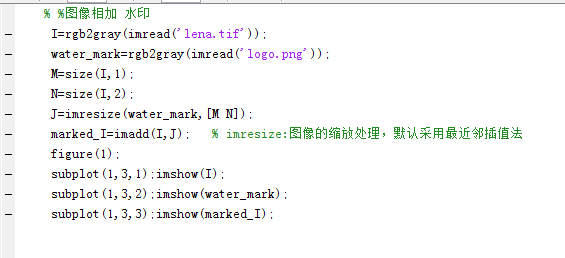
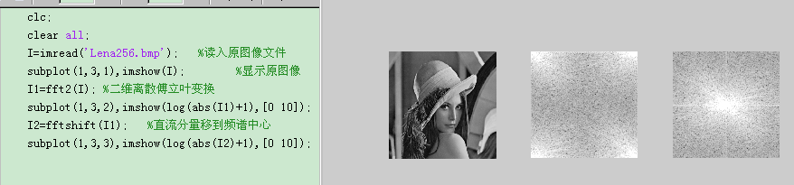

# 答案 实验二 图像基本变换

二 图像基本运算

一、实验目的

1．掌握图像的几何运算在数字图像处理中的初步应用。

2．掌握正交变换处理图像的过程和处理前后图像的变化。

二、实验原理

表2-1 图像处理工具箱中的图像变换运算函数

三、实验步骤

1、图像的几何变换(包括变换前的图像和变换后的图像，及对结果的分析)

图像的缩放：

①代码和实验结果图像：

②变换后的图像特点：

图像的水平镜像： fliplr(I);

①代码和实验结果图像：

②变换后的图像特点：

图像的垂直镜像： flipud(I);

①代码和实验结果图像：

②变换后的图像特点：

图像的旋转变换： imrotate(I,60);imrotate(I,-60);

①代码和实验结果图像：

②变换后的图像特点：

图像的转置变换： fliplr(imrotate(I,-90)) 或者permute(I,[2,1,3])

①代码和实验结果图像：

②变换后的图像特点：

2、图像的正交变换(包括变换前的图像和变换后的图像，及对结果的分析)

图像的离散傅里叶变换：

①代码和实验结果图像：

②变换后的图像特点：

图像的离散余弦变换:

①代码和实验结果图像：

②变换后的图像特点：

四、实验报告要求

用数据和图片给出实验（几何变换和正交变换）中取得的实验结果和源代码 ，并进行必要的讨论；必须包括原始图像及其计算处理后的图像以及相应的解释。

| 函数名 | 功能描述 |
| --- | --- |
| imresize(I,2) | 图像尺寸的缩放 |
| fliplr(),flipud | 图像水平镜像、垂直镜像 |
| imrotate() | 图像旋转 |
| permute(I,[2,1,3]) 或者使用旋转和镜像实现 | 图像转置 |
| fft2(),fftshift() | 图像的离散傅里叶变换，图像频谱中心化 |
| dct2() | 图像的离散余弦变换 |
