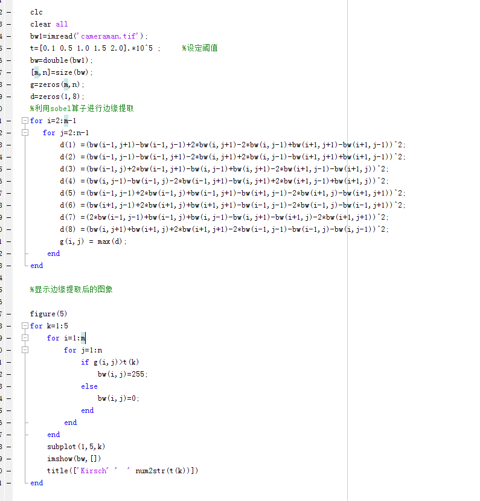
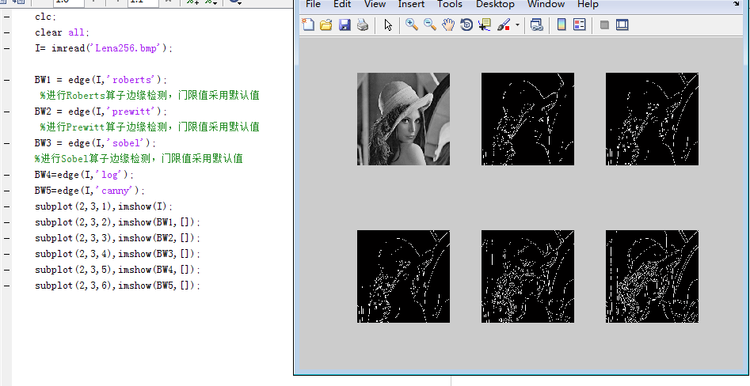
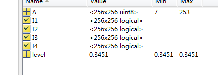
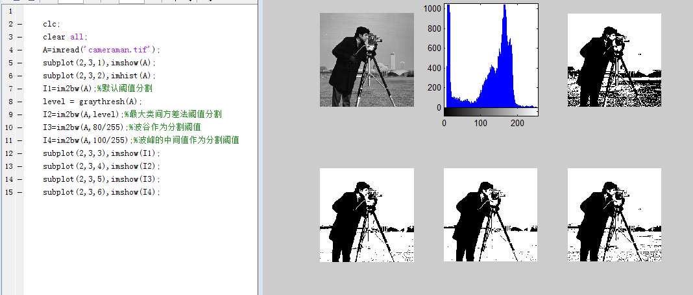
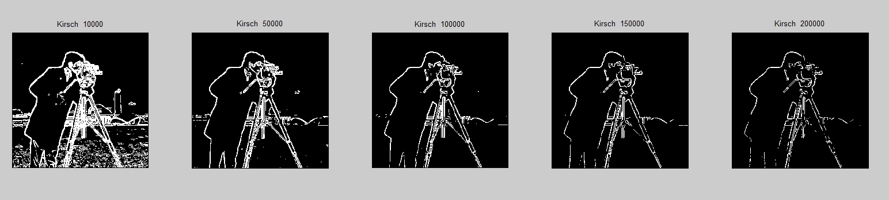

# 答案 实验五 图像分割

实验五 图像分割

一、　实验目的

1了解图像分割重要任务；

2熟悉图像分割的流程；

3掌握图像阈值分割方法和边缘检测；

4通过本实验掌握利用MATLAB编程实现数字图像的图像分割。

实验原理

图像处理的重要任务就是对图像中的对象进行分析和理解。图像分析主要包括以下几部分内容：（1）把图像分割成不同的区域，或把不同的目标分开（分割）。即把图像分成互不重叠的区域并提取出感兴趣目标。（2）找出各个区域的特征（特征提取）。（3）识别图像中的内容，或对图像进行分类（识别与分类）。（4）给出结论（描述、分类或其他的结论）。

1、阈值分割

若图像中目标和背景具有不同的灰度集合，且两个灰度集合可用一个灰度级阈值T进行分割。这样就可以用阈值分割灰度级的方法在图像中分割出目标区域与背景区域。

设图像为 f (x,y),其灰度集范围是[0,L]，在0和L之间选择一个合适的灰度阈值T。

这样得到的是一幅二值图像。

边缘检测

用差分、梯度、拉普拉斯算子及各种高通滤波处理方法对图像边缘进行增强，只要再进行一次门限化的处理，便可以将边缘增强的方法用于边缘检测。本实验主要用梯度算子进行边缘检测。

梯度对应于一阶导数，相应的梯度算子就对应于一阶导数算子。对于一个连续函数f (x,y)，其在(x,y)处的梯度:

常采用小型模板，然后利用卷积运算来近似，Gx和Gy各自使用一个模板。

1） Roberts算子

2.）Prewitt算子

3.）Sobel算子

表5-1 图像处理工具箱中的点运算增强函数

实验步骤

1打开计算机，安装和启动MATLAB程序；程序组中“work”文件夹中应有待处理的图像文件；

2利用MatLab工具箱中的函数编制图像复原的函数;

3   a)调入、显示“实验一”获得的图像；图像存储格式应为“.gif”;

b)对图像阈值分割;

c) 边缘检测。

4记录和整理实验报告。

实验仪器

1计算机；

2 MATLAB程序；

3移动式存储器（移动硬盘、U盘等）。

4记录用的笔、纸。

实验程序

①图像阈值分割MATLAB程序

试验要求：

显示的图片添加标题

采用不同分割阈值得到的分割图像显示在一张图上。进行对比分析不同阈值的图像分割效果，得出分析结论。

程序和结论：

②边缘检测MATLAB程序

实验要求：

1、显示的图片添加标题

2、采用不同分割算子得到的分割图像显示在一张图上，进行对比分析，得出分析结论

程序和结论：

③ 8方向sobel算子边缘检测

提示：对一个像素点要计算8个方向的梯度，然后取最大的梯度值作为这一点的最终梯度值；然后遍历整幅图像每个像素点都进行上述计算。对得到的最终幅值进行一次阈值分割二值化即可得到检测的边缘。

程序和结论：

实验结果

思考题

1、阈值分割分为几种？有何区别？

2、边缘检测依据的原理是什么？边缘检测有哪几种检测算子？不同边缘检测算子的特

点是什么？

| 函数名 | 功能描述 |
| --- | --- |
| im2bw() | 将图像转化成二值图像，分割阈值为默认阈值 |
| graythresh() | 获取最大类间方差法分割阈值 |
| im2bw(I,level) | 将图像转化为二值图像，分割阈值为level |
| edge(I,’ ’) | 对图像进行边缘检测，方法包括：roberts,sobel,prewitt,log,canny |
| zeros(m,n) | 构造m,n大小的零矩阵 |
| Zeros(1,8) | 构造一个1行8列的向量 |
| title(‘’) | 给显示的图片加标题 |
| subplot( , , ) | 将图像窗口划分区间 |
