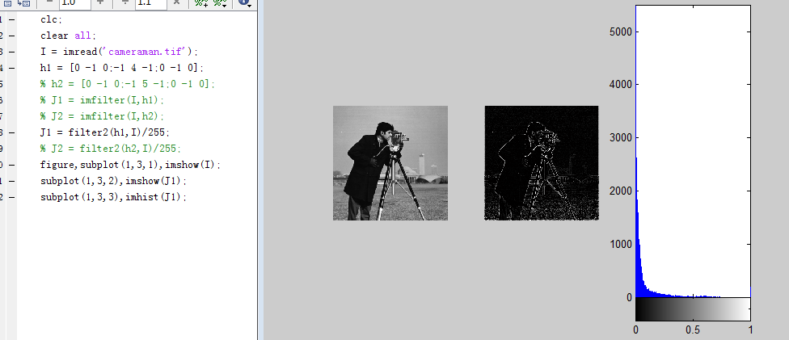
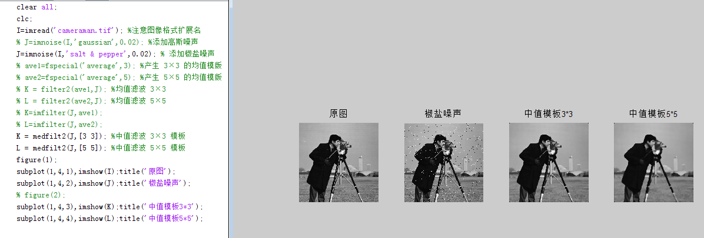
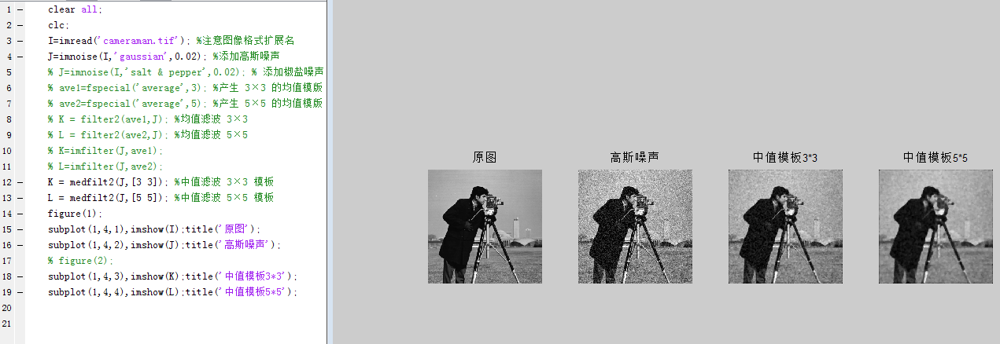
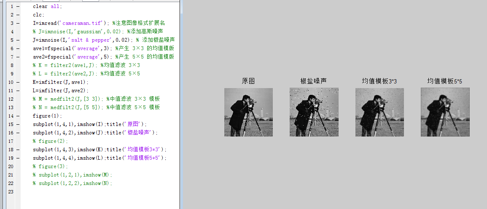
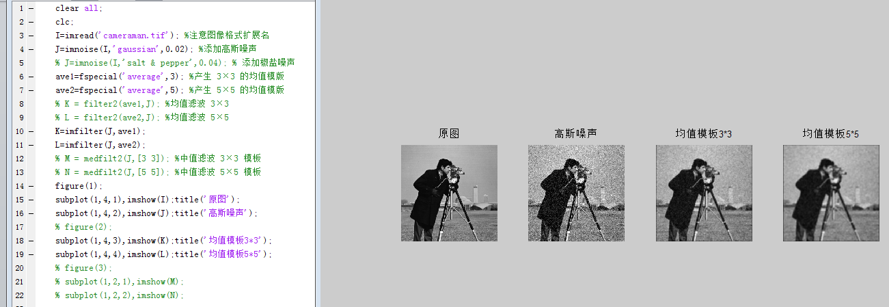
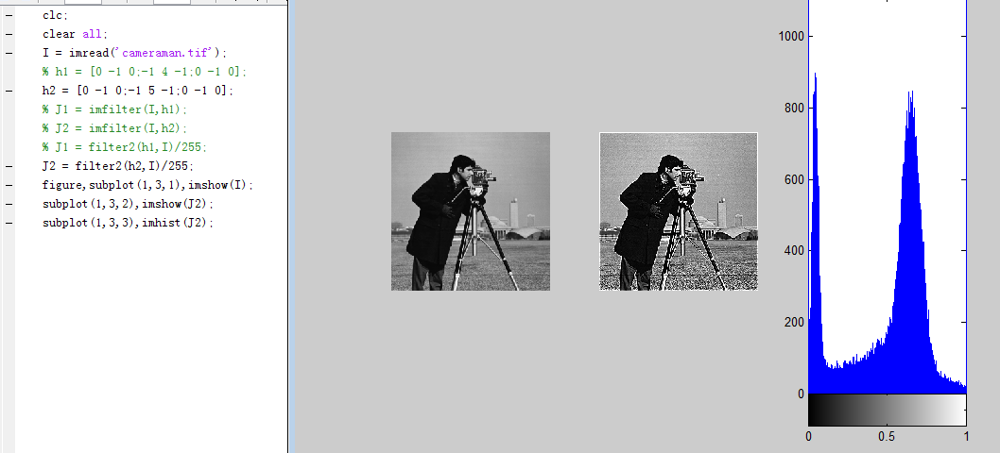

# 答案 实验四 图像增强

实验四 图像增强—空域滤波

一、实验目的

进一步了解MatLab软件/语言，学会使用MatLab对图像作滤波处理，使学生有机会掌握滤波算法，体会滤波效果。

了解几种不同滤波方式的使用和使用的场合，培养处理实际图像的能力，并为课堂教学提供配套的实践机会。

二、实验要求

(1)学生应当完成对于给定图像+噪声，使用平均滤波器、中值滤波器对不同强度的高斯噪声和椒盐噪声，进行滤波处理；能够正确地评价处理的结果；能够从理论上作出合理的解释。

(2)利用MATLAB软件实现空域滤波的程序：

J = imnoise(I,'gaussian',0.02);           %添加高斯噪声

J = imnoise(I,'salt & pepper',0.02);        %添加椒盐噪声

ave1=fspecial('average',3);              %产生3×3的均值模版

ave2=fspecial('average',5);              %产生5×5的均值模版

K = filter2(ave1,J)/255;

//K=imfilter(J,ave1) ;              %均值滤波3×3

L = filter2(ave2,J)/255;                 %均值滤波5×5

M = medfilt2(J,[3 3]);                  %中值滤波3×3模板

N = medfilt2(J,[5 5]);                  %中值滤波5×5模板

三、实验设备与软件

(1) IBM-PC计算机系统

(2) MatLab软件/语言包括图像处理工具箱(Image Processing Toolbox)

(3) 实验所需要的图片

四、实验内容与步骤

（1）采用邻域平均的方法去除图像的高斯噪声

（要求：①使用3*3大小和5*5大小的均值模板；

②显示原始图像/添加噪声的图像/ 去除噪声的图像）

（2）采用邻域平均的方法去除图像的椒盐噪声

（要求：①使用3*3大小和5*5大小的均值模板；

②显示原始图像/添加噪声的图像/ 去除噪声的图像）

采用中值滤波的方法去除图像的高斯噪声

（要求：①使用3*3大小和5*5大小的中值滤波模板；

②显示原始图像/添加噪声的图像/ 去除噪声的图像）

采用中值滤波的方法去除图像的椒盐噪声

（要求：①使用3*3大小和5*5大小的中值滤波模板；

②显示原始图像/添加噪声的图像/ 去除噪声的图像）

采用拉普拉斯算子提取图像边缘

（提示：①构造拉普拉斯算子模板；

②用模板与原图像卷积提取边缘）

采用拉普拉斯增强算子对图像进行锐化

（提示：①构造拉普拉斯算子模板；

②用模板与原图像卷积提取边缘）

五、思考题/问答题

(1) 简述高斯噪声和椒盐噪声的特点。

(2) 结合实验内容，定性评价平均滤波器/中值滤波器对高斯噪声和椒盐噪声的去噪效果？

(3) 结合实验内容，定性评价滤波窗口对去噪效果的影响？

(4) 结合实验内容，评价拉普拉斯算子与拉普拉斯增强算子的区别。

六、实验报告要求

描述实验的基本步骤，用数据和图片给出各个步骤中取得的实验结果，并进行必要的讨论，必须包括原始图像及其计算/处理后的图像。
