# 答案实验一 图像的基本处理和代数运算

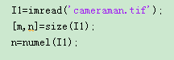

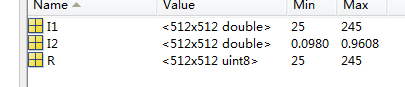

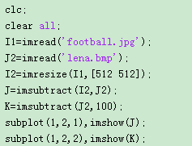

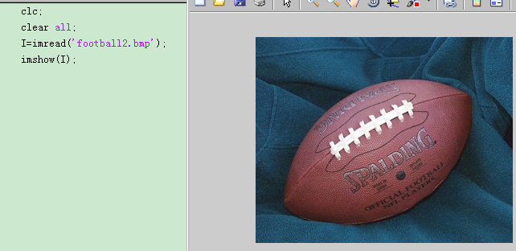

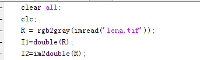

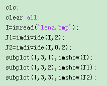

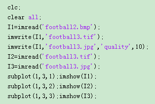

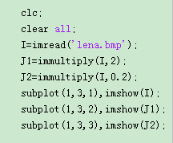

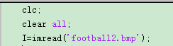

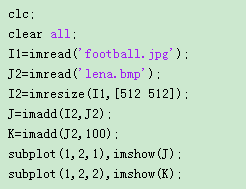

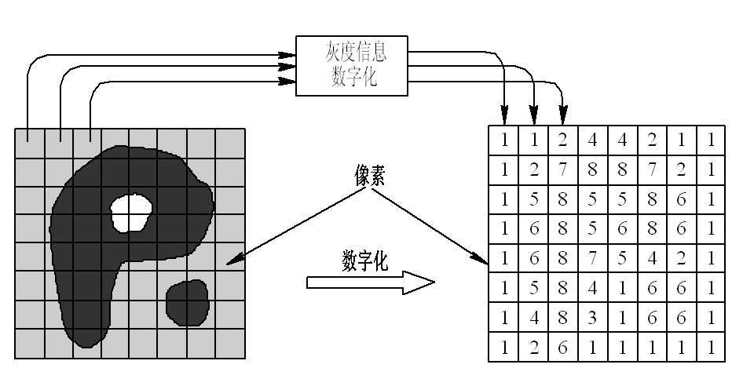

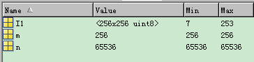

实验一  MATLAB数字图像处理初步

一、实验目的与要求

1．熟悉及掌握在MATLAB中图像的基本处理。

2．熟练及掌握在MATLAB中图像的代数运算。

二、实验原理及知识点

1、数字图像的表示和类别

图1 图像的采样和量化

1、读取：I=imread(‘原图像名.tif’);

2、显示：imshow() ;

3、求尺寸大小：[m, n]=size(I); num=numel(I);

4、图像另存为：

①imwrite(I,'flower.bmp');      % 以BMP的格式存储图像

②imwrite(I,'flower.jpg','quality',30); % 这种格式适用于jpg格式，压缩存储，q是0-100

将图像矩阵转化为double 类型矩阵

J=im2double(I)；

J=double(I);

2、图像的代数运算(加减乘除)

Z = imadd(X，Y);    Y可以是常数

Z = imsubtract(X,Y);  Y可以是常数

Z = immulitply(X,Y);  Y可以是常数

Z = imdivide(X,Y);    Y可以是常数

三、实验内容及步骤

1．利用imread( )函数读取一幅图像，存入一个数组中；

代码和结果：

利用imshow()函数来显示一副图像；

代码和结果：

利用size和numel函数来获取图像文件的宽高等等其他的详细信息；

代码和结果：

利用imwrite()函数来另存这幅图象，①另存为其他格式；②压缩另存

代码和结果：

用im2double() 和double() 将图像的整型灰度矩阵转化为double类型矩阵。

代码和转化结果矩阵特点：

用imadd() 函数完成对两幅图像的相加和对一副图像矩阵加常数，观察效果。

代码和相加后的效果：

用imsubtract() 函数完成对两幅图像的相减和对一副图像矩阵减常数，观察效果。

代码和相减后的效果：

用immulitply()函数完成对一副图像分别乘以大于1的常数或者大于0小于1的常数，观察效果。

代码和相乘后的效果：

用imdivide()函数完成对一副图像分别除以大于1的常数或者大于0小于1的常数，观察效果。

代码和相除后的效果：

四、实验报告要求

描述实验的基本步骤，用数据和图片给出各个步骤中取得的实验结果和源代码，并进行必要的讨论，必须包括原始图像及其计算/处理后的图像。
