# 第01章 绪论

## Slide 1

Digital Image Processing

数字图像处理
Digital Image Processing

## Slide 2

热门研究

Digital Image Processing

与图像处理有关的热门研究方向......

## Slide 3

热门研究

Digital Image Processing

我们接触到/应用过的图像处理技术

萝卜快跑，无人公交等；

手机、相机、摄像头的使用；

医院体检：X-照片、B超、CT；

娱乐：3D电影，VR体验，7D电影等；

图像处理软件：Photoshop，美图秀秀等

## Slide 4

教材及参考书

Digital Image Processing

教材：
《数字图像处理（第4版）》
胡学龙
电子工业出版社，2014

全国电子信息类优秀教材一等奖

## Slide 5

教材及参考书

Digital Image Processing

参考书：

曹茂永       数字图像处理            北京大学出版社
贾永红       数字图像处理            武汉大学出版社
阮秋琦       数字图像处理学          电子工业出版社
杨淑莹       VC++图像处理程序设计    清华大学出版社
章毓晋       图象工程:图象处理和分析 清华大学出版社
容观澳       计算机图象处理          清华大学出版社
冈萨雷斯(美) 数字图像处理(英文版)    电子工业出版社
卡斯特曼(美) 数字图像处理(英文版)    电子工业出版社

## Slide 6

Digital Image Processing

课程目的与要求

目标

- 掌握数字图像处理的基本概念，原理和方法；
初步掌握图像处理的理论与实践，为今后从事图
像处理，视频处理和多媒体信息处理研究及开发
打下基础。

- 理解基本概念，原理和方法
上机实验（Matlab）

要求

## Slide 7

Digital Image Processing

授课方式与考试介绍

授课方式
- 讲授为主
- 实践练习
5次实验作业，撰写实验报告。

成绩
- 平时成绩（40%）
- 考试成绩（60%）

## Slide 8

Digital Image Processing

本领域重要的国际会议

1、ICCV
会议名称（中文）： 国际计算机视觉大会(ICCV)
会议名称（英文）： IEEE International Conference on Computer Vision
2、CVPR
计算机视觉与模式识别会议
IEEE Computer Society Conference on Computer Vision and Pattern Recognition
3、ICIP
国际信息处理会议
IEEE International Conference on Image Processing
4、ACCV
亚洲计算机视觉学术会议
Asian Conference on Computer Vision

## Slide 9

Digital Image Processing

本领域重要的国际会议

5、ICPR
国际模式识别大会
International Conference on Pattern Recognition
6、CIVR
图像与视频检索国际会议
ACM International Conference on Image and Video Retrieval
相关其它国际会议
1、SPIE系列会议
SPIE-国际光学工程学会
SPIE is an international society advancing an interdisciplinary approach to the science and application of light.
2、IEEE系列会议
Institute of Electrical and Electronics Engineers (IEEE)
美国电气和电子工程师协会

## Slide 10

Digital Image Processing

本领域国外重要期刊

IEEE Transactions on Pattern Analysis and Machine Intelligence (PAMI)
IEEE Transactions on Image Processing (IP)
IEEE Transactions on Circuits and Systems for Video Technology (CSVT)
International Journal of Computer Vision (IJCV)
Pattern Recognition (PR)
Image and Vision Computing (IVC)
	…

## Slide 11

Digital Image Processing

本领域主要的国内会议

中国图象图形学会学术年会
中国体视学学会年会
中国模式识别年会

## Slide 12

Digital Image Processing

本领域主要国内期刊

	软件学报
	电子学报
	计算机研究与发展
…

|  |  |  |
| --- | --- | --- |

## Slide 13

Digital Image Processing

相关工具

开发工具
MATLAB
OPENCV
C++ / Python……
应用工具
Photoshop
ACDSee
CorelDraw
……

## Slide 14

Digital Image Processing

课程介绍

内容简介

数字图像处理

第1章 绪论
第2章 图像处理基本知识
第3章 图像变换与二维数字滤波
第4章 图像增强
第5章 图像分割
第6章 图像编码与压缩
第7章 图像复原
第8章 形态学图像处理

分析方法

基础

技术

## Slide 15

第一章 绪论

Digital Image Processing

1.2 数字图像处理的方法

1.1 数字图像处理基本概念

1.3 数字图像处理系统的组成

1.4 数字图像处理的主要应用

## Slide 16

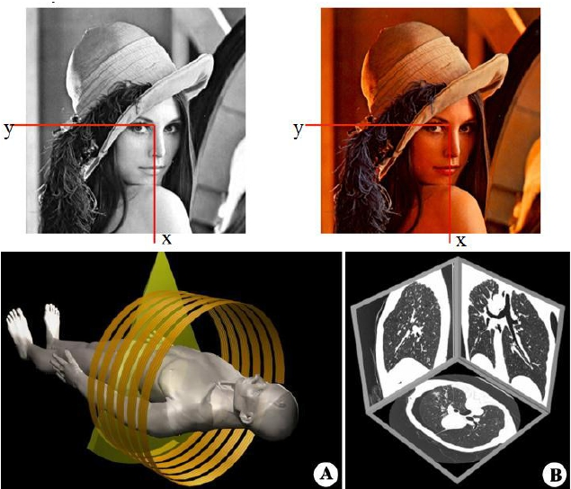

Digital Image Processing

什么是图像？

1.1 数字图像处理基本概念

## Slide 17

Digital Image Processing

1.1.1图像

1.1 数字图像处理基本概念

图: 物体反射光\透射光\发光物体本身发射光（能量）的分布(图像场),是客观存在；

图像:是二维或三维景物呈现在人心目中的影像。图和像的有机结合，既反映物体的客观存在，又体现人的心理因素,是对客观存在的物体的一种相似性的生动模仿或描述,是对物体的一种不完全、不精确，但在某种意义上是适当的表示。

像: 人的视觉系统所接受的图在人脑中所形成的印象或认识,是人的主观感觉；

## Slide 18

Digital Image Processing

1.1 数字图像处理基本概念

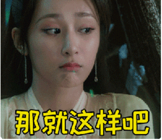

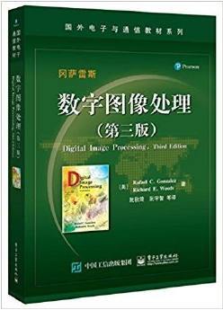

1.1.2 图像分类

静止图像

动态图像

## Slide 19

Digital Image Processing

1.1 数字图像处理基本概念

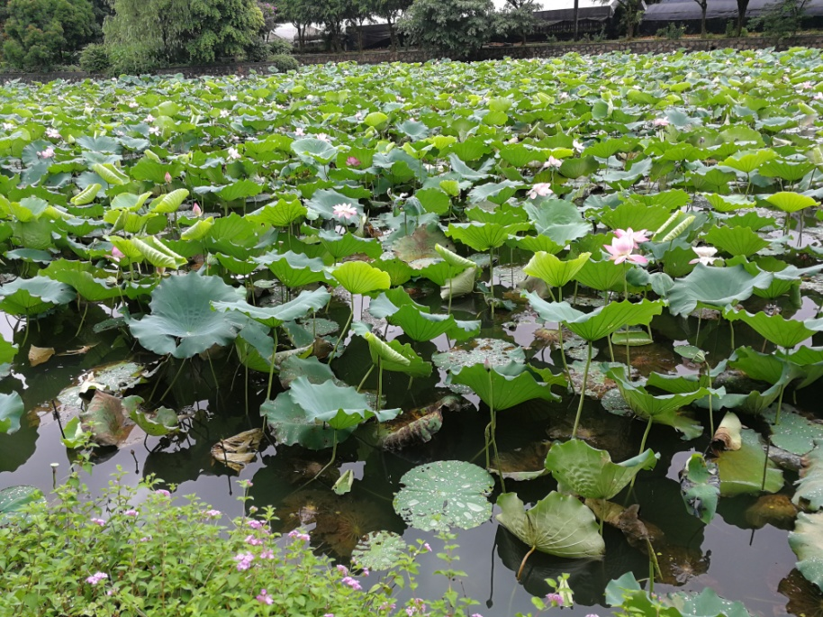

1.1.2 图像分类

彩色图像

灰度图像

## Slide 20

1.1.2 图像分类

1.1 数字图像处理基本概念

根据图像空间坐标和幅度(亮度或色彩)的连续性可分为模拟（连续）图像和数字图像。

模拟图像：空间坐标和幅度都连续变化的图像。
数字图像：空间坐标和幅度均用离散的数字（一般是整数）
表示的图像。

Digital Image Processing

## Slide 21

Digital Image Processing

图像处理（image  processing）就是对图像信息进行加工处
理和分析，以满足人的视觉心理需要和实际应用或某种目的（如
压缩编码或机器识别）的要求。图像处理可分为以下3类：

模拟图像处理（analogue  image  processing）；
数字图像处理（digital  image  processing）；
光电结合处理（optoelectronic  processing）。

模拟图像处理：也称光学图像处理，它是利用光学透镜或光学照
相方法对模拟图像进行的处理，其实时性强、速度快、处理信息
量大、分辨率高，但是处理精度低，灵活度差，难有判断功能。

1.1 数字图像处理基本概念

1.1.3 图像处理

## Slide 22

Digital Image Processing

数字图像处理：即利用计算机对数字图像进行处理，它具有精度
高、处理内容丰富、方法易变、灵活度高等优点。但是它的处
理速度受到计算机和数字器件的限制，一般也是串行处理，因
此处理速度较慢。

光电结合处理：用光学方法完成运算量巨大的处理（如频谱变换
等），而用计算机对光学处理结果（如频谱）进行分析判断等
处理。该方法是前两种方法的有机结合，它集结了二者的优
点。光电结合处理是今后图像处理的发展方向，也是一个值得
关注的研究方向。

1.1 数字图像处理基本概念

## Slide 23

Digital Image Processing

图像的数学表示：一幅图像所包含的信息首先表现为光的强度
（intensity）,即一幅图像可看成是空间各个坐标点上的光强度I
的集合，其普遍数学表达式为：

1.1 数字图像处理基本概念

式中(x,y,z)是空间坐标，  λ  是波长，t是时间，I是光点(x,y,z)的强度（幅度）。 上式表示一幅运动的(t)、彩色/多光谱的(λ )、立体的(x,y,z)图像。

I = f (x，y，z，λ，t）

1.1.4 图像的表示

## Slide 24

Digital Image Processing

1.1.4 图像的表示

1.1 数字图像处理基本概念

1.根据电磁波的波长范围，自然界电磁波有哪些类别。
无线电波波长：10um~30km    红外线波长：760nm-1mm
可见光波长：780nm-380nm    紫外线波长：380nm-10nm
X射线波长： 0.001-2.5A     伽马射线波长：

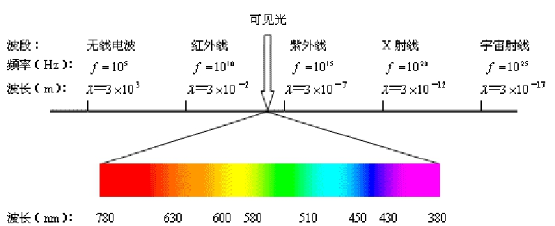

## Slide 25

静止图像，与时间t无关；单色图像（也称灰度图像），
波长λ为一常数；平面图像，则与坐标z无关。
即在每一种情况下，图像的表示可省略掉一维，即

静止图像：  I  =  f（x，y，z,  λ）
灰度图像：  I  =  f（x，y，z，t  ）
平面图像：  I  =  f（x，y,λ,t  ）

而对于平面上的静止灰度图像，其数学表达式可简化为：
I  =  f（x，y）

1.1 数字图像处理基本概念

Digital Image Processing

## Slide 26

1.1 数字图像处理基本概念

Digital Image Processing

1.1.5 数字图像

数字图像是模拟图像的数字化表示。

平面上的静止灰度图像，数字图像数学表达式为：
I  =  f（m，n）

（m,n ）为坐标，整数
I 为光强度（灰度值）

运动图像可用（静止）图像序列表示，彩色图像可分解成三基色图像，三维图像可由二维重建。因此本课程主要针对平面上的静止灰度图像进行讲解论述。

## Slide 27

Digital Image Processing

图像的特点：
（1）空间有界:人的视野有限，一幅图像的大小也有限。
（2）幅度（强度）有限  ：即对于所有的x，y都有
0≤f(x,y)  ≤  Bm
其中Bm为有限值  。

1.1 数字图像处理基本概念

1.1.6 图像特点

## Slide 28

1.2 数字图像处理的方法

Digital Image Processing

1.2.1  数字图像处理的目的

简单来讲，用计算机对图像进行处理就是数字图像处理。
将一幅图像变为另一幅经过加工的图像，就是图像到图像的过程。

概念：

目的：

1）提高图像视觉效果，提供人眼主观满意或较满意的效果。

2）提取目标某些特征，以便于后续分析或识别局部特征。

3）图像压缩，便于存储和传输庞大的图像和视频信息。

## Slide 29

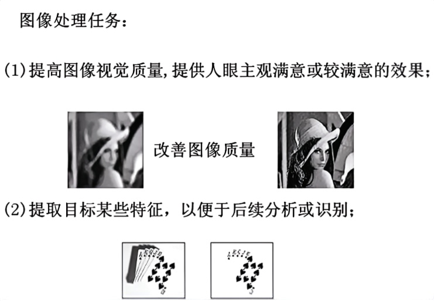

## Slide 30

获取：采用图像扫描仪等将图像数字化。

输出和显示：用可视的方法进行输出和显示。

1.2.2  数字图像处理的基本步骤

1.2 数字图像处理的方法

Digital Image Processing

存储：对获取的数字图像、处理过程中的图像信息以及处
理结果存储在计算机等数字系统中。

处理：即数字图像处理，它是指用数字计算机或数字系统
对数字图像进行的各种处理。

传输：要解决的主要问题是传输信道和数据量的矛盾问题，
一方面要改善传输信道，提高传输效率，另外要对传
输的图像进行压缩编码，以减少描述信息的数据量。

## Slide 31

图像数字化：将模拟图像信号通过数字化设备，转换成数字图像，包括采样和量化。

图像变换：对图像信息进行变换以便于在频域对图像进行
更有效的处理。

图像增强：增强图像中的有用信息，削弱干扰和噪声，提
高图像的清晰度，突出图像中所感兴趣的部分。

图像恢复（复原）：对退化的图像进行处理，使处理后的
图像尽可能地接近原始（清晰）图像。

1.2 数字图像处理的方法

Digital Image Processing

## Slide 32

图像压缩编码：对待处理图像进行压缩编码以减少描
述图像的数据量。

图像分割：根据选定的特征将图像划分成若干个有意义
的部分，这些选定的特征包括图像的边缘、区域等。

图像分析与描述：主要是对已经分割的或正在分割的图
像各部分的属性及各部分之间的关系进行分析表述。

图像识别分类：根据从图像中提取的各目标物的特征，
与目标物固有的特征进行匹配、识别，以作出对各目标物
类属的判别。

1.2 数字图像处理的方法

Digital Image Processing

## Slide 33

Digital Image Processing

一个基本的数字图像处理系统由图像输入、图像存储、
图像处理和分析、图像通信、图像输出五个模块组成。

1.3 数字图像处理系统的组成

图像获取/数字化
1. 数码相机
2. 数码摄像机
3. 扫描仪
4. 红外摄像仪

图像处理算法
实现软件
计算机

计算机内存
磁带，移动硬盘，软盘，光盘...

显示/永久保存
1. 显示器
2. 投影仪
3. 照相机
4. 打印机

传输和通信
图像数据

图像输入

图像存储

处理和分析

图像通信

图像输出

## Slide 34

输入模块：也称图像采集或图像数字化，利用图像采集设备（数码相机、数码摄像机等）来获取数字图像，或通过数字化设备（如图像扫描仪）将要处理的连续图像转换成适于计算机处理的数字图像。

存储模块：用于图像处理和分析的数字图像存储器可分为三类：处理和分析过程中使用的快速存储器；在线或联机存储器；不经常使用的数据库（档案库）存储器。如计算机内存、硬盘、软盘、闪存盘、CD光盘、DVD光盘等。

1.3 数字图像处理系统的组成

Digital Image Processing

## Slide 35

输出模块：在图像分析、识别和理解中，一般需要将处理前后的图像显示出来，或将处理结果永久保存。前者称为软拷贝或显示，使用设备包括CRT显示器、液晶显示器和投影仪等。后者称为硬拷贝，使用设备包括照相机、激光拷贝和打印机等。

通信模块：对图像数据进行传输和通信。由于图像数据量很大，
而能提供通信的信道传输率又有限，因此传输前必须对表示图
像信息的数据进行压缩编码，以减少图像数据量。

1.3 数字图像处理系统的组成

Digital Image Processing

## Slide 36

Digital Image Processing

通用图像处理：适用于功能要求灵活，图像数据量大，但实时性
要求不高的图像处理与分析算法，也可辅之于方便灵活的操作界面。

专用图像处理系统：对于像CT、核磁共振、彩色B超、机场安检
等专用影像处理，可采用能满足实际应用的专用计算机和专用图
像处理算法等，来构成专用图像处理系统。

1.3 数字图像处理系统的组成

图像处理芯片：将许多图像处理功能集成在一个很小的芯片上，
形成专用或通用的图像处理芯片 。

处理与分析模块：一般包括下面三种形式：

## Slide 37

1.4 数字图像处理的应用

Digital Image Processing

1839年－－照相术发明
1865年－－法国巴黎和里昂之间文字传真
1893年－－发明电影
1914年－－首张新闻传真照片出现在媒体

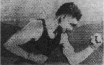

1921年的打印图像

发展简史：

## Slide 38

1.4 数字图像处理的应用

Digital Image Processing

1925年－－发明电视
1960年－－NTSC彩色电视开播
1964年－－航天探测器徘徊者7号发回地面几千张月球表面照片（美国喷气推进实验室JPL）。由计算机成功绘制月球表面地图。

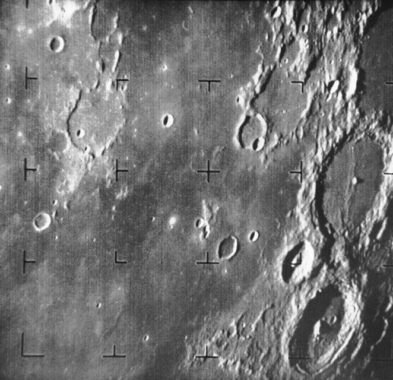

1964年美国航天器发回的第一张月球照片

发展简史：

## Slide 39

1.4 数字图像处理的应用

Digital Image Processing

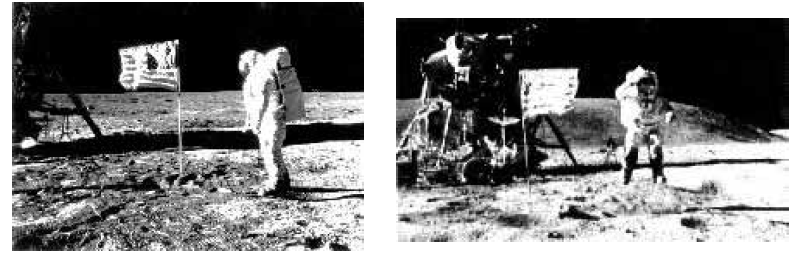

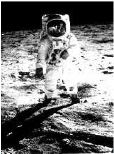

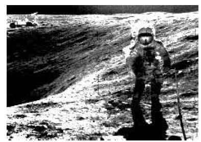

1969年7月开启了人类
探索月球的
新篇章

发展简史：

## Slide 40

1.4 数字图像处理的应用

Digital Image Processing

1972年－－发明了X射线断层摄像装置，简称CT，用于头颅诊断。
1975年－－研制出用于全身的CT装置，1979年该无损诊断技术获 得诺贝尔奖。

CT图像

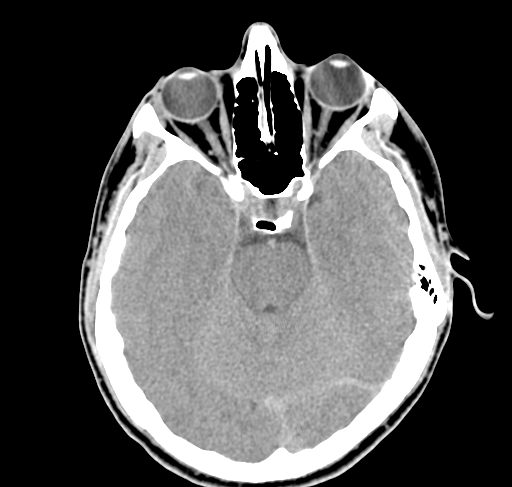

发展简史：

## Slide 41

1.4 数字图像处理的应用

Digital Image Processing

1980年－－CCITT(国际电报电话咨询委员会 )制定了三类传真机和公用电话网传输静止图像的国际标准。
1984年－－CCITT提出的第一个实用化的、适用于会议电视和可视电话要求的视频压缩编码国际标准，用于在ISDN网络上传输实际活动图像。
之后，数字图像处理应用得到迅速发展，图像成为人们生活不可或确的重要组成部分。CCD，数码相机，…… 。

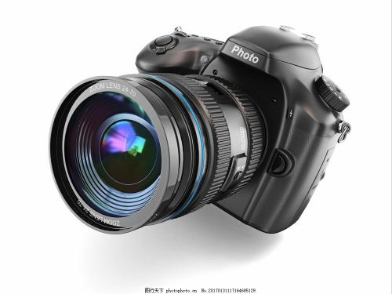

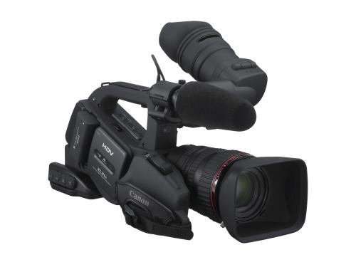

发展简史：

## Slide 42

1.4 数字图像处理的应用

Digital Image Processing

电子显微镜的发明提供了观察微观世界的手段。

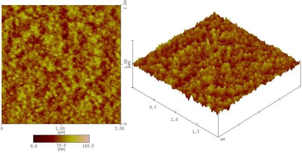

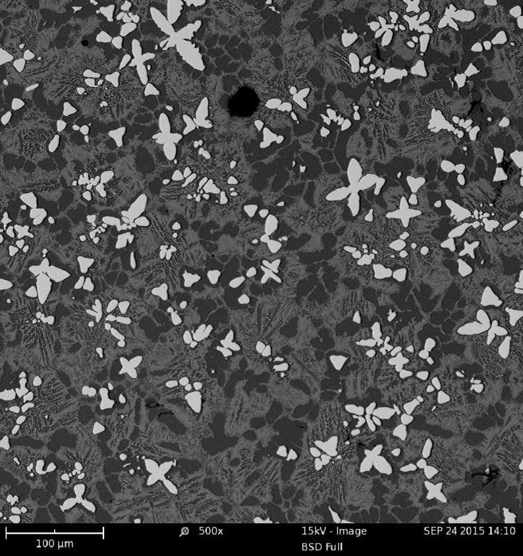

AFM照片

SEM照片

发展简史：

## Slide 43

1.4 数字图像处理的应用

Digital Image Processing

我国的图像处理技术近些年也取得了飞速发展，比如：图像处理技术在我国的宇航工程中也发挥了汗马功劳。

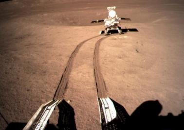

我国“嫦娥4号”登月器成功着陆在月球

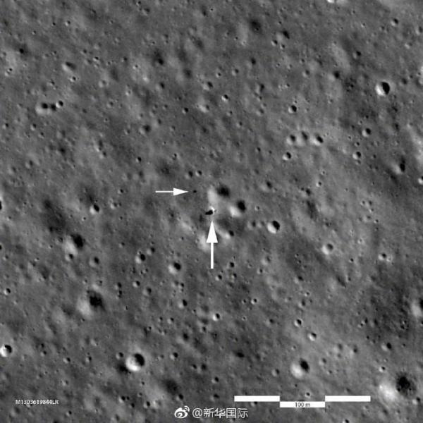

发展简史：

## Slide 44

1.4 数字图像处理的应用

Digital Image Processing

嫦娥5号月面采样返回视频（2020年12月17日）

https://v.qq.com/x/cover/mzc00200ozczy6l/v3206zs1guf.html

发展简史：

## Slide 45

宇宙探测中的应用：主要是星体图片的获取、传送和处理。

1.4 数字图像处理的应用

Digital Image Processing

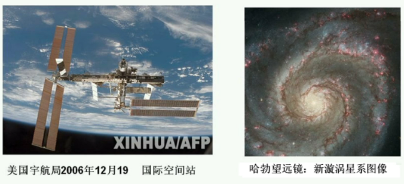

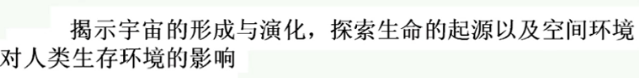

应用：

## Slide 46

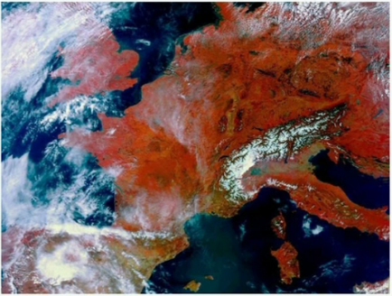

遥感方面的应用：航空遥感和卫星遥感，地形、地质、

资源的勘测，自然灾害监测、预报和调查，环境监测、违法建筑
调查等  。

天气预报:天气云图测绘、传输，气象卫星云图的处理和识别等。

1.4 数字图像处理的应用

## Slide 47

生物医学方面的应用：细胞分析、染色体分类、放射图像

处理、电子显微镜对血球分类、各种CT、核磁共振图像分析、
DNA显示分析、显微图像处理、癌细胞识别、心脏活动的动态分析、
超声图像成像、生物进化的图像分析等等  。

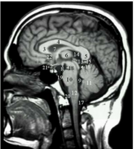

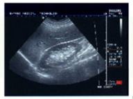

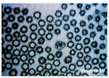

1.4 数字图像处理的应用

## Slide 48

军事公安方面的应用：

军事：军事目标的侦察和探测、导弹制导、各种侦察图像的判读和识别，雷达、声纳图像处理、指挥自动化系统等 。
公安：现场实景照片、指纹、足迹的分析与鉴别，人像、印章、手迹的识别与分析，集装箱内物品的核辐射成像检测，人随身携带物品的X射线检查及视频侦查等。

1.4 数字图像处理的主要应用

Digital Image Processing

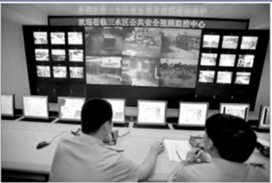

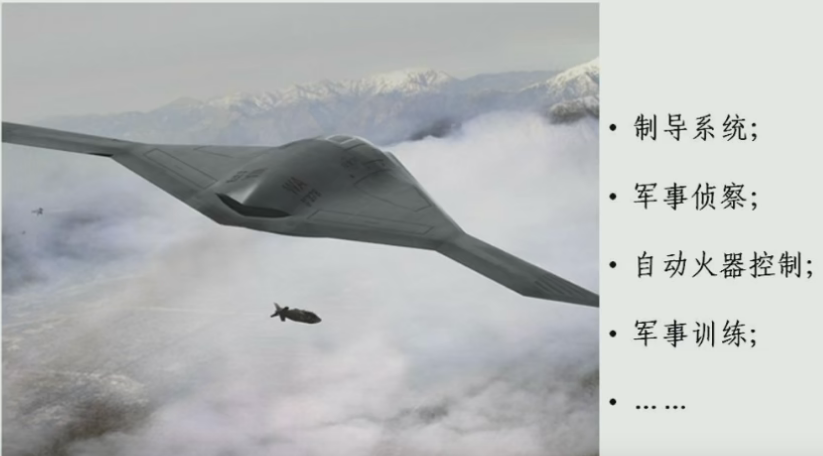

## Slide 49

Digital Image Processing

工业生产的应用:  印制板质量和缺陷的检测、无损探伤、石油气勘测、交通管制和机场监控、纺织物的图案设计、光的弹性场分析、运动工具的视觉反馈控制、流水线零件的自动监测识别、邮件自动分拣和包裹的自动分拣识别等。

1.4 数字图像处理的应用

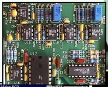

## Slide 50

考古：珍贵文物图片、名画、壁画的辅助恢复。

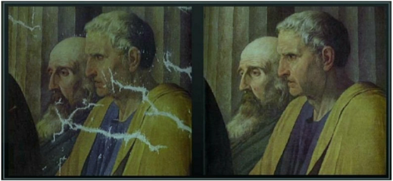

1.4 数字图像处理的应用

## Slide 51

新领域 ：生物特征识别
指纹识别：指纹打卡机，指纹解锁......
面部识别：人脸解锁，人脸匹配......

1.4 数字图像处理的应用

Digital Image Processing

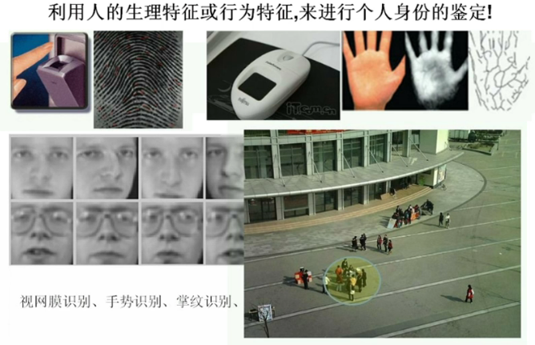

## Slide 52

新领域 ：
车牌识别：智能交通管理，智能停车场管理，高速收费站
出入口......
自动驾驶：
智能机器人：

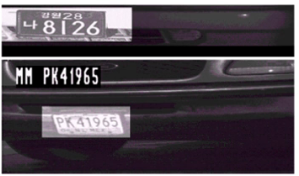

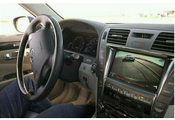

1.4 数字图像处理的应用

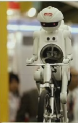

## Slide 53

1.4 数字图像处理的应用

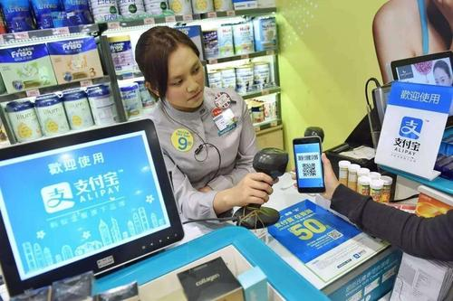

新领域 ：扫码支付

## Slide 54

1.4 数字图像处理的应用

生活娱乐：

流浪地球宣传照

## Slide 55

新领域 ：
数字水印：信息隐藏技术

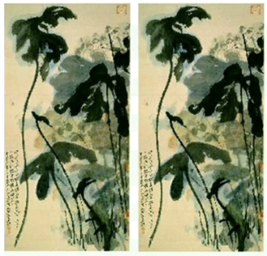

1.4 数字图像处理的应用

## Slide 56

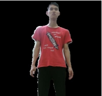

▓

前景物体提取 ：

1.4 数字图像处理的主要应用

Digital Image Processing

## Slide 57

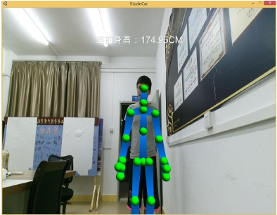

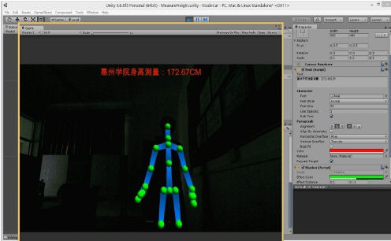

▓

图像测量：

1.4 数字图像处理的主要应用

Digital Image Processing

## Slide 58

1.4 数字图像处理的主要应用

Digital Image Processing

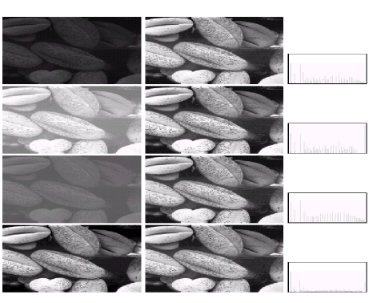

对比度增强 ：

## Slide 59

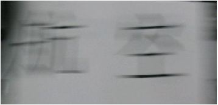

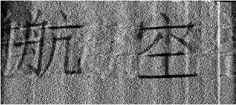

▓

去除运动模糊：

(a) 实际拍摄的运动模糊图像

(b) 恢复的图像

1.4 数字图像处理的主要应用

Digital Image Processing

## Slide 60

▓

超分辨率恢复 ：

1.4 数字图像处理的主要应用

Digital Image Processing

## Slide 61

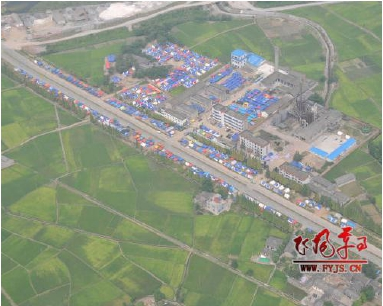

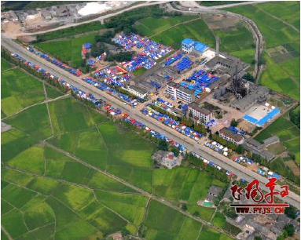

图像去雾：

1.4 数字图像处理的主要应用

Digital Image Processing

## Slide 62

Digital Image Processing

问题

图像处理系统由哪些模块组成？各模块起何作用？
数字图像处理主要应用有哪些？

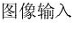

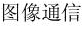

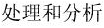

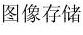

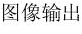

图像获取/数字化
1. 数码相机
2.数码摄像机
3. 扫描仪

图像处理算法
实现软件
计算机

计算机内存
移动硬盘，软盘
光盘...

显示/永久保存
1. 显示器
2. 投影仪
3. 照相机
4. 打印机

传输和通信
图像数据

## Slide 63

本章要求：了解图像及图像处理的概念、图像的表达方
法、图像处理系统的构成及数字图像处理技术的应用。

Digital Image Processing

本章要求及作业

本章作业：
必做：1.1，1.2，1.3，1.7
