# 第02章 图像处理基本知识

## Slide 1

第二章  图像处理基本知识

2.1  图像采集装置

2.3  彩色视觉和颜色模型
2.4  图像采样和量化
2.5  图像显示

Digital Image Processing

2.2  人眼成像过程

## Slide 2

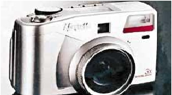

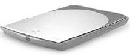

扫描仪
数码照相机

Digital Image Processing

2.1  图像采集装置

## Slide 3

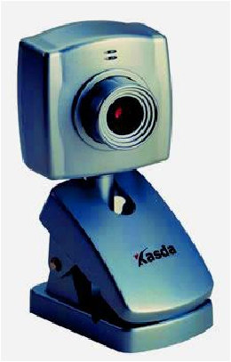

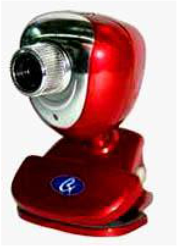

视频摄像头

Digital Image Processing

2.1  图像采集装置

## Slide 4

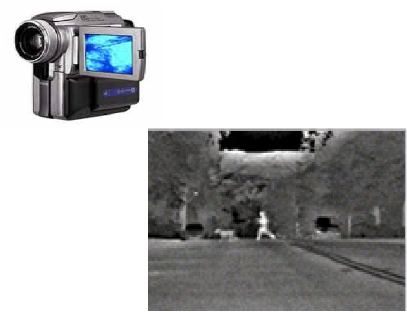

红
外
热
像
仪

Digital Image Processing

2.1  图像采集装置

采集装置都包括下面两个部件：
 光敏感器件
 模/数转换装置

## Slide 5

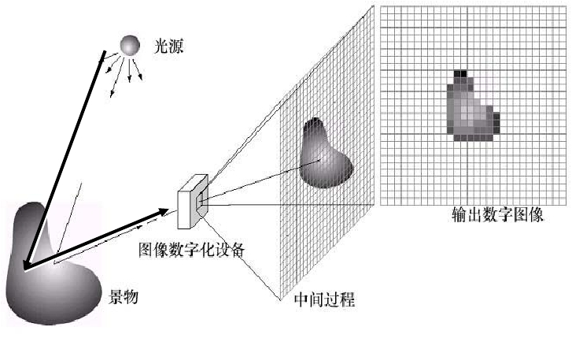

2-2  图像数字化器

图  图像的成像过程

Digital Image Processing

2.1  图像采集装置

发出光源照射物体

物体反射光线到成像设备

成像镜头

## Slide 6

Digital Image Processing

2.2 人眼成像过程

角膜：光从角膜进入眼睛。
晶状体：光从角膜进入人眼后通过晶状体将光线聚焦在视网膜上。
虹膜：虹膜上的瞳孔可放大收缩。
视网膜：人眼感知的视觉是通过光在视网膜上成像所实现的。
中间凹：分布了较多的光接收器，视锥细胞，是产生最清晰视觉的地方。
中央凹周围：视觉分辨能力逐渐下降，视锥细胞急剧减少，视杆细胞急剧增多，对黑白运动的感知能力增强。

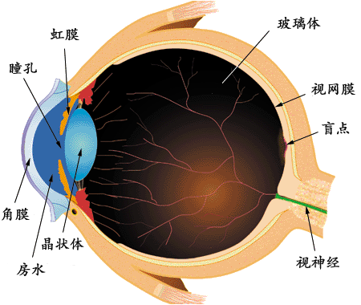

## Slide 7

Digital Image Processing

2.2 人眼成像过程

眼睛中图像的形成

当眼睛聚焦在前方物体上时，从外部射入眼睛内的光就在视网膜上成像。

## Slide 8

Digital Image Processing

2.2 人眼成像过程

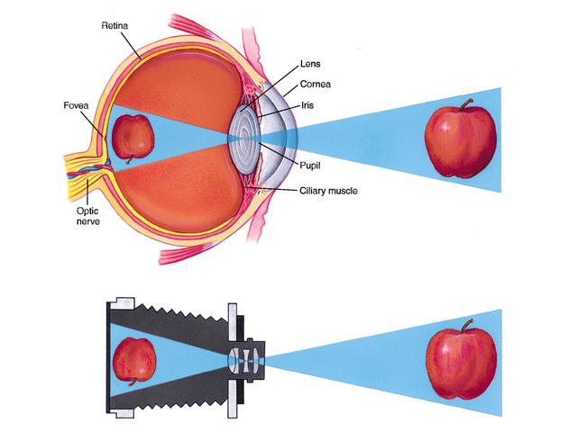

人眼视觉

## Slide 9

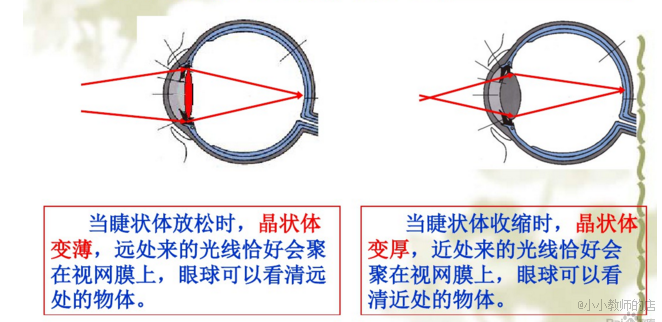

## Slide 10

问题

1.人眼近视后，为什么看不清远方的物体？

## Slide 11

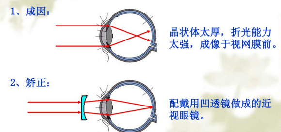

## Slide 12

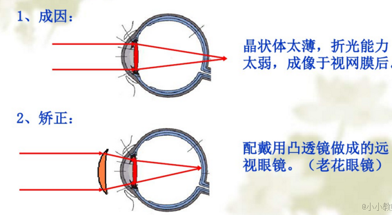

## Slide 13

Digital Image Processing

2.2  人眼成像过程

（1）视觉的空间特性：人的视觉系统感知到的亮度是进入眼内光强的对数函数，从夜视阈值到强闪光约有    量级；视觉的时间特性：视频传输满足大于15帧/s 人眼会产生连贯的感觉。

人眼成像特点：

（2）亮度适应能力：

白天到夜晚，人眼能看清物体，是利用改变视觉灵敏度来完成这一大变动的，这就是所谓的亮度适应现象，与整个适应范围相比，能同时鉴别的光强度级总范围很小，灰度分辨能力约64个灰度级。
人眼自我保护：强光下人眼自动收缩瞳孔降低视觉灵敏度；暗光下，人眼放大瞳孔提高视觉灵敏度来适应黑暗，在黑暗中也能看见物体。

## Slide 14

Digital Image Processing

2.2  人眼成像过程

（3）同时对比度：在相同亮度的刺激下,由于背景亮度不同,人眼所感受到的主观亮度不同，这种效应称为同时对比度。

同样的物体放在较暗的背景里就会显得比较亮，而放在较亮的背景里就会显得比较暗。
即人眼对某个区域感觉的亮度（主观亮度）不仅依赖于他自身的亮度，还与它的背景有关。

## Slide 15

Digital Image Processing

2.2  人眼成像过程

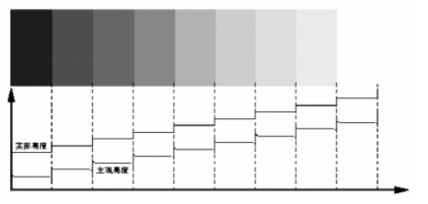

（4）马赫带效应：视觉的主观感受在亮度有变化的边缘出现虚幻的明亮或黑暗的条纹，人类的视觉系统有增强边缘对比度的机制。

## Slide 16

Digital Image Processing

2.2  人眼成像过程

（5）视觉错觉

在错觉中，眼睛填上了不存在的信息或错误地感知物体的几何特点。

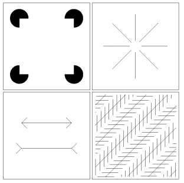

## Slide 17

Digital Image Processing

2.2  人眼成像过程

（5）视觉错觉

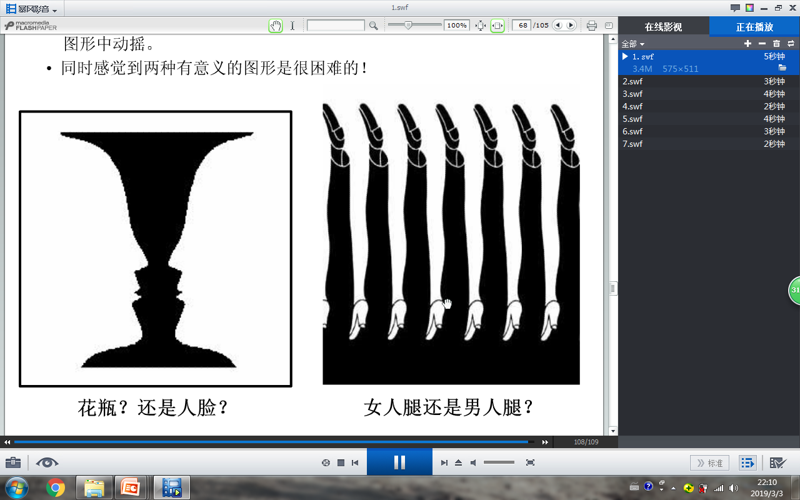

## Slide 18

问题

2. 进入一个黑暗剧场后，在能看清周围的物体前需适应一段时间，简述视觉原理。

## Slide 19

人的视觉不仅能感知光的刺激，还将不同频率的电磁波感知为不同的颜色。光能本身是无颜色的，颜色是人们眼睛感知光后产生的生理和心理现象。眼睛对光的感觉称为光觉，对颜色的感觉称为色觉，这是眼睛的特性。

Digital Image Processing

2.3  彩色视觉和颜色模型

## Slide 20

Digital Image Processing

2.2 人眼成像过程

人眼视觉细胞

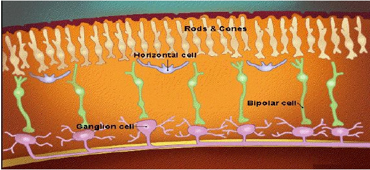

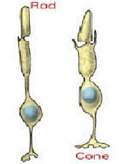

## Slide 21

Digital Image Processing

2.2  人眼成像过程

视网膜的感光细胞：

杆状细胞：——负责暗视觉

锥状细胞：——负责彩色视觉

负责黑白视觉，同时观察物体的运动
对低亮度光敏感（夜视觉）
数量多，约7500万-1.5亿

有三种类型：红色，绿色，蓝色感光细胞
可感受600~700万种颜色
空间分辨能力强，可看清物体表面的细节和轮廓
数量约为600~700万

典型动物：

猫头鹰仅有杆状细胞
鸡仅有锥状细胞

## Slide 22

为什么人眼能感知不同的颜色？红色，绿色，蓝色...
三色学说：

Digital Image Processing

2.3 彩色视觉和颜色模型

假设有三种视锥细胞，分别对红、绿、蓝三种颜色敏感；当光线同时作用在这三种视锥细胞上时，三个感受器产生的兴奋程度不同；传至大脑，产生不同的颜色感觉，三种感受器处于等强度兴奋时，便产生白色的感觉。
现代技术的发展充分证实了三色假说的合理性。

## Slide 23

Digital Image Processing

2.3 彩色视觉和颜色模型

第一类：蓝色敏感
第二类：绿色敏感
第三类：红色敏感

人眼的视网膜含有三种不同的视锥细胞：

## Slide 24

三色假说的验证

Digital Image Processing

2.3 彩色视觉和颜色模型

三种锥体细胞的光谱敏感示意图

对445nm波长的光谱敏感——蓝敏视锥细胞。
对535nm波长的光谱敏感——绿敏视锥细胞。
对575nm波长的光谱敏感——红敏视锥细胞。

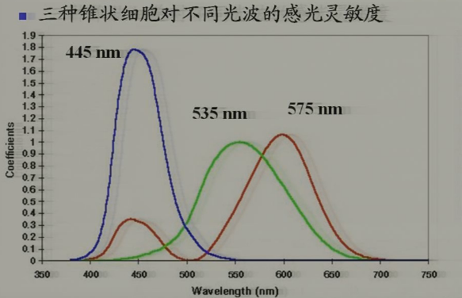

## Slide 25

例如600nm的单色黄光就处在VR（λ）， VG（λ）曲线之下，  所以

600nm的单色黄光既激励了红敏细胞， 又激励了绿敏细胞， 可引起混合
的感觉。

当混合红绿光同时作用于视网膜时， 分别使红敏细胞、 绿敏细胞同
时受激励，只要混合光的比例适当，  可以与单色黄光引起的彩色感觉相同。

Digital Image Processing

2.3 彩色视觉和颜色模型

当三种颜色按一定比例同时刺激人眼时，会产生各种颜色感觉，颜色
只取决于三个基本输入量，这也是色觉三基色的基本原理。

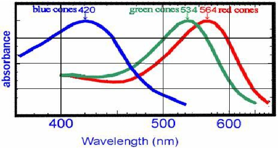

## Slide 26

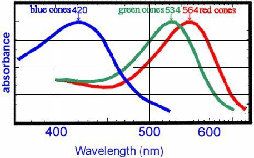

•    色盲/色障/色弱患者大多为红绿色盲原因（Sekuler  &  Blake,  1994）红绿视锥细胞缺失/损坏

Digital Image Processing

2.3 彩色视觉和颜色模型

## Slide 27

RGB颜色模型

当把红、绿、蓝色光混合时，通过改变三者各自的强度比例可得到白色以及各种彩色。

Digital Image Processing

2.3 彩色视觉和颜色模型

## Slide 28

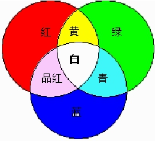

RGB颜色模型
自然界中绝大部分的可见光谱可以
用红、绿和蓝三基色光按不同比例
和强度的混合来表示。RGB分别代
表着3种颜色：R（波长=700.00nm)，
G（波长=546.1nm)   、B   （波长
=435.8nm) 。  RGB颜色模型是相
加混色，称为加色模型。

Digital Image Processing

2.3 彩色视觉和颜色模型

## Slide 29

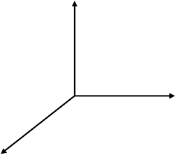

R

G

B

当把红、绿、蓝色光混合时，通过改变三者各自的强度
比例可得到白色以及各种彩色：

Digital Image Processing

2.3 彩色视觉和颜色模型

其中C代表某特定色，  表示匹配，R、G、B表示三原色，r、g、b代表比例系数， r+g+b=1。

C= rR+gG+bB

## Slide 30

Digital Image Processing

2.3 彩色视觉和颜色模型

RGB图像使用三种颜色，按照不同的比例混合，可以生成16581375种颜色。

RGB色彩模式为图像中每一个像素的RGB分量分配一个
0~255范围内的强度值。例如：纯红色R=255，G=0，B=0；白色的R、G、B都为255；黑色的R、G、B都为0。

## Slide 31

黄(255,255,0)

黑(0,0,0)

绿(0,255,0)

青(0,255,255)

蓝(0,0,255)

品红(255,0,255)

白(255,255,255)

红(255,0,0)
R:200
G:50
B:120

RGB颜色模型

Digital Image Processing

2.3 彩色视觉和颜色模型

## Slide 32

获取图像的方法有很多种，模拟图像是不能直接用数字计算机来处理的。为使图像能在数字计算机内进行处理，首先必须将各类图像（如照片，图形，X光照片等等）转化为数字图像。为了产生一幅数字图像，需要把连续的感知数据转化为数字形式，即图像数字化。

Digital Image Processing

2.4 图像采样和量化

图像数字化包括两种处理：采样和量化。

## Slide 33

Digital Image Processing

2.4 图像采样和量化

2.4.1 图像采样

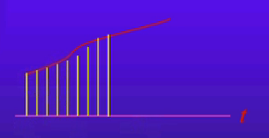

一维信号采样

二维信号采样

## Slide 34

像
素

图像采样
对图像采样，就是把模拟图像分割成若干个称为像素的
小区域，采样是对图像空间坐标的离散化。

Digital Image Processing

2.4 图像采样和量化

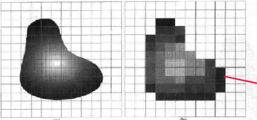

## Slide 35

图像采样定理

Digital Image Processing

2.4 图像采样和量化

二维采样定理（Nyguist准则）
1/△x, 1/△y ≥2倍的图像函数上限频带

## Slide 36

图像采样

Digital Image Processing

2.4 图像采样和量化

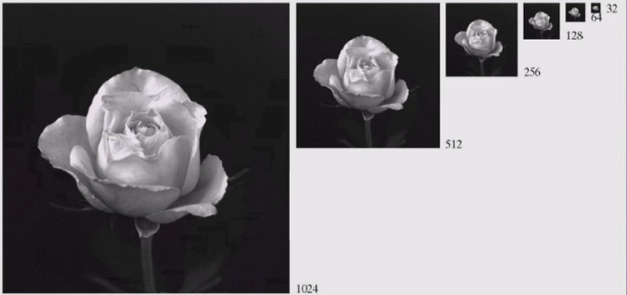

## Slide 37

图像采样

Digital Image Processing

2.4 图像采样和量化

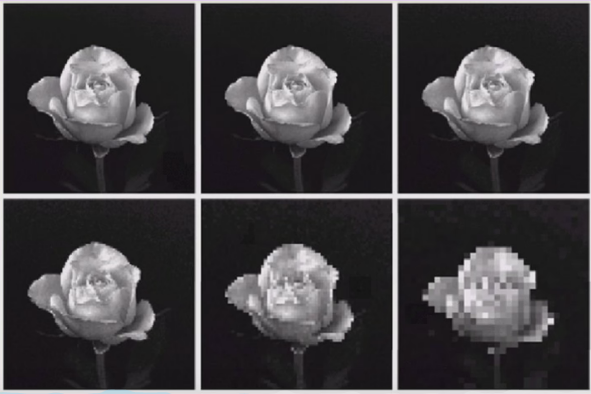

采用图像插值的方法让图像恢复同样大小

## Slide 38

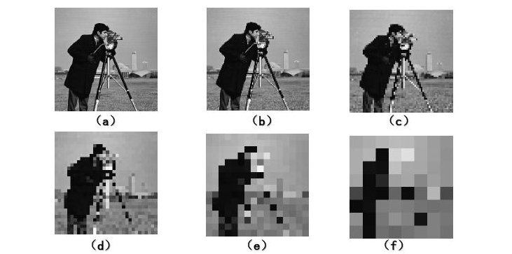

图像采样与空间分辨率

Digital Image Processing

2.4 图像采样和量化

当量化级数一定，采样点数减少时，图像的块状效应（马赛克效应）就逐渐明显。

采样后通过复制行和列使图像恢复到原来大小

## Slide 39

2.4.2 图像量化
经过采样，模拟图像已在空间上离散化为像素。但采样结果所得的像素的值仍是连续量。

Digital Image Processing

2.4 图像采样和量化

像
素

把采样所得到的各像素的灰度值从模拟量到离散量的转换称为图像灰度的量化。

## Slide 40

2.4.2 图像量化

Digital Image Processing

2.4 图像采样和量化

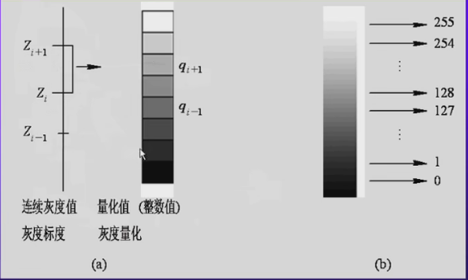

256个灰度级的均匀量化

## Slide 41

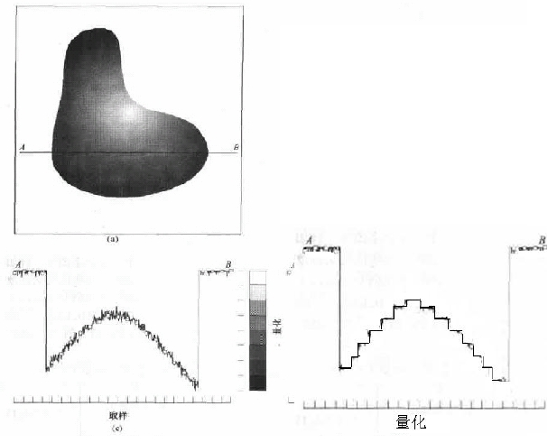

灰度图像量化

Digital Image Processing

2.4 图像采样和量化

## Slide 42

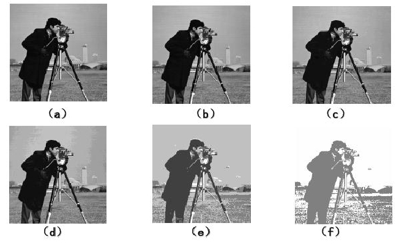

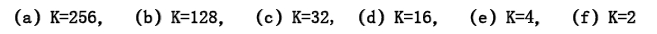

图像量化与灰度级

Digital Image Processing

2.4 图像采样和量化

当图像的采样点数一定时，量化级数越少，图像质量越差。

## Slide 43

Digital Image Processing

2.4 图像采样和量化

一般，当限定数字图像的大小时，为了得到质量较好的图像，可采用如下原则：
（1）对缓变的图像，应该细量化，粗采样，以避免出现假轮廓。
（2）对细节丰富的图像，细采样、粗量化，以避免模糊。

## Slide 44

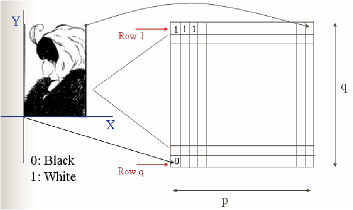

黑白（二值）图像的数字化

Digital Image Processing

2.4 图像采样和量化

## Slide 45

彩色图像的数字化

Digital Image Processing

2.4 图像采样和量化

## Slide 46

0
1

2
.
.
.
.
.

255

R

r
.
.
.

0
1

2
.
.
.
.
.

G

g
.
.
.

0
1

2
.
.
.
.
.

255

B

b
.
.
.

255
彩色图像的数字化

Digital Image Processing

2.4 图像采样和量化

## Slide 47

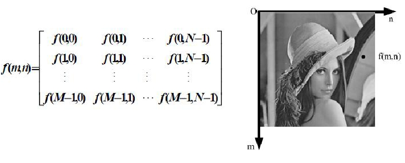

经过数字化过程（采样、量化）得到矩阵

Digital Image Processing

2.4 图像采样和量化

其中矩阵中的每个元素代表一个像素

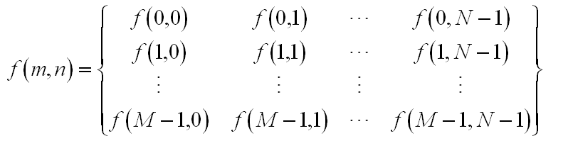

## Slide 48

采用cameraman测试图像，计算图像的大小，取中央窗口的16×16子图像，显示其量化值。
对测试图像进行适当裁剪并显示处理后的图像。

【解】W = 16;
I = imread('cameraman.tif');
S = size(I);
J = I(S(1)/2-W/2:S(1)/2+W/2-1,S(2)/2-W/2:S(2)/2+W/2-1)
imshow(J);
K = I(2*W:S(1)-W,2*W:S(2)-5*W) ;
imshow(K);

Digital Image Processing

2.4 图像采样和量化

举例：

## Slide 49

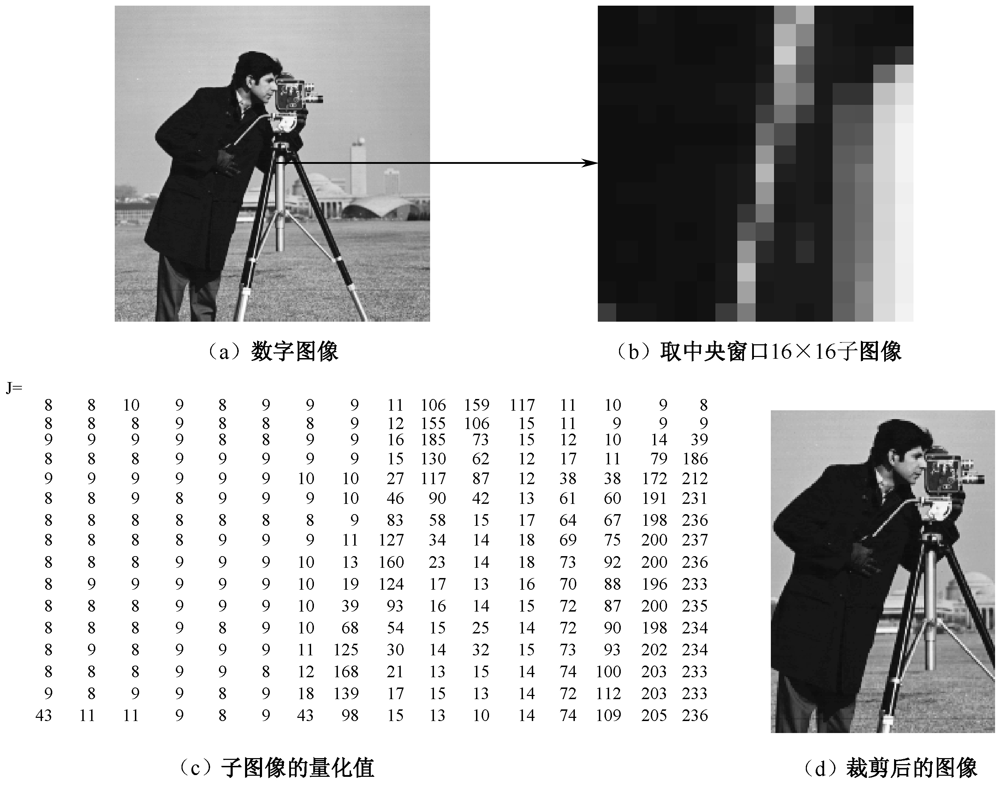

## Slide 50

Digital Image Processing

2.4 图像采样和量化

2.4.3数字图像性质

A、 图像分辨率
1） 图像分辨率：指组成一幅图像的像数密度

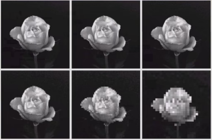

数码相机指标：
640*380=307200，
30万像数

## Slide 51

Digital Image Processing

2.4 图像采样和量化

2.4.3数字图像性质

2） 显示分辨率：指显示屏上能够显示的像数个数
例如：显示器分辨率为640*480 ，表示显示屏分成480行，每行显示640个像数，整个显示屏含有307200个像数。
降低显示屏显示分辨率，桌面图标会如何变化？

## Slide 52

Digital Image Processing

2.4 图像采样和量化

2.4.3数字图像性质

3） 打印机、扫描仪分辨率
DPI (Dots Per Inch) 每英寸像数点数
DPI越大，图像越清晰

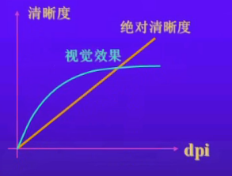

## Slide 53

Digital Image Processing

2.4 图像采样和量化

2.4.3数字图像性质

像数深度
指存储每个像数所需的位数，它也可以用来度量图像的分辨率。256个灰度级的灰度图像是8位，彩色图像是多少位？

位面数量
一幅图像的位面数量相当于组成图像的像数矩阵维数。
灰度图像是一个位面；
彩色图像有三个位面——红色分量，蓝色分量，绿色分量

## Slide 54

假定图像尺寸为M、N，每个像素所具有的离散灰度级数为G
这些量分别取为2的整数幂m，n，k，即M =2m，N =2n，G =2k
存储这幅图像所需的位数是：
b = M·N·K
图像尺寸的增加，所需的存储空间？

Digital Image Processing

2.4 图像采样和量化

## Slide 55

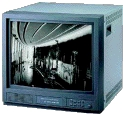

图像显示指将图像数据以图的形式展示出来。
可以显示图像的设备有许多种。常见图像处理和分析系统
的主要显示设备是显示器。
还有阴极射线管(CRT)、   液晶显示   、   等离子体显示   、
注入电致发光显示、  高场电致发光显示、投影显示以及各
种打印设备也可用于图像输出和显示。

Digital Image Processing

2.5 图像显示

## Slide 56

灰度图像是指每个像素的信息由一个量化的灰度级来描述
的图像，没有彩色信息，如2级（二值图像）、64级、256级。
像素用8位表示的图像，包含256个灰度，即用256种不同灰度值
来表示图像，灰度值为0～255，0表示黑色，255表示白色。
任何模式的图像都可转换为灰度模式。

灰度图像

Digital Image Processing

2.5 图像显示

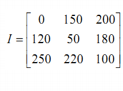

## Slide 57

二值图像（黑白图像）

黑白图像又称为二值图像是指图像的每个像素只能是黑或
者白，没有中间的过渡，即像素的值为0、1。

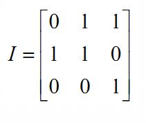

Digital Image Processing

2.5 图像显示

## Slide 58

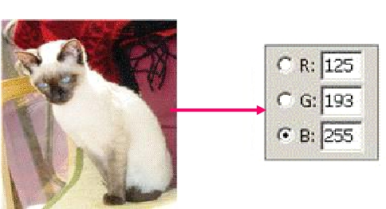

RGB彩色图像

RGB彩色图像是指每个像素的色彩信息由RGB三原色构成的图像，
其中RGB是由不同的灰度级来描述的。每个像素的RGB分量是一个
介于0（黑色）～255（白色）之间的灰度值。每一个象素的颜色由
存储在该位置的红、绿、蓝颜色共同决定。
RGB颜色模式下红、绿、蓝分别占用8位，每个像素包含24（8×3）
位颜色信息。   RGB色彩模式的图像可以在屏幕上生成多达
种颜色。

Digital Image Processing

2.5 图像显示

## Slide 59

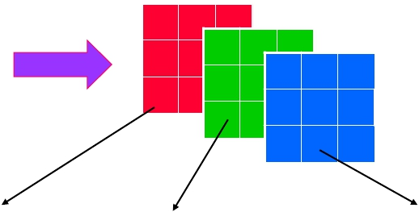

RGB彩色图像不能用一个矩阵来描述了，是用三个矩阵同
时来描述。

Digital Image Processing

2.5 图像显示

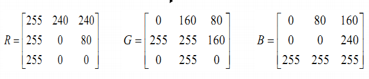

## Slide 60

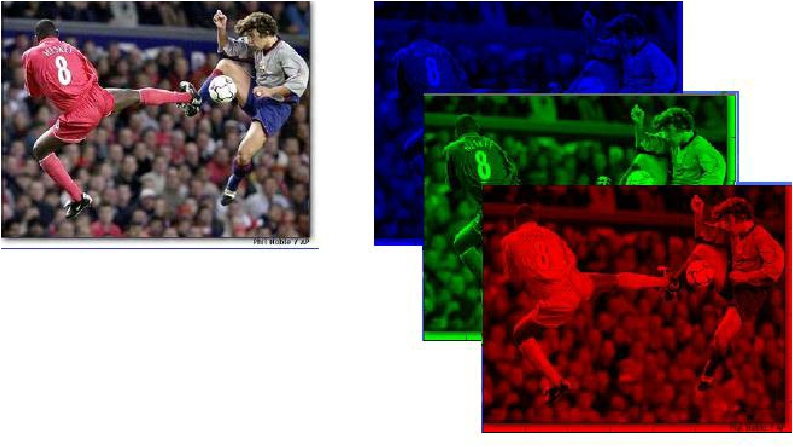

根据RGB模型，每幅RGB彩色图
像包括三个独立的基色平面，或
者说可分解到三个平面上。

Digital Image Processing

2.5 图像显示

## Slide 61

索引图像
索引模式使用0～255种颜色来表示图像，当一幅RGB图像
转化为索引颜色时，将建立一个256色的颜色查找表（调色板）
存放并索引图像所用到的颜色。索引图像把象素值直接作为
索引颜色的序号，这样，根据索引颜色的序号在调色板中可以
查到该象素的实际颜色。对于256色图像有256个索引颜色，
相应的调色板就有256个单元。

2.5 图像显示

## Slide 62

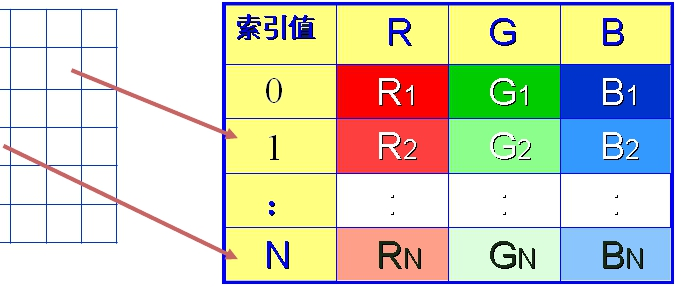

|  |  |  |  |  |  |
| --- | --- | --- | --- | --- | --- |
数据区

调色板

像素的调色板索引值

Digital Image Processing

2.5 图像显示

## Slide 63

| 颜色
索引 | 红 | 绿 | 蓝 | 颜色
索引 | 红 | 绿 | 蓝 |
| --- | --- | --- | --- | --- | --- | --- | --- |
索引色的图像占硬盘空间较小，但是图像质量也不高，
适用于多媒体动画和网页图像制作。

256色彩图像的索引表（调色板）

Digital Image Processing

2.5 图像显示

## Slide 64

问题

3 图像的数字化包含哪些步骤？

## Slide 65

Digital Image Processing

本章要求：
了解视觉成像过程；
掌握图像的视觉原理和不同的视觉成像现象；
熟悉彩色图像的模型；
掌握图像的采样和量化原理及对图像质量的影响。

本章作业：
2.3  ，2.5 ，2.6

本章要求及作业
