# 第03章 图像变换与二维数字滤波

## Slide 1

Slide

第3章 图像变换与二维数字滤波

## Slide 2

Slide

图像和其它信号一样，既能在空间域（简称空域）处理，
也能在频率域（简称频域）处理。把图像信息从空域变换到频
域，可以更好地分析、加工和处理。

概述

## Slide 3

Slide

内容提要

主要介绍图像处理中常用的二维离散变换的定义、性质、实现方法及应用。
1）几何变换，代数运算
2）经典变换——离散傅里叶变换（DFT）
3）离散余弦变换（DCT）
4）离散沃尔什-哈达玛变换（DWT）
5）K-L变换（KLT）
6）离散小波变换（DWT）及其应用

## Slide 4

3.1 图像几何变换

Slide

◘图像的几何变换包括:
图像的空间平移、比例缩放、旋转、镜像、转置变换。

图像在生成过程中，由于系统具有非线性或拍摄角度不同，会使生成的图像产生几何失真。几何失真一般分成系统失真和非系统失真，系统失真是有规律的能预测的，非系统失真是随机的。系统失真可以通过几何变换加以修正，这就是几何变换的应用背景。

## Slide 5

Slide

◘图像几何变换的一般表达式  :

即变换后图像仅仅是原图像的简单拷贝。

[u, v]  =  [ X  ( x, y), Y ( x, y)]
其中，[u,v] 为变换后图像像素的笛卡尔坐标，[x, y] 为原始图像中像素的笛卡尔坐标。这样就得到了原始图像与变换后图像的像素对应关系。

如果   X(x, y) = x  ， Y(x, y) = y

3.1 图像几何变换

## Slide 6

Slide

3.1.1 图像平移变换

若图像像素点   (x, y)   平移到(x + x0, y + y0) ，则变换函数为：

写成矩阵表达式为：

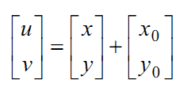

其中， x0 和 y0 分别为 x 和 y的坐标平移量。

## Slide 7

图像平移示例

移出画布的
数据被裁减

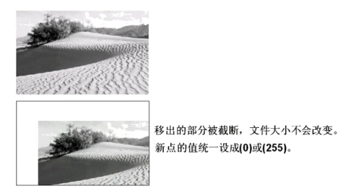

扩大画布

## Slide 8

Slide

3.1.2 图像缩放

若图像坐标 ( x, y )   缩放到（ sx,sy  )倍，则变换函数为：

其中,  sx,sy  分别为x 和  y 坐标的缩放因子，其大于1表示放大，小于1表示缩小。

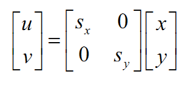

## Slide 9

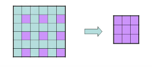

缩小

图像缩小实际是对原有的数据进行抽取，获得期望缩小的尺寸，并且尽量保持原有的特征不丢失。

最简单的方法就是：等间隔取样

## Slide 10

图像缩小示例

（a）比例缩小

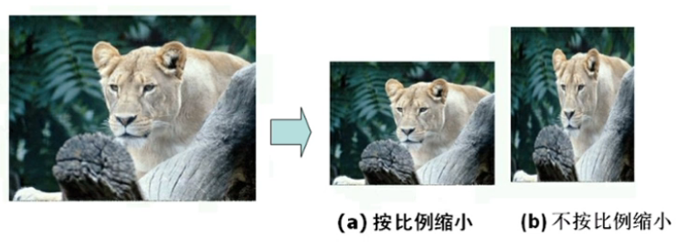

（b）非比例缩小

## Slide 11

x, y

插值处理后

放大
2倍

赋值方法：一般采用最邻近插值和线性插值法。

b)  放大

图像放大是对多出的空白像素点赋新的像素值，是对信息的估计。

## Slide 12

放大最简单的思想：原图像长和宽放大K倍，则将原图像中每个像素值放大k*k 倍。

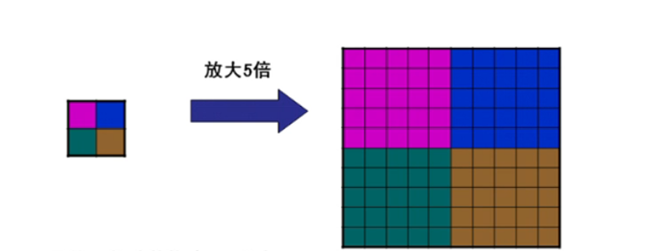

当k为整数，可以采用这种方法。

## Slide 13

图像放大示例

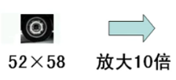

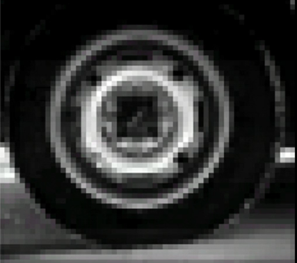

放大倍数过大，出现马赛克效应。

## Slide 14

缩放倍数不为整数？

如：sx=sy=1.5,f(x,y)大小为200*200,放大后图像g(u,v)
图像大小？
g(150,150)=
g(100,100)=
sx=sy=0.4,变换后图像g(u,v)：
图像大小？
g(55,55)=

采用图像插值

## Slide 15

Slide

（1）最近邻插值法：也称作零阶插值，就是令变换后像素的灰度值等于距它最近的输入像素的灰度值。

(2)双线性插值:  也称作一阶插值,该方法通常是沿图像矩阵的
每一列（行）进行插值，然后对插值后所得到的矩阵再沿着
行（列）方向进行线性插值。

3.1.3 图像插值

## Slide 16

1．最近邻点法

该法取与像素点相邻的4个点中距离最近的邻点灰度值作为该点的灰度值。

## Slide 17

2．双线性插值法

用(             )点周围4个邻点的灰度值加权内插作为该点的灰度值。

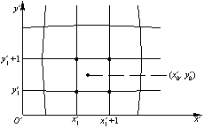

## Slide 18

2．双线性插值法

优点：
内插法校正灰度连续，结果一般满足要求。
缺点：
计算量较大且具有低通特性，图像轮廓模糊。

## Slide 19

2．双线性插值法

双线性插值填充放大

## Slide 20

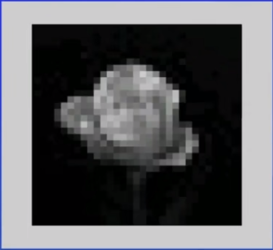

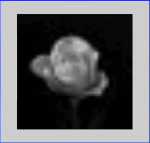

最近邻插值

双线性插值

32*32 大小图像放大为512*512大小图像

## Slide 21

将输入图像绕笛卡尔坐标系的原点顺时针旋转a 度，则变
换后图像坐标表示为：

3.1.4 图像旋转

## Slide 22

将输入图像绕笛卡尔坐标系的原点顺时针旋转a 度，则变
换后图像坐标表示为：

3.1.4 图像旋转

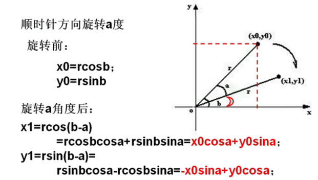

## Slide 23

绕中心旋转表达式

逆时针旋转     角度的表达式？

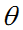

注意：这个计算公式计算出的值为小数，而坐标值为正整数。因此需要前期处理：扩大画布，取整处理，平移处理。

## Slide 24

图像旋转示例

图像旋转是以图像的中心为圆心旋转，常用的情况：
（1）转出的图像空间的部分被裁剪掉
（2）旋转后，将图像变大

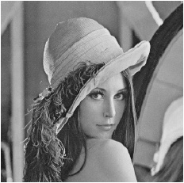

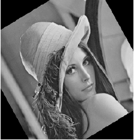

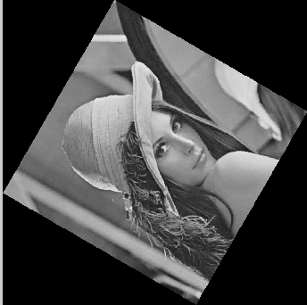

## Slide 25

为了避免丢失信息，画布的扩大是非常重要的。
画布扩大的原则是：以最小的面积承载全部的画面信息。

画布扩大的简单方法是根据(逆时针)旋转公式：

计算u和v的最大、最小值，即umax、umin和vmax、vmin。
画布大小为：umax-umin、 vmax-vmin。

画布扩大公式

## Slide 26

图像旋转存在的问题

图像旋转出现锯齿、断裂、小桥，本质都是因为像索值的填充是不连续的。

## Slide 27

3.1.5图像的镜像

包括水平镜像和垂直镜像。

a、水平镜像

## Slide 28

3.1.5图像的镜像

左右像素置换

(a)原始图像                 (b)水平镜像

## Slide 29

垂直镜像

上下像素置换

b、垂直镜像

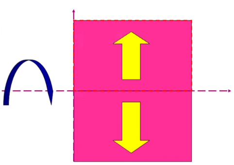

## Slide 30

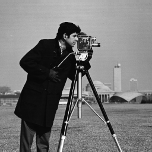

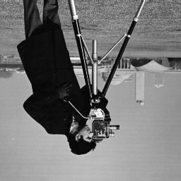

上下像素置换

## Slide 31

旋转与镜像

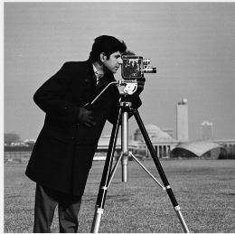

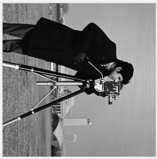

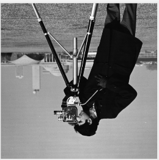

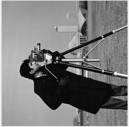

## Slide 32

转置

原图

转置 （长宽互换）    顺时针旋转90°

c、垂直镜像:将x和y 坐标对换

## Slide 33

几何运算符函数(缩放)

I1=imread('filename1');
I2=imread('filename2');
c=imresize(I1,m);   % m 为整数，表示缩放倍数
c= imresize(I1,[m  n])   % m，n 为指定的高度和宽度
c=imresize(I1,[m n ],’nearest’) % 可以使用‘bilinear’/ ‘bicubic’
imshow(c);

## Slide 34

几何运算符函数（旋转）

B = imrotate(A,angle)
%angle度， 正数表示逆时针旋转， 负数表示顺时针旋转。返回旋转后的图像矩阵。
B = imrotate(A,angle,method)
'nearest'：最邻近插值  'bilinear'： 双线性插值 'bicubic'： 双立方插值
B = imrotate(A,angle,method,bbox)
bbox参数用于指定输出图像属性：
'crop'： 对旋转后的图像进行裁剪， 保持旋转后输出和输入图像的尺寸一样。
'loose'：保证源图像旋转后超出图像尺寸范围的像素值没有丢失。 一般这种格式产生的图像的尺寸都要大于源图像的尺寸。

## Slide 35

几何运算符函数（镜像）

B = flipud(A)
%垂直镜像
B = fliplr(A)
% 水平镜像

B=fliplr(imrotate(A,-90))
% 转置

## Slide 36

问题

图像几何变换的实质是什么？

计算新像素在原图的对应位置；
2. 为这些新像素对应位置赋灰度值

什么时候图像会出现马赛克效应？为什么？

图像放大倍数过高时，采用最近邻插值的
方法来填充图像，会出现马赛克效应。

## Slide 37

Slide

3.2 图像代数运算

	加
	减
	乘
	除

## Slide 38

3.2.1 代数运算——加法

1、加法运算

2、主要应用举例：
（1）  去除“叠加性”随机噪声
（2）  生成图像叠加效果

## Slide 39

加法运算应用

①去除叠加性噪声

对于原图象f(x,y),有一个噪声图像集 { g i (x ,y) }    i =1,2,...M
其中：g i (x ,y) = f(x,y) + ei(x,y)

M个图像的均值为：

当：噪声ei(x,y)为互不相关，且均值为0时，上述图象均值将降低噪声的影响。

## Slide 40

加法运算应用

利用同一景物的多幅图像取平均、消除噪声。取M个图像相加求平均得到1幅新图像，一般选8幅取平均。

## Slide 41

加法运算应用

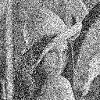

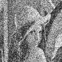

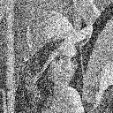

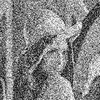

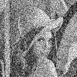

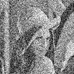

噪声图像1              噪声图像2                     噪声图像3               噪声图像4

噪声图像5                 噪声图像6              噪声图像7               噪声图像8

## Slide 42

加法运算应用

原始图像             降噪后图像

## Slide 43

②生成图像叠加效果
对于两个图像f(x,y)和h(x,y)有：
g(x,y) = 1/2 * f(x,y) + 1/2* h(x,y)
推广为：
g(x,y) = α * f(x,y) + β * h(x,y)
其中 α+β= 1
可以得到各种图像合成的效果

加法运算应用

## Slide 44

利用图像加法生成图象叠加效果：其中α+β= 1

## Slide 45

定义:   C(x, y) = A(x, y) - B(x, y)
主要应用
1）图像分离：如分割运动的车辆，减法去掉静止部分，剩余的是运动元素和噪声
2）显示两幅图像的差异，检测同一场景两幅图像之间的变化

3.2.2 代数运算——减法

## Slide 46

1）图像分离：
设：背景图像b(x, y)，前景背景混合图像f(x, y)
g(x, y) = f(x, y) – b(x, y)
g(x, y) 为去除了背景的图像。

减法运算应用

## Slide 47

减法运算应用

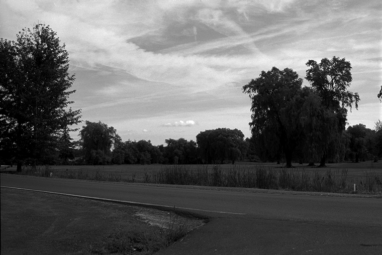

乡村公路

## Slide 48

减法运算应用

打破宁静的不速之客

## Slide 49

减法运算应用

模糊的影像

## Slide 50

减法运算应用

混合图像分离：

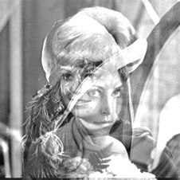

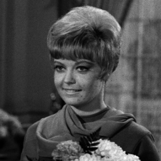

-

=

## Slide 51

减法运算应用

2）检测同一场景两幅图像之间的变化
设： 时间1的图像为T1(x, y)，
时间2的图像为T2(x, y)
g(x, y) = T2 (x, y) - T1(x, y)

=

-

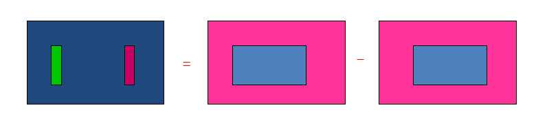

## Slide 52

定义：C(x, y) = A(x, y) * B(x, y)
主要应用：图像的局部显示
用二值掩膜图像与原图像做乘法

3.2.3 代数运算——乘法

## Slide 53

定义：
主要应用：改变图像的灰度级
常用于遥感图像处理中。
在四种算术运算中，减法与加法在图像增强处理中最为有用。

3.2.4 代数运算——除法

## Slide 54

问题

加法运算和减法运算在图像处理中的应用？

加法主要应用举例：
（1）  去除“叠加性”随机噪声
（2）  生成图像叠加效果
减法主要应用举例：
（1）  混合图像分离/去除不需要的叠加性图案
（2）  显示两幅图像的差异

## Slide 55

代数运算符函数

a=imread('filename1');
b=imread('filename2');
c=imadd(a,b);
% 可以使用其他代数运算符： imsubtract,
% immultiply ,imdivide
% a,b两个矩阵必须同样的大小
imshow(c);

## Slide 56

3.3 逻辑运算

“与”、“或”，“非”，“异或”逻辑运算

逻辑运算主要以像素对像素为基础在两幅或多幅图像间进行。
主要用于二值图形。

## Slide 57

逻辑运算符：not
主要应用举例
获得一个反图像/阴图像
获得一个子图像的补图像

3.3.1 逻辑运算——非

## Slide 58

逻辑运算符: and
主要应用
求两个子图像的相交子图

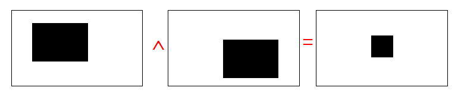

3.3.2 逻辑运算——与

## Slide 59

逻辑运算符: or
主要应用
合并子图像

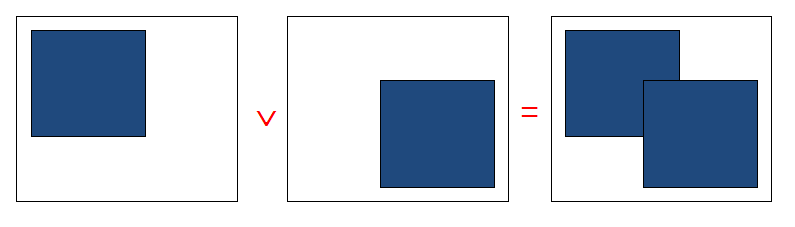

3.3.3 逻辑运算——或

## Slide 60

逻辑运算符: xor
主要应用举例
获得图像的差异部分

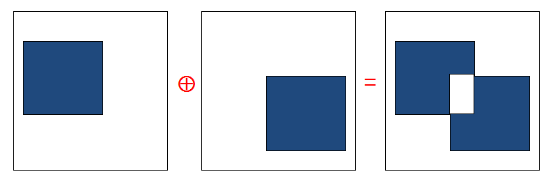

3.3.2 逻辑运算——异或

## Slide 61

逻辑运算符函数

a=imread('filename1');
b=imread('filename2');
c=xor(a,b);       % 可以使用其他逻辑运算符：and, or ,not
% a,b两个矩阵必须同样的大小
imshow(c);

提示：
注释方式与C语言不同
可用快捷键：Ctrl+R 快速注释多行数据、Ctrl+T 取消多行注释

## Slide 62

问题

减法运算和异或运算在图像处理中的异同？

相同点：
（1）  可以显示两幅图像的差异
不同点：
（1）减法运算适用于一般的灰度图像，异或运算主要适用于二值图像。
（2）减法运算得到的是图像的像素间的差值，小于0的用0 填充，仍然是一般灰度图像；异或运算得到的是二值图像，要么0，要么1。

## Slide 63

Slide

3.4 正交变换

1.   线性变换
f是N*1 向量，T是N*N矩阵：

则定义了向量f 的一个线性变换。
g(x,u):正变换核，矩阵T称为变换的核矩阵，即变换矩阵。

逆变换：

## Slide 64

Slide

3.4.1 一维正交变换

例：平面坐标系的旋转变换：

## Slide 65

Slide

2. 酉变换
T的逆变换等于其复共轭的转置时，称该线性变换为酉变换。

3.4.1 一维正交变换

3. 正交变换
若T为实数变换，则称酉变换为正交变换。

正交基：正交变换的每一行，称为正交基。

## Slide 66

Slide

正交矩阵称为正交函数，或者基函数。

3.4.1 一维正交变换

## Slide 67

Slide

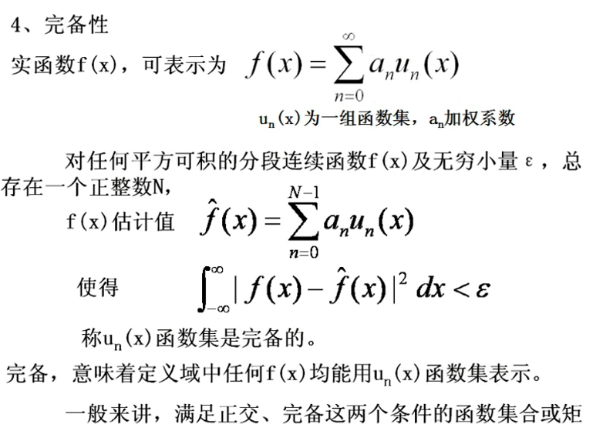

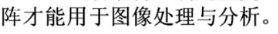

3.4.1 一维正交变换

## Slide 68

Slide

1. 二维线性变换

3.4.2 二维正交变换

g(x,y,u,v)和h(x,y,u,v)为基图像

## Slide 69

Slide

2、 可分离变换核

核的可分离性质，使得二维变换可以分布计算，每一步做一个一维变换。

变换核的可分离性，可以大大加快计算速度，降低程序复杂度。

变换核是可分离的

沿f(x,y)的y方向作一维线性变换

沿f(x,y)的x方向作一维线性变换

3.4.2 二维正交变换

## Slide 70

Slide

若变换核是可分离的，有：

由矩阵相乘算法可知，对于由f逐行串接形成的矢量f,对应的正交表达式为：
矩阵P和Q分别是由P(x,u),Q(y,v)构成的矩阵。
对于由逐列串接形成的矢量f,对应的正交表达式为：

3.4.2 二维正交变换

## Slide 71

Slide

3.4.3 基函数和基图像

数字图像可以表示成按行串接的矢量，该矢量可以表示成单位基矢量的加权和，权重为像素的强度值。

## Slide 72

Slide

实际上，任何以矩阵表示的图像都可以看作是加权系数为图像像素值f(i,j)的一系列基函数加权和。

3.4.3 基函数和基图像

## Slide 73

Slide

任何图像都可以看成是加权系数为图像像素值f(i,j)的一系列单位基图像的加权和。

对于N*N图像阵列，有

仅第i+1个元素为1，其余全为0
仅1个非零元素的系数矩阵。

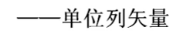

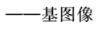

图像正交变换的实质是改变基图像和加权系数。

3.4.3 基函数和基图像

## Slide 74

Slide

任何图像都可以分解为基图像之和，基图像相互是正交的。图像变换的本质是寻找合适的基图像来表达图像。

根据基函数的不同类型，图像的正交变换分为三大类：
正弦/余弦型变换
方波形变换
基于特征向量的变换

3.4.3 基函数和基图像

## Slide 75

Slide

3.5 二维离散傅里叶变换

离散傅里叶变换是最经典的一种正弦/余弦型正交变换。
建立空间域和频域间的关系，具有明确的物理意义，能够更直观，更方便的解决许多图像处理问题。
具有许多在工程上有重要意思的独特性质，而且具有快速算法，广泛应用于数字图像处理领域。

## Slide 76

傅里叶变换的依据

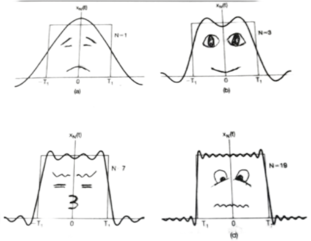

一个连续的信号可以进行傅里叶级数展开

## Slide 77

z

信号频谱代表了信号在不同频率分量成分的大小，能够提供比时域信号波形更直观，丰富的信息。

## Slide 78

Slide

3.5.1  一维连续傅里叶变换:

3.5  二维离散傅里叶变换（DFT）

定义  ：

函数f(x)的傅里叶一般情况下是一个复数量，可以表示为

狄里赫莱条件：有限个间断点，有限个极值点，绝对可积

## Slide 79

连续信号（非周期）的傅里叶变换

时域连续函数造成频域是非周期的谱
时域的非周期造成频域是连续的谱

## Slide 80

Slide

3.5  二维离散傅里叶变换（DFT）

3.5.2  一维离散傅里叶变换1D-DFT:

1D-DFT的矩阵表示  ：

定义  ：由取样后的有限长序列    f (n)(n = 0,1,2,     , N -1) ,其DFT定义为：

## Slide 81

Slide

其中：

而1D-DFT就称为酉变换。
同理可得到反变换的矩阵表示：

3.5  二维离散傅里叶变换（DFT）

其中的U成为变换矩阵。从U的构成形式可知，U是对称的，即
又由                   ，，，称U为酉矩阵。且

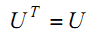

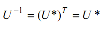

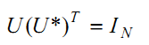

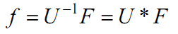

## Slide 82

Slide

3.5  二维离散傅里叶变换（DFT）

3.5.3  二维连续傅里叶变换
定义：设 f (x, y) 是独立变量x和y  的函数，且在±∞ 上绝对可积，则定义积分
为二维连续函数 f (x, y) 的傅里叶变换，并定义
为F (u, v) 的反变换。 f (x, y) 和F (u, v)为傅里叶变换对。

## Slide 83

Slide

【例3.1】求图3.1所示函数的傅里叶变换。

解：

图3.1  二维信号f (x, y)

其幅度谱为

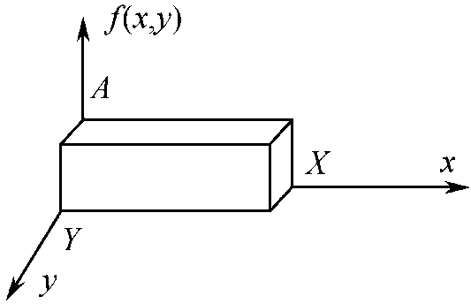

## Slide 84

Slide

二维信号的频谱图

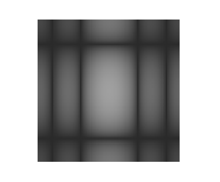

（a）信号的频谱图                    （b）频谱的灰度图
图3.1  信号的频谱图

## Slide 85

Slide

3.5 二维离散傅里叶变换

尺寸为M×N的离散图像函数的DFT

反变换可以通过对F(u,v) 求IDFT获得

3.5.4  二维离散傅里叶变换2D-DFT:

## Slide 86

Slide

F(u, v)即为f (x, y)的频谱，通常是复数：

幅度谱

相位谱

## Slide 87

Slide

DFT幅度谱的特点

① 频谱的直流成分说明在频谱原点的傅里叶变换
等于图像的平均灰度级。

② 幅度谱|F(u, v)|关于原点对称。

## Slide 88

Slide

3.5.5 二维离散傅里叶变换的性质

1．变换可分离性
二维DFT可以用两个可分离的一维DFT之积表示：

式中，

结论：（1）二维变换可以通过先进行行变换再进行列变换的两次一维变换来实现。（2）也可以通过先求列变换再求行变换得到二维傅里叶变换。

## Slide 89

Slide

用两次一维DFT计算二维DFT

## Slide 90

Slide

2．周期性与频谱中心化

周期性和共轭对称性来了许多方便。
首先来看一维的情况。
设有一矩形函数,求出它的傅里叶变换：

## Slide 91

Slide

在进行DFT之前用输入信号乘以（-1）x，便可以在一个周期的变换中求得一个完整的频谱。

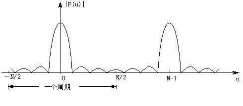

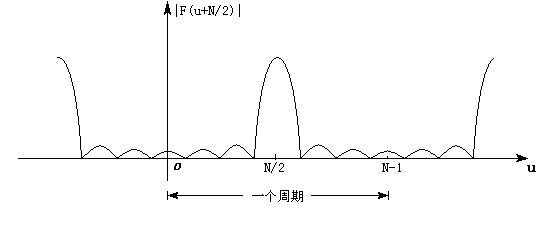

（a）幅度谱

（b）原点平移后的幅度谱

## Slide 92

Slide

用(-1)x+y 乘以输入的图像函数，则有：

原点F(0,0)被设置在 u = M/2和v = N/2上。

## Slide 93

Slide

图像频谱

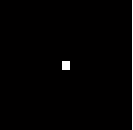

（a）原始图像

(b) 中心化前的频谱图

（c）中心化后的频谱图

## Slide 94

Slide

3．离散卷积定理

设f (x, y)和g(x, y) 是大小分别为A×B和C×D的两个数组，则它们的离散卷积定义为

卷积定理

一些图像处理方法利用了空域上的卷积运算。
在频域的乘积运算比在空域的卷积运算快，

## Slide 95

性质列表

Slide

## Slide 96

性质列表

## Slide 97

Slide

DFT的显示

①对称平移：将 F(u,v) 的0点移至频谱图的中心以便观察。

## Slide 98

DFT的显示

## Slide 99

Slide

DFT的显示

①对称平移：将 F(u,v) 的0点移至频谱图的中心以便观察。

## Slide 100

Slide

② 值域动态范围压缩：

DFT的显示

傅里叶变换模的值大于显示区域，要进行值域的动态压缩。

## Slide 101

Slide

【例】用MATLAB实现图像的傅里叶变换。

【解】MATLAB程序如下：
I = imread('pout.tif');	%读入图像
imshow(I);	                %显示图像
F1 = fft2(I);	    %计算二维傅里叶变换
figure, imshow(log(abs(F1)+1),[0 10]);
%显示对数变换后的频谱图
F2 = fftshift(F1);	%将直流分量移到频谱图的中心
figure, imshow(log(abs(F2)+1),[0 10]);
%显示对数变换后中心化的频谱图

## Slide 102

Slide

(a) 原始图像

(b) 傅里叶变换频谱图

(c) 中心化的频谱图

## Slide 103

单击此处添加标题

图像的频率指什么?
图像的频率是表征图像中灰度变化剧烈程度的指标,是灰度在平面空间上的梯度。如:大面积的沙漠在图像中是一片灰度变化缓慢的区域,对应的频率值很低;而对于地表属性变换剧烈的边缘区域在图像中是一片灰度变化剧烈的区域,对应的频率值较高。

## Slide 104

傅立叶变换系数矩阵F(u,v)的特征

变换之后的图像（频率谱）在原点平移之前四角是低频最亮部分），平移之后中间部分是低频（最亮部分），亮度大能量大（幅值比较大），说明图像的能量主要集中在低频区间。

## Slide 105

（a）原始图像     (b) 中心化前的频谱图  (c) 中心化后的频谱

## Slide 106

例 2-D图像函数和傅里叶频谱的显示

旋转不变性

## Slide 107

平移不变性

## Slide 108

点源函数

双点源函数

线源函数

菱形函数

例 2-D图像函数和傅里叶频谱的显示

## Slide 109

描述纹理

## Slide 110

Slide

相位与幅度， 谁更重要

## Slide 111

Slide

## Slide 112

Slide

3.5.6 傅里叶变换的应用

1.  反映频域特性，频谱能量集中；
2.  平移不变性，旋转不变性；
3.  将卷积运算化为乘积运算。

在图像增强中的应用
在图像压缩中的应用

傅里叶变换特点：

傅里叶变换的应用

## Slide 113

问题

1. 图像离散傅里叶变换的频谱图的显示有什么要求？

2. 图像离散傅里叶变换后的频率表示什么？

3. 图像离散傅里叶变换F（0,0）表示什么？
4. 图像离散傅里叶变换的特点？

## Slide 114

问题

①图像离散傅里叶变换的频谱图的显示有什么要求？

②图像离散傅里叶变换后的频率表示什么？频谱图能量集中在哪个频段？

图像的频率是表征图像中灰度变化剧烈程度的指标，
是灰度在平面空间上的梯度。

③图像离散傅里叶变换F(0,0）表示什么？

图像的平均灰度。

1. 对称平移，F(0,0)平移到至频谱图的中心点；
2. 值域动态范围压缩，傅里叶变换模的值大于显示区域，要进行值域的动态压缩。

## Slide 115

Slide

3.6  二维离散余弦变换（DCT）

3.6.1 ：一维离散余弦变换
傅里叶变换的参数都是复数，在数据的描述上相当于实数的两倍。

实偶函数的傅里叶变换必然是实偶函数。基本思想是将一个实函数对称延拓成一个实偶函数，则其傅里叶变换为实偶函数，仅包含余弦项。连续函数和离散函数的余弦变换都是基于这一原理。

## Slide 116

Slide

1、1维DCT

给定实信号序列                                ，可以按下式将其延拓为偶对称序列。

显然，g(x)是以x=0为中心的偶对称函数。

离散余弦变换

## Slide 117

Slide

对g(x)求2N个点的一维DFT，有

离散余弦变换

## Slide 118

考虑到g(x)为偶函数，即g(x)=g(-x)，并对上式运用欧拉公式可得

离散余弦变换

## Slide 119

Slide

即
用y=x-1/2对上式作变量代换后，再用x代替y可得

离散余弦变换

## Slide 120

Slide

3.6.1  一维离散余弦变换（DCT）

对上式乘以K(u)，以便将其表示成归一正交矩阵形式，就可得f(x)的一维DCT为：
其中

一维DCT的表示:

## Slide 121

一维DCT正变换核都为：
且

离散余弦变换

## Slide 122

可以验证有：
也即，C是正交矩阵。由此可知，离散余弦反变换与正变换核C(x,u)形式上是相同的。但由于变换核C是不对称的，因此正、反变换矩阵并不等同。

离散余弦变换

## Slide 123

一维DCT反变换定义式可表示为：

一维DCT变换的正、反变换的矩阵形式为：

离散余弦变换

## Slide 124

当N＝4时，一维DCT的正变换矩阵为：
一维反变换矩阵为：

离散余弦变换举例

## Slide 125

例：计算f＝[1 3 3 1]的余弦变换

离散余弦变换举例

## Slide 126

Slide

3.6.2  二维离散余弦变换（DCT）

基本思想：形成二维偶函数。先做水平镜像，在做垂直镜像。

二维离散余弦变换定义：

## Slide 127

Slide

Slide

【例】应用MATLAB实现图像的DCT变换。

【解】MATLAB程序如下：
I = imread('wpeppers2.png');
J = rgb2gray(I);        %转换彩色图像为灰度图像
subplot(1,2,1),imshow(J); %显示原灰度图像
K = dct2(J);                       %对图像做DCT变换
subplot(1,2,2), imshow(log(abs(K)+1),[0 10]);
%显示DCT变换结果

## Slide 128

Slide

Slide

图3.6  离散余弦变换

（a）wpeppers2图像

（b）wpeppers2 图像的DCT系数

## Slide 129

Slide

Matlab矩阵离散余弦变换

## Slide 130

Slide

离散余弦变换为实正交变换；
离散序列的余弦变换是DFT的对称扩展形式；
和傅里叶变换相同，DCT也存在快速变换；
和傅里叶变换类似，DCT具有将高度相关的数据能量集中的优势。

3.6.3  二维离散余弦变换的性质

## Slide 131

## Slide 132

## Slide 133

Slide

3.6.4  二维DCT的应用

典型应用是对静止图像和运动图像进行性能优良的有损数据压缩，与DFT相似，高频部分压缩多一些，低频部分压缩少一些。
DCT具有很强的能量集中在频谱的低频部分的特性，而且当信号具有接近马尔可夫过程的统计特性时，DCT的去相关性接近于具有最优去相关性的K-L变换的性能。

## Slide 134

Slide

3.7 二维离散沃尔什-哈达玛变换

前面的变换是余弦型变换，基底函数选用的是余弦型。
图像处理中有些变换常常选用方波信号或者它的变形。
沃尔什（Walsh）变换，哈达码变换。
沃尔什函数是一组矩形波，其由取值为1和-1的基本级数展开而成的，满足完备正交性。属于方波型正交变换。
沃尔什函数是二值正交函数，与数字逻辑中二个状态相对应。因此他更适用与计算机技术，数字信号处理。

## Slide 135

沃尔什函数系的前10个函数

列率排列

## Slide 136

Slide

一维沃尔什变换

正变换：
逆变换：

## Slide 137

Slide

一维沃尔什变换核g(x,u)

N = 2n，变换核为

x,u=0,1,…,N-1,N=2n,
bk(x)表示x的二进制码的第k位值,
如n = 3,   对 x = 6 (110)2       有 b0(x) = 0，b1(x) = 1，b2(x) = 1

## Slide 138

Slide

例：求沃尔什变换元素（N=4）

一维沃尔什变换举例

## Slide 139

Slide

可见沃尔什变换的本质是将离散序列f(x)的各项值符号按一定的规律变化，进行加减运算。

F(0)=(1/4)*[f(0)+f(1)+f(2)+f(3)]
F(1)=(1/4)*[f(0)+f(1)-f(2)-f(3)]
F(2)=(1/4)*[f(0)-f(1)+f(2)-f(3)]
F(3)=(1/4)*[f(0)-f(1)-f(2)+f(3)]

一维沃尔什变换举例

## Slide 140

| N |  | 2(n=1) |  | 4(n=2) |  |  |  | 8(n=3) |  |  |  |  |  |  |  |
| --- | --- | --- | --- | --- | --- | --- | --- | --- | --- | --- | --- | --- | --- | --- | --- |
取值   对称   正交

（忽略系数1/N）

由                   得沃尔什变换矩阵的值

佩利排列（自然排列）

## Slide 141

Slide

排列方式：佩利（Paley）排列、列率排列、和哈达玛（Hadamard）排列。
沃尔什变换的排列方式为列率排列。

## Slide 142

Slide

二维沃尔什变换

正变换：
逆变换：

变换核：可分离的，对称的

## Slide 143

Slide

不难看出，与傅里叶变换一样，二维沃尔什变换是可分离的，可以通过两个一维沃尔什变换完成计算。

沃尔什变换也有快速算法，与FFT方法类似，差别只是将FFT的旋转因子    变为1。

## Slide 144

Slide

【例】求图像 f 的沃尔什变换

【解】采用MATLAB程序求解W。
f=[1 3 3 1;1 3 3 1;1 3 3 1;1 3 3 1];
G = [1 1 1 1; 1 1 -1 -1; 1 -1 -1 1; 1 -1 1 -1];
W = (1/16)*G*f*G

列率排列

## Slide 145

Slide

得到F后，通过反变换公式f=GFG,得到图像矩阵。

运行结果为
W =
2     0    -1     0
0     0     0     0
0     0     0     0
0     0     0     0

【例】求图像 f 的沃尔什变换

## Slide 146

Slide

运行结果为
f =
1     3     3     1
1     3     3     1
1     3     3     1
1     3     3     1

反变换求得的f矩阵与原矩阵相同。
沃尔什变换是无损的对称正交变换。

【例】求图像 f 的沃尔什变换

## Slide 147

Slide

二维沃尔什变换具有能量集中的作用。而且原始数据中数字越是均匀分布，经变换后的数据越是集中于矩阵的边角上。
因此，二维沃尔什变换可应用于图像压缩。

【例】求图像 f 的沃尔什变换

## Slide 148

Slide

3.7.2  哈达玛变换

哈达玛矩阵：与沃尔什矩阵类似，元素仅由＋1和－1组成的正交方阵。
正交方阵：指它的任意两行（或两列）都彼此正交。
哈达玛变换要求图像的大小为N＝2n 。
一维哈达玛变换核为
其中， bk(z) 代表z的二进制表示的第k位值。

## Slide 149

Slide

一维、二维哈达玛正、逆变换

一维哈达玛正变换
一维哈达玛逆变换
二维哈达玛正变换
二维哈达玛逆变换

## Slide 150

Slide

高阶哈达码矩阵

正反变换都可通过两个一维变换实现。
高阶哈达玛矩阵可以通过如下方法求得：

哈达码排列

## Slide 151

Slide

N＝8的哈达玛矩阵为

行率：每行符号
改变的次数

## Slide 152

3.7.3 沃尔什与哈达码矩阵

Slide

将无序的哈达码矩阵按照有序的行率（列率）排序，即得到有序的沃尔什变换矩阵。

根据4阶哈达码矩阵写出4阶沃尔什矩阵形式：

## Slide 153

Slide

【例3.5】求图像 f 的哈达码变换。

【解】采用MATLAB程序求解H。
f=[1 3 3 1;1 3 3 1;1 3 3 1;1 3 3 1];
G = [1 1 1 1; 1 -1 1 -1; 1 1 -1 -1; 1 -1 -1 1];
H = (1/16)*G*f*G

## Slide 154

Slide

运行结果为
H=
2     0     0    -1
0     0     0     0
0     0     0     0
0     0     0     0

哈达码变换结果与沃尔什变换结果相比，只是顺序不同，不影响压缩。

## Slide 155

哈达码变换的Matlab实现

## Slide 156

2-D哈达码变换

哈达码变换的Matlab实现

## Slide 157

一副图像如下所示，已知该图像有4个灰度级，请写出该图像的沃尔什变换结果。
（1）请写出该图像的灰度矩阵（5分）；
（2）请写出沃尔什变换矩阵（5分）；
（3）请写出沃尔什变换的过程和结果（5分）。

## Slide 158

问题

1、离散余弦变换的特点？

2、沃尔什变换和哈达码变换的异同点？沃尔什变换的矩阵表达式？
3、求N=8对应的沃尔什变换核矩阵。

离散余弦变换为实正交变换；
和傅里叶变换类似，DCT具有将高度相关的数据能量集中的优势。

## Slide 159

KL（Karhunten-Loeve)或者DKT，也称为Hotelling变换，特征向量变换（Eigenvector-Based Transform）、主分类分析等。
他是一种利用图像的统计特征/统计模型的变换，常用在数据压缩、特征提取等方面。

3.8 卡胡南-列夫变换（K-L变换）

基本思想：提取空间原始数据的主要特征，减少数据冗余，使得数据在一个低维的特征空间被处理，同时保持原始数据的大部分信息，从而解决数据空间维数过高的瓶颈问题。

## Slide 160

Slide

3.8 卡胡南-列夫变换（K-L变换）

KL变换的特点：
目的是寻找任意统计分布的数据集合主要分量的子集。
基向量满足相互正交性，可将原始数据集合互相关性(cross-correlation)降低到最低点，也即消除数据的相关性。

## Slide 161

fi 表示研究图像N*N 的f(x,y)的一个样本，按行将所有像素点灰度值写成列向量表示如下：

Xi 为N2 *1 的随机向量

## Slide 162

K-L变换的要求

如何得到这样的变换？

选取合适的变换T，变换后向量Y满足：

(1)  Y 是具有M<<N2 个分量的向量；
(2) 逆变换后恢复的   ，和原图像X的均方误差最小。

满足这两个条件的正交变换为K-L变换。

## Slide 163

图像均值和方差定义如下：
均值：
协方差：

## Slide 164

Cx是一个N2×N2的实对称矩阵。

由M帧图像，其平均向量和协方差矩阵可近似表示如下：

## Slide 165

由特征向量构成的矩阵是一个正交矩阵

设：

那么K-L变换的变换核矩阵表示为：

## Slide 166

A 是按照特征值大小顺序排列的特征向量构成的变换矩阵，特征值小的部分对图像的影响不大，图像的能量主要集中在特征值较大的特征向量上。

## Slide 167

K-L变换的优点：
1、完全去除原信号X中的相关性；
2、将N个特征值按照大小顺序排列，即
，若将                 舍去后，保留了原信号的最大能量
3、将Y截短时，均方误差最小；

K-L变换的缺点：
计算复杂、计算量大；难以应用。

## Slide 168

下图给出了利用不同的k 个最大特征值对应的特征向量进行降维重建后的估值图像，当k=64 时，重建的图像效果已经很好。

(1) k=8                        (2) k=16                       (3) k=32                  (4)  k=64

K-L变换举例（压缩）

## Slide 169

K-L变换举例（去相关性）

## Slide 170

K-L变换举例（去相关性）

## Slide 171

Slide

3.9  二维离散小波变换

小波分析是20世纪80年代开始逐渐发展成熟的应用数学的一个分支。
主要特点：
对时间（二维信号为空间）-频率的双重分析和多分辨率分析能力。
被誉为“数学显微镜”，在信号和图像处理等领域具有重要的应用价值。

## Slide 172

3.9.1 小波变换－引言

实际中绝大多数信号是时域信号，即获取到的信号是时间变量的函数
为什么我们需要频域信息？
多数情况下，最明显的差异信息表现在频域中

## Slide 173

傅里叶变换思想

基本思想：将信号分解成一系列不同频率的连续正弦波的叠加
将信号从时间域转换到频率域

## Slide 174

平稳信号

f1=5hz
f2=25hz
f3=50hz

非平稳信号
信号的频率随着时间发生变化

## Slide 175

傅里叶变换的局限

可以准确地知道频率成分，但不知道这些频率出现的位置和延续的时间

F5(u)

非平稳信号

## Slide 176

FT缺乏局域性
整体上将信号分解为不同频率分量
不能确定某个频率分量发生在哪些时间内

不能处理非平稳信号

短时傅里叶变换

可否假设在信号的局部是平稳信号呢？

傅里叶变换的局限性

## Slide 177

短时傅里叶变换

由于傅立叶变换反映的是整个信号全部时间下的整体频域特征，无法作任何的局部分析，为此，人们提出了短时傅里叶变换（STFT）的概念，即窗口傅里叶变换。
短时傅里叶变换将整个时间域分割成一些小的等时间间隔，然后在每个时间段上用傅里叶分析，它在一定程度上包含了时间频率信息，但由于时间间隔不能调整，因而难以检测持续时间很短、频率很高的脉冲信号的发生时刻。

## Slide 178

短时傅里叶变换

信号f (x)的窗口傅里叶变换定义为

WFT的重构公式为

常见的窗函数具有相对短的时间窗宽，例如可选为高斯函数，所以WFT也称为短时傅里叶变换（ STFT）。

## Slide 179

短时傅里叶变换

## Slide 180

短时傅里叶变换

## Slide 181

窗口傅里叶变换是一种大小及形状均固定的时频化分析。
实际信号进行时间和频率分析时，分辨率往往是相对的，即反映信号高频成分需要较高的时间分辨率，因此窗函数宽度应该窄一些，而反映低频成分则需要较高的频率分辨率，窗函数宽度应该宽一些。
窗口傅里叶变换不能满足上述要求。

## Slide 182

3.9.2 小波变换

小波分析拓展了信号STFT，实现了一种新的时频分析方法，其时窗可以随着频率增高而缩小，频率减低而增大，有效地解决信号短时傅里叶变换的缺陷，因而得到广泛应用。
小波变换具有良好的局部时频聚焦特性，而被称为“数学显微镜”。

## Slide 183

小波(wavelet)是什么？---“小区域的波形”
“小”是指在时域具有紧支集或近似紧支集（局部非零，波形具有衰减性）
“波”是指具有正负交替的波动性，包含频率的特性，直流分量为0。
小波概念：是定义在有限间隔而且其平均值为零的一种函数。

波

小波

什么是小波？

## Slide 184

Slide

哈尔提出了一种正交归一化函数系，以其作为正交规范基的哈尔变换收敛均匀而迅速，在图像信息压缩和特征编码等方面获得应用。
哈尔变换特点：
（1）具有尺度和位移两个特性；
（2）变换范围窄；
（3）变换特性与图像边界的特性十分接近。

## Slide 185

Slide

Haar函数系的前几个函数波形

Haar函数的定义域t为[0,1]，可将它延拓到整个时间轴。
Haar函数表示为har(2p + n, t)，其中p = 1, 2, …, ；n = 0, 1,…, 2p – 1。

## Slide 186

设           ，当      满足允许条件时：

称      为一个“基本小波”或“母小波”。

3.9.3  连续小波变换

## Slide 187

Slide

3.9.3  连续小波变换

按如下方式生成的函数族为连续小波（分析小波）：

 (x)称为基本小波或母小波
a称为伸缩因子，b为平移因子。母波可由平移与尺度变换构造小波基函数。

## Slide 188

Slide

小波函数的平移与扩展

## Slide 189

Slide

信号的连续小波变换

正变换：
反变换：

小波变换的含义是：

把基本小波(母小波)的函数    作位移后，再在不同尺度下与待分析信号作内积，就可以得到一个小波序列。

## Slide 190

连续小波变换示意图：

1.  基小波 和原始信号f(t)求 积分，计算与原始信号的相似度C，C值越大，相似度越大 。
2. 小波右移nk， 得到小波基函数 ，重复步骤1，。
3. 扩展小波，如扩展一倍，得到小波基函数，重复步骤1和2，直到信号结束.
4. 压缩小波，如压缩一半，得到小波基函数，重复步骤1和2，直到信号结束.
5. 进行不同尺度和平移变换，重复步骤1和2.

## Slide 191

Slide

3.9.4  一维离散小波变换

把连续小波变换离散化更有利于实际应用。
对a和b按如下规律取样：
其中             ；              ；                ，得离散小波：

离散小波变换和逆变换为

## Slide 192

Slide

3.9.5  二维离散小波变换

信号f (x, y)的连续小波变换Wf (a,bx,by)为

由Wf (a,bx,by)重构f (x, y)的小波逆变换为

## Slide 193

Slide

图像小波变换

（a）1层分解              （b）2层分解                （c）3层分解

LL：即近似图像；HL：即水平细节图像 LH：即垂直细节图像 HH：即对角线细节图像。

图像小波变换可以依据二维小波变换按如下方式扩展，在变换的每一层次，图像都被分解为4个四分之一大小的图像。

## Slide 194

Harr小波2级分解

Haar小波3级分解

haar多尺度分解实例

这样就构成了2D DWT的金字塔结构。

## Slide 195

## Slide 196

Slide

由于小波变换的理论和算法比较复杂，从应用的角度看，可以将注意力集中在用MATLAB对图像进行小波变换和重构的实现过程中。

## Slide 197

Slide

3.10  二维数字滤波器

尺寸为M×N的待处理输入为f(x,y)，其DFT为F(u,v)；系统的单位脉冲响应为h(x,y)，其DFT为H(u,v)；已处理的输出图像为g(x,y) ，其DFT为G(u,v)，则

g(x,y) = f(x,y)*h(x,y) =

二维数字滤波器空域和频域框图

G(u,v) = F(u,v)·H(u,v)

## Slide 198

Slide

二维数字滤波器

（a）二维LPF的频率响应

## Slide 199

Slide

二维FIR低通数字滤波的实例

（b）原始测试图像   （c）经低通滤波后的图像

## Slide 200

Slide

二维数字滤波器

（c）二维HPF的频率响应

## Slide 201

Slide

二维FIR高通数字滤波的实例

滤波后的图像在慢变化部分产生了明显的模糊现象，符合高通特性。

（a）原始测试图像                 （d）经高通滤波后的图像

（a）原始测试图像        （d）经高通滤波后的图像

## Slide 202

Slide

本章小结

图像变换可以直接在空间域进行，也可以通过频域变换的手段达到更好的效果。
图像变换是图像处理中常用的有效手段，对实现某些图像处理和后期的图像分析起着十分重要的作用。

## Slide 203

Slide

重点是几何变换，傅里叶变换、离散余弦变换，沃尔什哈达码变换。

## Slide 204

作业：

4.1 ，4.2，4.4，4.6，4.10 ,4.11, 4.12

Slide
