# 第04章 图像增强

## Slide 1

Slide

第4章  图像增强

## Slide 2

Slide

数字图像往往要经过采集、处理、存储、传输等一系列加工变换，而由电气系统和外界引入的图像噪声也将在这些过程中随之引入，可能严重影响图像的质量。
图像噪声消除或减低在图像预处理中的地位显得十分重要。

4.1  概述

## Slide 3

4.1.1  图像增强的目的

Slide

4.1  概述

改善图像视觉效果，提高图像清晰度。
平滑，降噪----图像清晰

利于后期图像处理
锐化----突出轮廓边缘，便于后期特征分析

## Slide 4

Slide

椒盐（salt&pepper）噪声：含有随机出现的黑白强度值。
脉冲噪声：只含有随机的白强度值（正脉冲噪声）或黑 强度值（负脉冲噪声）。
高斯噪声：含有强度服从高斯或正态分布的噪声。
高斯噪声是许多传感器噪声的模型，如摄像机的电子干扰噪声。

4.1  概述

## Slide 5

Slide

## Slide 6

4.1.1  图像增强的方法

Slide

4.1  概述

## Slide 7

Slide

4.1.2  图像增强的方法

在空间域直接对像素灰度值进行运算。
f (x, y)是待增强的原始图像,
g(x, y)是已增强的图像,
h(x, y)是空间运算函数。

1．空间域增强法

## Slide 8

Slide

1.  空间域增强模型

对点运算操作有：
g(x,y) = f(x,y) ·h(x,y)          （4.1）
对于邻域增强操作有
g(x,y) = f(x,y)*h(x,y)         （4.2）

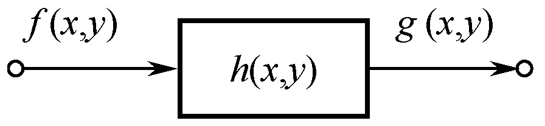

图4.1  空间域增强模型

## Slide 9

Slide

2．频率域增强法

在频率域利用二维滤波器H(u, v)对f (x, y)进行滤波，得到新的频谱G(u, v)，即
G(u, v) = F(u, v)·H(u, v)           （4.3）

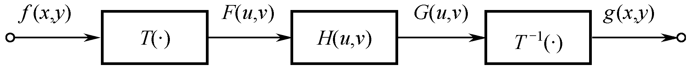

图4.2  频率域增强模型

## Slide 10

Slide

H(u, v)的性质
可能是低通，起平滑作用；
也可能是高通，起锐化作用。

实际的图像增强方案可能综合上述两种技术。
如同态滤波增强包含了空间域灰度的非线性运算，也有高频增强环节。

## Slide 11

Slide

4.2  点运算

点运算操作：
g(x,y) = f(x,y) ·h(x,y)

点运算要求：

一幅输出图像上每个像素的灰度值仅由相应输入像素的灰度值决定，而与像素点所在的位置无关，与相邻的像素之间也没有运算关系。

像素的逐点运算：

像素值通过运算改变之后，可以改善图像的显示效果。

## Slide 12

Slide

点运算的方法

一般有三种方法：

（1）灰度级校正解决成像不均匀问题。

（2）灰度变换解决图像曝光不足问题。

（3）直方图修正以突出所需要的图像特征。

## Slide 13

Slide

4.2.1  灰度级校正

适用场景：
光照的强弱、感光部件的灵敏度、光学系统的不均匀性、元器件特性的不稳定，可引起图像亮度分布的不均匀。
灰度级校正目的：
在图像采集系统中对图像像素进行逐点修正，使得整幅图像能够均匀成像。

## Slide 14

Slide

设理想真实的图像为 f (x, y) ，实际获得的畸变的图像为 g(x, y) ，则有

灰度级校正的原理：

采用一幅灰度级为常数C的图像成像，若经成像系统的实际输出为gC(x, y)，则有
gC(x, y) = C e (x, y) 	                 （4.6）

g(x, y) = e(x, y)f (x, y) 	         （4.5）
e(x, y)是使理想图像发生畸变的比例因子。
知道了e(x, y) , 就可以求出不失真图像。

## Slide 15

Slide

标定系统失真系数的方法

注意：乘了一个系数C/ gc(i,j) ，校正后可能出现“溢出”现象需再作适当的灰度变换，最后对变换后的图像进行量化。

## Slide 16

Slide

非均匀光照的校正

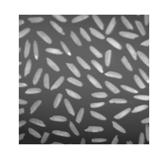

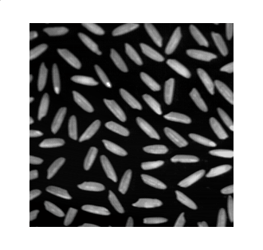

（a）校正前的图像

（a）校正后的图像

## Slide 17

Slide

4.2.2  灰度变换

为了将图像灰度级的整个范围或一段范围扩展或压缩到显示设备的动态范围内，可使图像动态范围增大或减小。

灰度变换目的：

灰度变换方法：
线性变换、分段线性变换和非线性变换几种方法。

适用场景：
环境光源太暗，使灰度值偏小，就会使图像太暗看不清。
如果环境光源太亮，又使图像泛白

## Slide 18

Slide

b

a

c

d

b

a

d

c

g (m , n )

f (m, n)

g ( m , n )

灰度线性变换关系

（a）

（b）。

（a） k  d  c  0	（b）k  d  c  0
b  a                                  b  a

1．线性变换

## Slide 19

Slide

1．线性变换

灰度g与灰度f之间的关系为

## Slide 20

（1）扩展动态范围。若[a,b]   ＞ [c,d],即k＞1，结果会使图像灰度取值的动态范围展宽，这样就可以改善曝光不足的缺陷。
（2）缩小动态范围。若[a,b]  ＜  [c,d],即0＜k＜1，结果会使图像动态范围变窄。
（3）改变取值区间。若k=1,即d-c=b-a,则变换后灰度动态范围不变，但灰度取值区间会随a和c的大小而平移。
（4）反转或取反。若k＜0，则变换后的图像的灰度值会反转，即原亮的变暗，原暗的变亮。k=-1时，g(m,n)即为f(m,n)的取反。

Slide

根据[a,b] 和[c,d]的取值大小可有如下几种情况：

## Slide 21

Slide

Matlab程序：采用线性变换进行图像增强

应用函数imadjust将图像在0.3×255～0.7×255灰度之间的值通过线性变换映射到0～255之间。
【解】实现的程序如下：
I = imread('pout.tif');
imshow(I);
figure,imhist(I);	%显示原始图像的直方图
J = imadjust(I,[0.3 0.7],[]);
%使用imadjust函数进行灰度的线性变换
figure,imshow(J);
figure,imhist(J)	%显示变换后图像的直方图

## Slide 22

Slide

图像线性变换

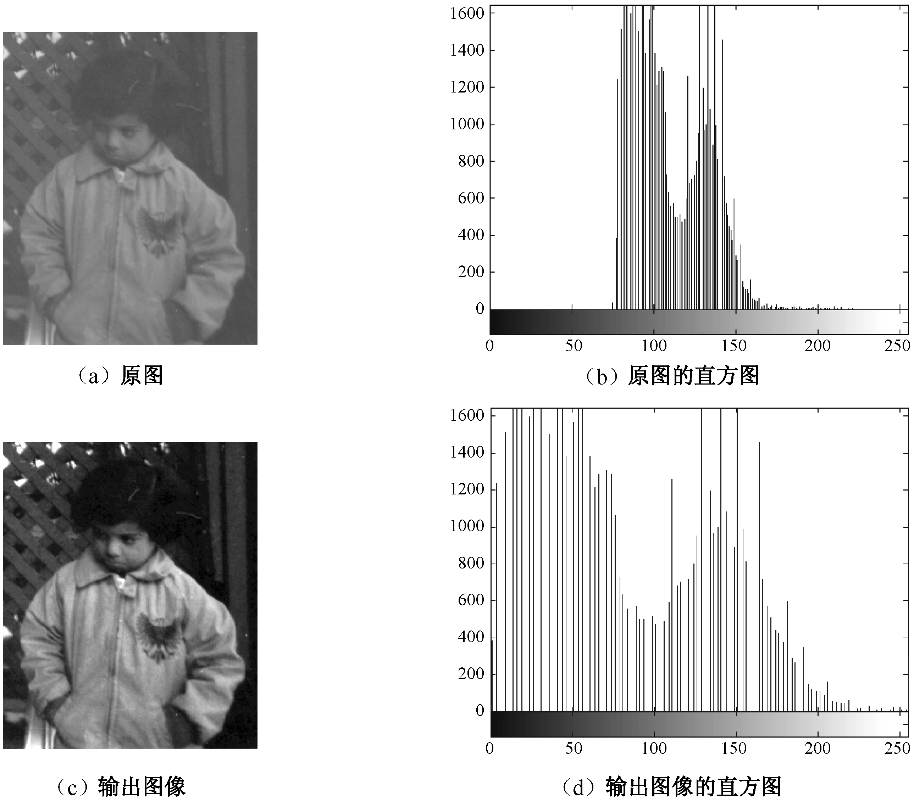

原图灰度图像较模糊，不清晰，直方图范围窄，灰度范围进行线性拉伸，是图像灰度值映射到【0 255】之间，图像视觉效果改善，对比度增强。

## Slide 23

Slide

2．分段线性变换

对整个灰度区间进行分段，采用分段线性函数进行变换。
这种变换突出了感兴趣的目标或灰度区间，相对抑制那些不感兴趣的灰度区间。
常用的是三段线性变换。

## Slide 24

Slide

应用在遥感图像分类中：感兴趣的地貌特征可能有明显的灰度变化，而那些过黑或过白的像素往往对应于玄武岩、水、冰等。

b

a

c

d

b

a

M

c

N
d

f (m, n)

g (m, n)

f (m, n)

图4.1.2	灰度分段线性变换关系
（a）扩展感兴趣的，牺牲其它   （b）扩展感兴趣的，压缩其它

g (m, n)

2．分段线性变换

## Slide 25

灰度分段线性变换

（1）扩展感兴趣的，牺牲其他
对于感兴趣的[a,b]区间，采用斜率大于1的线性变换来扩展，而把其他区间用a,b来表示。变换函数为：

Slide

（2）扩展感兴趣的，压缩其他
在扩展感兴趣的[a,b]区间的同时，为了保留其他区间的灰度层次，也可以采用其他区间压缩的方法。变换函数为：

## Slide 26

Slide

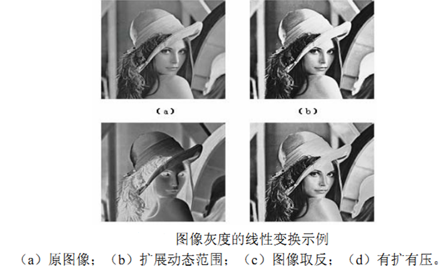

## Slide 27

Slide

X2=0.7

X1=0.3

Y1=0.15

Y2=0.85

I(i, j)

out (i, j)

X=imread('lena.bmp');
I=rgb2gray(X);
subplot(2,2,1);
imshow(I);
[M,N]=size(I);
I=im2double(I);
out=zeros(M,N);
X1=0.3;Y1=0.15;
X2=0.7;Y2=0.85;

分段线性变换对图像增强：

## Slide 28

Slide

for i=1:M
for j=1:N
if I(i,j)<X1
out(i,j)=Y1;
elseif I(i,j)>X2
out(i,j)=Y2;
else
out(i,j)=(I(i,j)-X1)*(Y2-Y1)/(X2-X1)+Y1;
end
end
end
subplot(2,2,2);imshow(out);subplot(2,2,3);imhist(I);
subplot(2,2,4);imhist(out);

## Slide 29

Slide

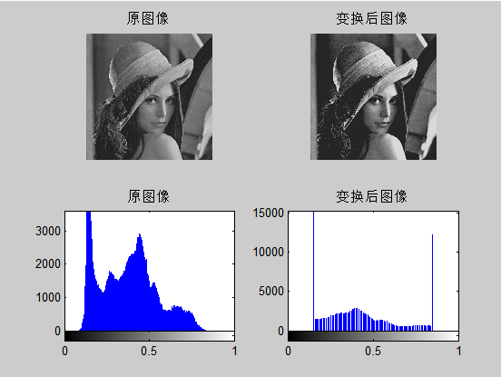

## Slide 30

Slide

3．非线性灰度变换

1. 对数变换的一般表达式为：
g = a + clog(f + 1)

有时原图的灰度值动态范围太大，超出某些显示设备的允许动态范围，如直接使用原图，则一部分细节可能丢失。
解决办法是对原图进行灰度压缩，如对数变换。

## Slide 31

Slide

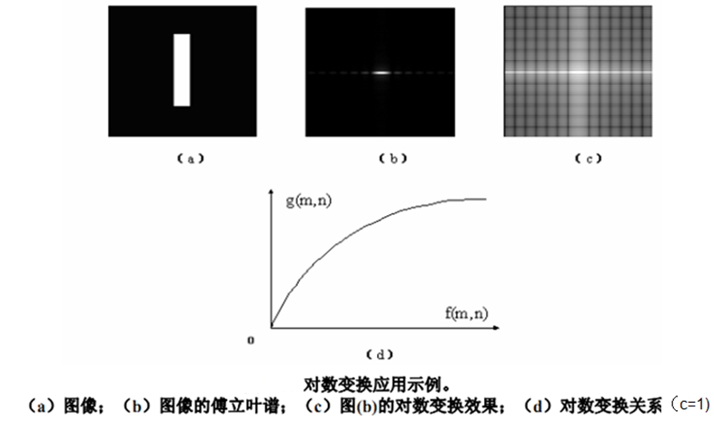

对数变换可以增强低灰度级的像素，压制高灰度级的像素,使灰度分布与视觉特性相匹配。

对数变换的特点？

## Slide 32

2. 幂次变换
其一般表达式为：

Slide

  1 提高灰度级，在正比函数上方，使图像变亮
  1 降低灰度级，在正比函数下方，使图像变暗

幂次变换的特点？

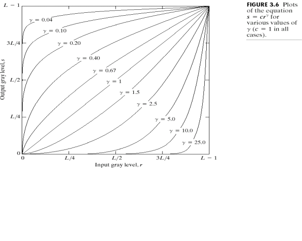

## Slide 33

Slide

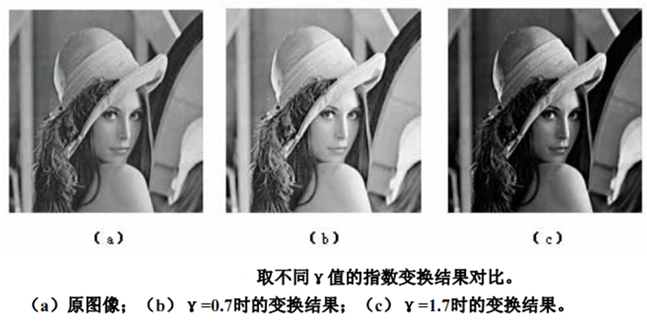

## Slide 34

Slide

  0.4
增强效果最好

例：人体胸上部脊椎骨折的核磁共振图像
  1 提高灰度级，使图像变亮。c=1,  0.6,0.4,0.3

## Slide 35

Slide

例：航空地面图像
  1                                    降低灰度级，使图像变暗c=1,   3,4,5

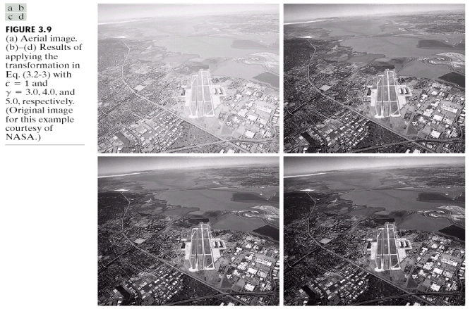

## Slide 36

Slide

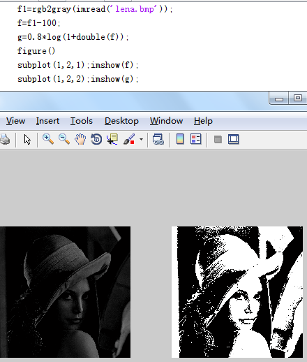

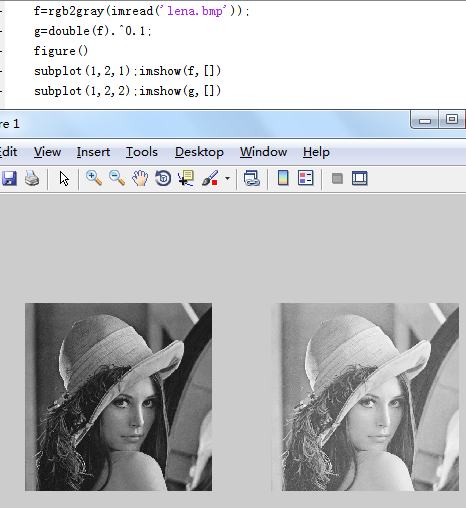

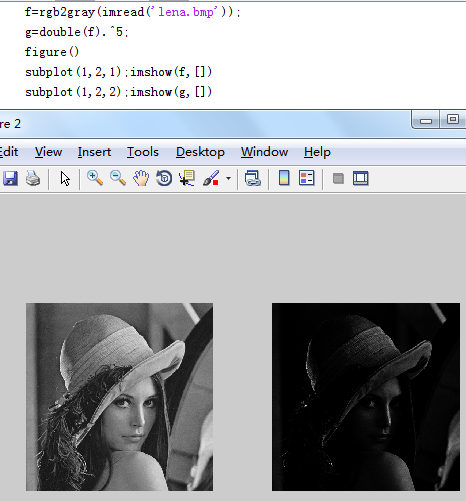

## Slide 37

问题

1、图像增强包含哪些方法
空域法包括：
频域法包括：

Slide

3、图像的非线性变换中，对数变换和幂次变换的特点。

2、图像的线性变换和分段线性变换的特点。

## Slide 38

Slide

4.2.3  灰度直方图变换

一个灰度级范围为[0，L-1]的数字图像的直方图是一个离散函数
p(rk)= nk
nk是图像中灰度级为rk的像素个数
rk 是第k个灰度级，k = 0,1,2,…,L-1
即，图像中不同灰度级像素出现的次数

图像直方图的定义（1）

## Slide 39

Slide

4.2.3  灰度直方图变换

一个灰度级范围为[0，L-1]的数字图像的直方图是一个离散函数
p(rk)= nk/n
nk是图像中灰度级为rk的像素个数
rk 是第k个灰度级，k = 0,1,2,…,L-1
n 是图像的像素总数
即，图像中不同灰度级像素出现的频率

图像直方图的定义（2）

## Slide 40

Slide

使函数值正则化到[0,1]区间，成为实数函数
给出灰度级rk在图像中出现的概率密度统计

p(rk)= nk
p(rk)= nk/n

定义(1)
定义(2)

其中定义（2）

两种图像直方图定义的比较

## Slide 41

Slide

求图像的归一化直方图。

【解】lena图像是彩色图像，进行格式转换。
I = imread('lena.jpg');
J = rgb2gray(I);%将彩色图像转换为灰度图像
imshow(J);
N = numel(J);		%求图像像素的总数
Pr = imhist(J)/N;	%显示原始图像的直方图
k=0:255;
figure, stem(k,Pr)

## Slide 42

Slide

归一化直方图

（a）lena图像          （b）lena图像的直方图

## Slide 43

Slide

直方图是一幅图像中各像素灰度出现频次的统计结果，它只反映图像中不同灰度值出现的次数，而不反映某一灰度所在的位置。
任何一幅图像，都有惟一确定的与它对应的直方图，但不同的图像可能有相同的直方图。
由于直方图是对具有相同灰度值的像素统计得到的，因此，一幅图像各子区的直方图之和就等于该图像全图的直方图。

## Slide 44

问题

Slide

| 3 | 9 | 9 | 8 |
| --- | --- | --- | --- |
求该图像的灰度直方图。

## Slide 45

Slide

直方图变换后可使图像的灰度间距拉开或使灰度分布均匀，从而增大对比度，使图像细节清晰，达到增强的目的。

4.2.3  灰度直方图变换

直方图变换有两类
直方图均衡化;
直方图规定化

直方图的变换目的：

## Slide 46

Slide

直方图均衡化达到的效果

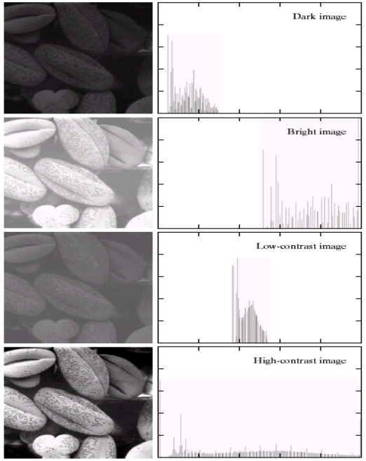

## Slide 47

直方图均衡化条件：

Slide

s=T(r)	0≤r≤1
T(r)满足下列两个条件：
（1）T(r)在区间0≤r≤1中为单值且单调递增
（2）当0≤r≤1时,0≤T(r) ≤1
条件（1）保证原图各灰度级在变换后仍保持从黑 到白（或从白到黑）的排列次序
条件（2）保证变换前后灰度值动态范围的一致性

当变换函数是原图像直方图累计分布函数时，
能达到直方图均衡化的目的。

## Slide 48

直方图均衡化的计算过程如下：

（1）列出图像的灰度级：i, j ： 0,1,…, L -1，其中L是灰度级级数。
（2）统计原图像各灰度级的像素个数 ni	；
（3）计算原始图像归一化直方图 ；
（4）计算累计直方图  ；
（5）利用灰度变换函数计算变换后的灰度值；
（6）确定灰度变换关系 ，据此将原图像的灰度值i修正为j；
（7）统计变换后各灰度级的像素个数 nj；
（8）计算变换后图像的归一化直方图   。

Slide

## Slide 49

Slide

【例4.3】对图像进行直方图均衡化。

假定有一幅总像素为n = 64×64的图像，灰度级数为8，各灰度级分布列于表4.1中。

## Slide 50

Slide

表4.1  图像的灰度直方图均衡化

| 步骤 | 计算方法 | 计算结果 |  |  |  |  |  |  |  |
| --- | --- | --- | --- | --- | --- | --- | --- | --- | --- |
0-1

1-3

2-5

3,4-6

5,6,7-7

0.19

0.44

0.65

0.81

0.89

0.95

0.98

1

1

3

5

6

6

7

7

7

0

0.19

0

0.25

0

0.21

0.24

0.11

## Slide 51

Slide

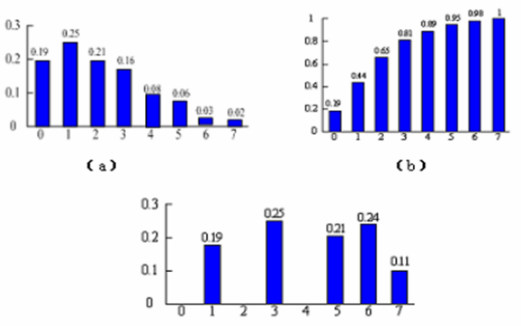

图4.6 直方图均衡化示意图

（a）原始图像直方图   （b）累计直方图  （c）均衡化后的直方图

由于数字图像灰度取值的离散性，变换后的直方图并非完全均匀分布，但相比于原直方图要平坦的多。

## Slide 52

Slide

【例4.4】直方图均衡对图像进行增强。

在MATLAB环境中，待处理图像为 tire.tif。
I = imread('tire.tif');
subplot(2,2,1), imshow(I);   %显示原图像
subplot(2,2,2), imhist(I);
J = histeq(I);        	%完成直方图均衡化
subplot(2,2,3),imshow(J);   %直方图均衡化后的图像
subplot(2,2,4),imhist(J);     %均衡化后的直方图

## Slide 53

Slide

直方图均衡

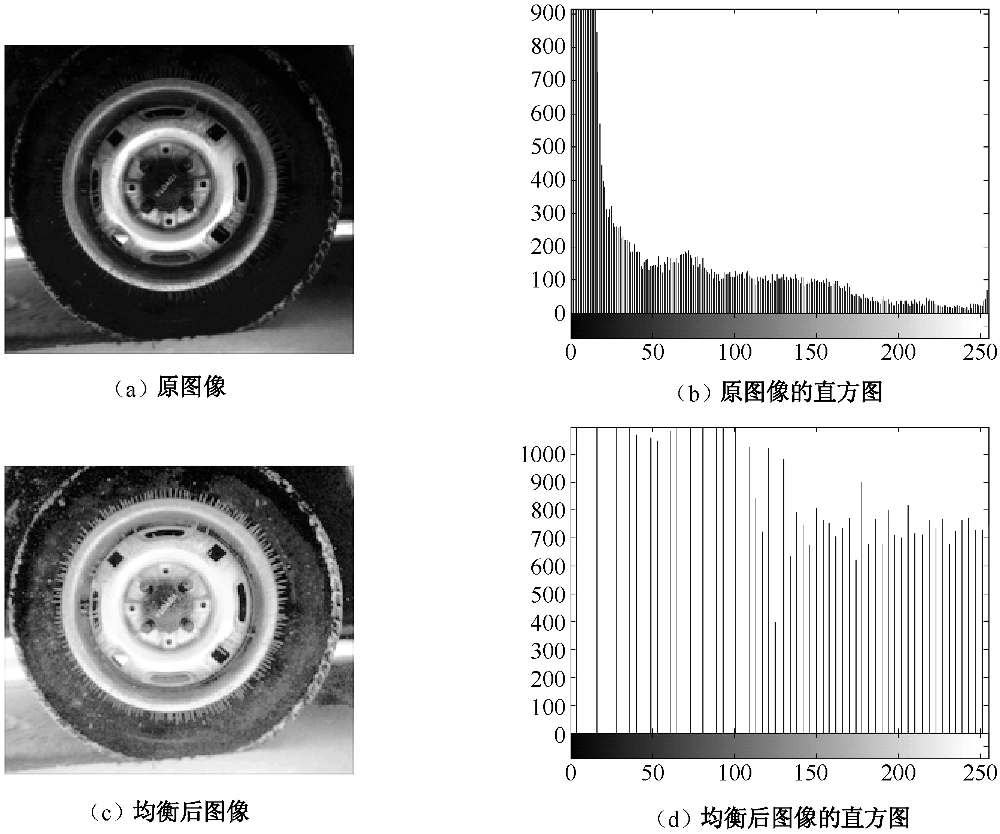

## Slide 54

Slide

直方图规定化

基本思想：突出感兴趣灰度范围，即修正直方图使 其具有要求的形式。

（a）

（b）

（c）

（d）	（e）

（a）原直方图        （b）正态扩展直方图   （c）均匀化直方图
（d）暗区扩展直方图  （e）亮区扩展直方图

## Slide 55

直方图规定化的方法步骤如下：

Slide

（1）对 原 图直 方 图，求 其 累 计 直 方 图

Pi

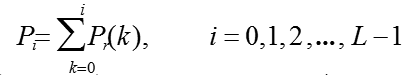

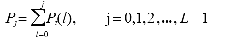

（2）对规定直方图，求其累计直方图

（3）对于每一个Pi（灰度值为i） ,  在 Pj 中找到与其差值最小的那个Pj 的值 （像素为j）,那么规定化后就把 i 变换为 j 。

Pj

## Slide 56

[例4.5] 对例4.3所给的图像进行直方图规定化处理。给定的规定直方图如表4.2所示。
表4.2	规定直方图

Slide

| 图像灰度级 j | 0 | 1 | 2 | 3 | 4 | 5 | 6 | 7 |
| --- | --- | --- | --- | --- | --- | --- | --- | --- |

## Slide 57

Slide

表4.2  图像的灰度级分布

| 步骤 | 计算方法 | 计算结果 |  |  |  |  |  |  |  |
| --- | --- | --- | --- | --- | --- | --- | --- | --- | --- |
0.19

0.44

0.65

0.81

0.89

0.95

0.98

1

0

0

0

0

0.2

0.5

0.8

1

0.2

0.5

0.8

0.8

0.8

1

1

1

0→4

1→5

2→6

3→6

4→6

5→7

6→7

7→7

0

0

0

0

0.19

0.25

0.45

0.11

## Slide 58

练习1

Slide

设某个图像为：

| 3 | 2 | 2 | 7 |
| --- | --- | --- | --- |
请完成：求该图像的灰度直方图。对该图像进行直方图均衡化处理，写出过程和结果。

## Slide 59

练习1

Slide

| 步骤 | 计算方法 | 计算结果 |  |  |  |  |  |  |  |
| --- | --- | --- | --- | --- | --- | --- | --- | --- | --- |
1

2

3

4

5

5

6

7

0→1

1→2

2→3

3→4

4→5

5→5

6→6

7→7

0

0.1875

0.0625

0.1875

0.1875

0.125

0.125

0.125

0.1875

0.25

0.4375

0.625

0.6875

0.75

0.875

1

## Slide 60

练习2

Slide

| 步骤 | 计算方法 | 计算结果 |  |  |  |  |  |  |  |
| --- | --- | --- | --- | --- | --- | --- | --- | --- | --- |
0.19

0.44

0.65

0.81

0.89

0.95

0.98

1

0

0

0

0.15

0.35

0.55

0.85

1

0.15

0.35

0.55

0.85

0.85

1

1

1

0→3

1→4

2→5

3→6

4→6

5→7

6→7

7→7

Slide

0

0

0

0.19

0.25

0.21

0.24

0.11

## Slide 61

Slide

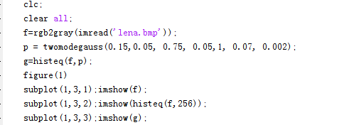

## Slide 62

Slide

4.4  图像平滑（Smoothing）

图像平滑的目的
消除或尽量减少噪声的影响，改善图像的质量。

图像平滑的本质：
在假定加性噪声是随机独立分布的条件下，利用邻域平均或加权平均可以有效的抑制噪声。

## Slide 63

Slide

图像平滑的方法：
邻域平均法
中值滤波法

## Slide 64

Slide

4.4.1 像素间的基本关系

图像由像素组成，像素在图像空间上按规律排列，相互之间有一定的联系。
一、像素的领域与邻接

构成：P的水平(左右)和垂直(上下)共4个近邻像素
坐标：N4(P) = {(x+1, y), (x, y+1), (x–1,y),(x, y–1)}
像素示意图

（1）4-邻域—N4(p)

## Slide 65

Slide

（2）对角邻域—ND(p)

构成: 由P的对角（左上、右上、左下、右下）共4个
近邻像素Si组成P的对角近邻像素，记为ND(p);
坐标: ND(P) = {(x-1, y-1), (x-1, y+1), (x+1,y+1),(x+1, y–1)}
像素示意图

## Slide 66

Slide

构成：P的周围8个近邻像素全体，记为N8(p)；
即8-邻域是N4(P)和ND(p)之和。
像素示意图

（3）8-邻域---N8(p)

## Slide 67

Slide

4 - 邻域             对角邻域               8-邻域

## Slide 68

Slide

2、像素邻接（connectivity）
-空间上相邻，且像素灰度值相似

邻接判断条件：
（1）是否接触（邻域关系？）
（2）灰度值是否满足某个特定的相似准则V
灰度值相等
同在一个灰度值集合中

## Slide 69

Slide

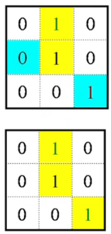

4邻接和8邻接在图像识别中具有广泛的应用

三种邻接：
假设V为灰度值集合。
4-邻接
2个像素p和q 在V中取值；
且q在N4(p)中
8-邻接
2个像素p和q 在V中取值；
且q在N8(p)中

## Slide 70

Slide

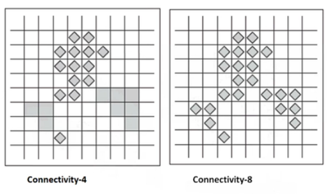

判断像素子集是否属于同一类？

邻接关系在图像处理中十分重要，影响图像处理的结果

## Slide 71

Slide

二、连通性
反映两个像素间的空间关系
1. 通路
像素p(x,y)到像素q(s,t)的一条通路，由一系列具有坐标（x0,y0）,(x1,y1),......,(xi,yi),......,(xn,yn)的独立像素组成。
其中，(xi,yi)与(xi-1,yi-1)邻接
1≤i≤n,n为通路长度
通路种类：4-通路，8-通路，m-通路

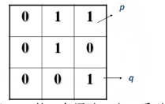

## Slide 72

Slide

举例：V={1}

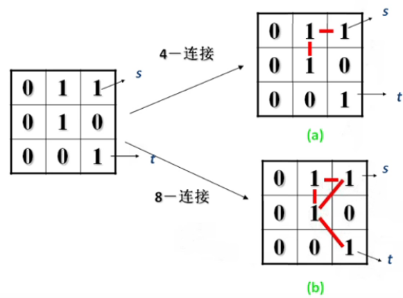

## Slide 73

Slide

举例：V={1}

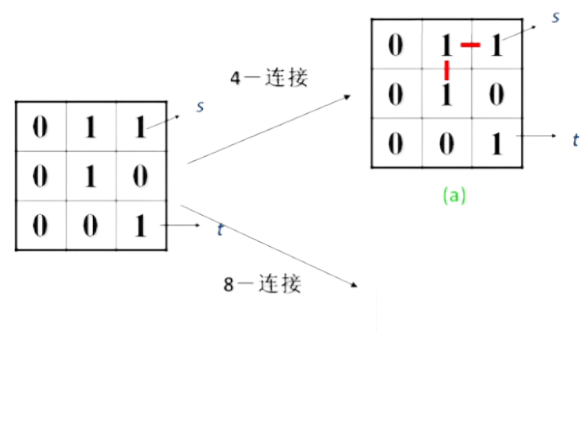

## Slide 74

Slide

举例：V={1}

如何保证像素s到t之间存在一条不含回路的通路？

## Slide 75

Slide

b:   满足m-邻接
c:  不满足m-邻接

m-邻接（混合邻接）
2个像素p和r在V 中取值，且满足下列条件之一
r在  N4(p)中
r在ND(p)中且集合N4(p)∩N4(r)是空集

## Slide 76

Slide

2、连通
通路上所有的像素灰度值满足相似性准则
即(xi,yi)与(xi-1,yi-1)邻接
实例：像素 s 和 t 间（右图）

4-连通：不存在
8-连通：2条
m-连通：1条

## Slide 77

Slide

连通性具有如下性质：
（1）p与q连通，则q与p也连通
（2）若p与q连通，q与r连通，则p与r连通。

## Slide 78

Slide

三、距离度量

说明：
（1）2像素之间的距离总是正的，若重合，则为0；（非负性）
（2）距离与起终点的选择无关；（距离相对性）
（3）2像素之间直线距离最短。

距离( distance )函数的定义：
给定3个像素p，q，r，
如果满足下面条件，则称D为距离量度函数。

## Slide 79

Slide

欧式距离De
对于像素 p(x,y), q(s,t)
距点(x,y)的De距离小于或等于某一值r的像素组成以(x,y)为中心的圆平面。

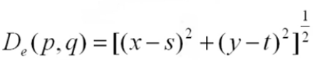

特点：比较直观，但运算量大，要开方

## Slide 80

Slide

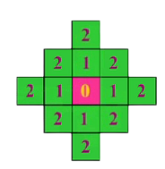

城市距离D4
对于像素p(x,y),q(s,t)
距点(x,y)的D4距离小于或等于某一值r的像素组成以(x,y)为中心的的菱形。

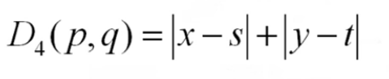

## Slide 81

Slide

棋盘距离  ( chess - board  distance )

根据这个距离量度，与(x, y)的D8距离小于或等于某个值d的象素组成以(x, y)为中心的正方形。

| 2 | 2 | 2 | 2 | 2 |
| --- | --- | --- | --- | --- |

## Slide 82

Slide

4.4.2  邻域平均法(空间域分析)

某一像素，如果它与周围像素点相比，有明显的不同，则该点被噪声感染了。
设当前待处理像素为f (m,n)

给出一个大小为3×3的邻域处理模板。

## Slide 83

Slide

（一）邻域（局部）平均法
定义：用该点邻域的灰度平均值来代替该点的灰度值。
公式：

## Slide 84

Slide

① 4-邻域平均法
定义：用该点4-邻域的灰度平均值来代替该点的灰度值。
公式：

## Slide 85

Slide

② 8-邻域平均法
定义：用该点8-邻域的灰度平均值来代替该点的灰度值。
公式：

## Slide 86

举例

Slide

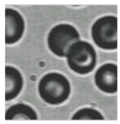

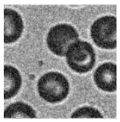

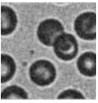

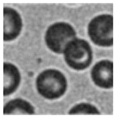

(a)原图

(b)加噪

(c)4邻域平均

(d)8邻域平均

结论：邻域平均法能有效去除加性的随机噪声，但会使目标物轮廓或细节（边缘）变模糊。

## Slide 87

Slide

③ 阈值平均法
目的：为克服邻域平均使图像变模糊的缺点，采用加门限的方法来减少模糊。
公式：

特点：能有效去除椒盐噪声，同时也能较好的保护仅有微小变化差的目标物细节。

## Slide 88

Slide

(a)原图像
(b)对(a)加椒盐噪声的图像
(c)3×3邻域平滑
(d)5×5邻域平滑
(e)3×3 阈值平均法(T=64)
(f)5×5 阈值平均法(T=48)

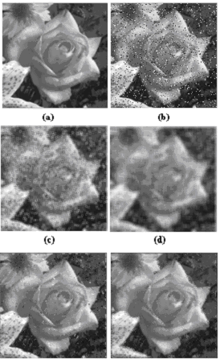

邻域平均法对比

## Slide 89

结论

Slide

1、邻域平均窗口越大，去噪效果越明显，模糊也更明显。

2、阈值平均在去噪的同时，能较好的保留目标物的轮廓。

3、阈值越大，目标物信息保留越多，阈值越小，去噪效果越好，但越模糊。

## Slide 90

Slide

④ 加权平均法
思想：用邻域内灰度值及本点灰度加权值来代替该点灰度值。
公式：

加门限的加权平均公式：

特点：既能平滑噪声，又保留一部分边缘，减少图像模糊。

## Slide 91

卷积分析

Slide

| 1/8 | 1/8 | 1/8 |
| --- | --- | --- |
H(m,n)

## Slide 92

Slide

综上：邻域平均法可归纳为模板平滑法。

4-邻域平均：

8-邻域平均：

4-邻域加权平均：

8-邻域加权平均：

## Slide 93

根据实际需要，可以设计其他具有不同特性的模板，如

Slide

从权值上看，一些像素比另一些更重要，该模板中，处于模板中心位置的像素比其他任何像素的权值都大，因此，在均值计算中
给定的这一像素显得更重要，而距离掩模中心较远的其他像素就
显得不太重要。

## Slide 94

Slide

【例4.5】采用模板对图像进行平滑处理。

图像：受到椒盐噪声污染的eight.tif图像.处理：4种模板
I = imread('eight.tif');			%读入原始图像
imshow(I,[]);
f = imnoise(I,'salt & pepper',0.04);	%加椒盐噪声，噪声强度为0.04
figure, imshow(f);
h0 = 1/9.*[1 1 1 1 1 1 1 1 1];			%定义平滑模板
h1 = [0.1 0.1 0.1; 0.1 0.2 0.1; 0.1 0.1 0.1];
h2 = 1/16.*[1 2 1;2 4 2;1 2 1];			%高斯模板
h3 = 1/8.*[1 1 1;1 0 1;1 1 1];
g0 = filter2(h0,f); 				%用模板进行滤波处理
g1 = filter2(h1,f);g2 = filter2(h2,f);g3 = filter2(h3,f);
figure,imshow(g0,[]);       			%显示平滑处理结果
figure,imshow(g1,[]);figure,imshow(g2,[]);figure,imshow(g3,[]);

## Slide 95

Slide

图4.9  平滑处理的实例

（a）原始图像 （b）有噪声的图像 （c）用模板0处理后的图像

（d）用模板1处理后的图像 （e）用模板2处理后的图像（f）用模板3处理后的图像

邻域平均法有效的平滑了噪声,但也损伤了目标和细节

## Slide 96

Slide

J = imnoise(I, type, parameters)
I为原图像的灰度矩阵，J为加噪声后的灰度矩阵。
type为噪声种类，parameters是允许修改的参数，可以默认。
type可以有四种:gaussian,poisson,salt&pepper,specker

## Slide 97

Slide

R=imread('liftingbody.png');
I=imnoise(R,'salt & pepper',0.02);
H1=[0,1,0;1,0,1;0,1,0]/4;%4邻域平均
H2=[0,1,0;1,1,1;0,1,0]/5;%4邻域加权平均
H3=[1,1,1;1,0,1;1,1,1]/8;%8邻域平均
H4=[1,1,1;1,1,1;1,1,1]/9;%8邻域加权平均
I1=imfilter(I,H1);%线性滤波器I2=imfilter(I,H2);I3=imfilter(I,H3);I4=imfilter(I,H4);
subplot(3,2,1),imshow(R),title('原图像');
subplot(3,2,2),imshow(I),title('加噪图像');
subplot(3,2,3),imshow(I1),title('4邻域平均');
subplot(3,2,4),imshow(I2),title('4邻域加权平均');
subplot(3,2,5),imshow(I3),title('8邻域平均');
subplot(3,2,6),imshow(I4),title('8邻域加权平均')

## Slide 98

Slide

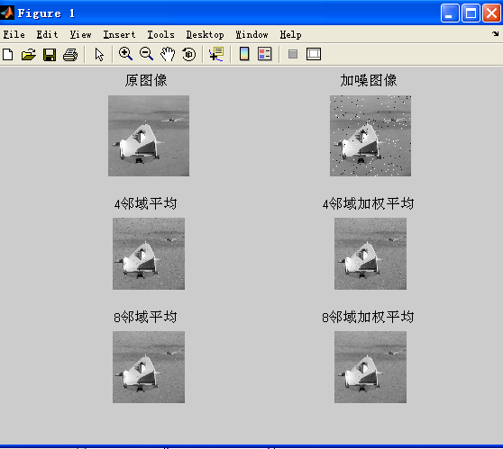

## Slide 99

Slide

① 平滑模板的所有系数都是正数，和为1；在空间域用用模板跟原图像进行卷积实现平滑。

邻域平均法总结

②  在设计滤波器时通常还要求行列数为奇数，保障中心   定 位性能。

③  空域滤波的去噪能力与它的模板大小有关，模板越大，去噪声能力越强，但是边缘、细节模糊程度越明显；

④  阈值平均在去噪的同时，能较好的保留目标物的轮廓。

⑤  阈值越大，目标物信息保留越多，但去噪效果较差；阈值越小，去噪效果越好，但越模糊。

## Slide 100

Slide

2．频率域分析

对式（4-2）进行二维DFT，则将空间域的卷积关系转化为频率域的乘法关系：
G(u, v) = H(u, v) F(u, v)
式中，H(u, v) = DFT[h(u, v)]为滤波器频率响应函数。

## Slide 101

Slide

图4.10  频率域平均去噪原理框图

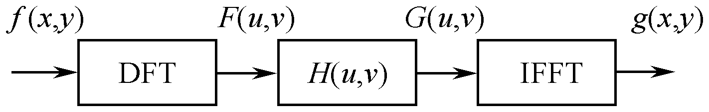

## Slide 102

空域模板平滑与频域低通滤波的关系：

Slide

| 1/9 | 1/9 | 1/9 |
| --- | --- | --- |
H(m,n)

## Slide 103

Slide

当                   时有最大值，                      时，有最小值；很明显是个低通滤波器。

## Slide 104

Slide

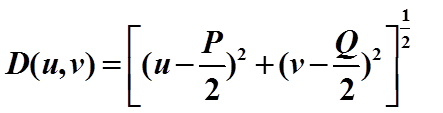

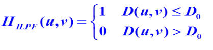

（1）理想低通滤波器

## Slide 105

Slide

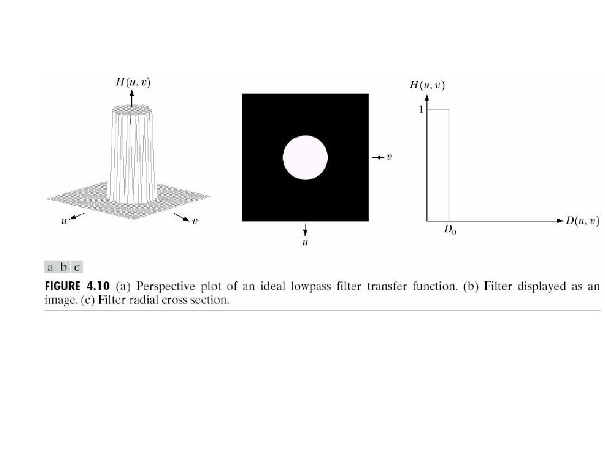

说明：在半径为D0的圆内，所有频率没有衰减地通过滤波器，而在此半径的圆之外的所有频率完全被衰减掉。

## Slide 106



其中

原点在频率域的中心，半径为D0的圆包含%的功率

其中:

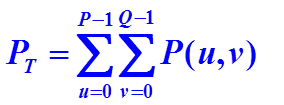

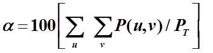

## Slide 107

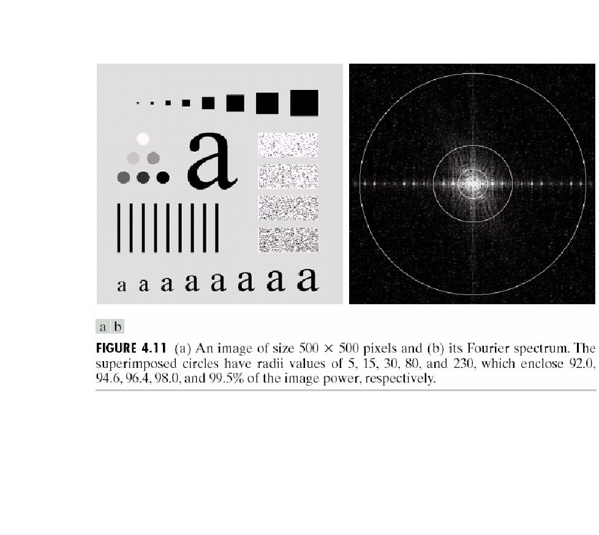

理想低通滤波器举例

500×500的原图

图像的傅里叶频谱

圆环具有半径5,15,30,80和230个像素
图像功率为92.0%,94.6%,96.4%,98.0%和99.5%

结论:
①90%以上的功率(能量)集中在半径小于5的圆周内;
②随滤波器半径的增加,越来越少的功率被滤出掉,使模糊减弱;

## Slide 108

滤除8%的总功率，模糊说明多数尖锐细节在这8%的功率之内

滤除0.5%的总功率，与原图接近说明边缘信息很少在0.5%以上的功率中

滤除3.6%的总功率

理想低通滤波器举例——具有振铃现象

滤除5.4%的总功率

滤除2%的总功率

## Slide 109

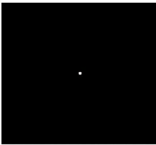

理想低通滤波器举例——具有振铃现象

对应空间域h(x,y)
中心开始的圆环周期

频率域函数H(u，v)
前述例子产生模糊且半径为5的ILPF

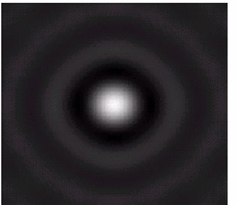

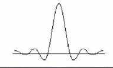

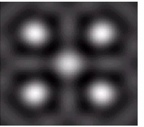

f(x,y)由黑色背景下5个明亮的像素组成，明亮点可看作冲激

f(x,y)*h(x,y),在每个冲激处复制h(x,y)的过程，振铃现象

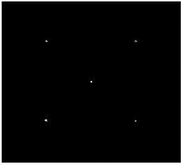

## Slide 110

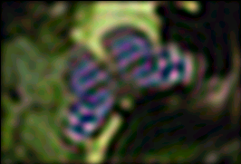

振铃效果——理想低通滤波器的一种特性

## Slide 111

（2）巴特沃思低通滤波器

它的特性是连续性衰减，而不像理想滤波器那样陡峭变化，
即明显的不连续性。因此采用该滤波器滤波在抑制噪声的
同时，图像边缘的模糊程度大大减小，几乎没有振铃效应产生

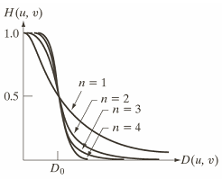

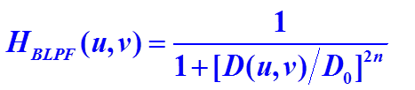

## Slide 112

透视图

滤波器

阶数从1到4的滤波器横截面

## Slide 113

巴特沃思低通滤波器 n    2

## Slide 114

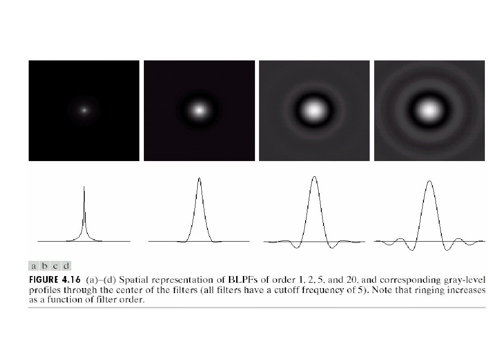

注：二阶BLPF处于有效低通滤波和可接受的振铃特征之间

阶数n=20
与ILPF相似

阶数n=5明显振铃和负值

阶数n=2轻微振铃和负值

阶数n=1
无振铃和负值

巴特沃思低通滤波器

## Slide 115

高斯低通滤波器

透视图

滤波器

各种D0值的滤波器横截面

## Slide 116

高斯低通滤波器

采用该滤波器滤波在抑制噪声的同时，图像边缘的模糊程度较Butterworth滤波产生的大些，无振铃效应

## Slide 117

① 理想低通滤波器会产生振铃效应

② Butterworth滤波器滤波在抑制噪声的同时，图像边缘的模糊程度大大减小，几乎没有振铃效应产生。

③  GLPF没有振铃,GLPF不能达到有相同截止频率的二阶BLPF的平滑效果。

## Slide 118

Slide

## Slide 119

Slide

fspecial是用来生成滤波器（也叫算子）的函数，使用type参数来指定滤波器的种类，使用para来对具体的滤波器种类添加额外的参数信息。

type参数通常可以取gaussian、average、disk、laplacian、log、prewitt

## Slide 120

低通滤波器的应用实例：模糊,平滑等

## Slide 121

字符识别举例

如打印、传真、复印文本等，
字符失真、字符断裂等

D0=80的高斯低通滤波器
修复字符

用于机器识别系统识别断裂字符的预处理

## Slide 122

人脸图像处理

原图像

D0=100的GLPF滤波,
细纹减少

D0=80的GLPF滤波，
细纹减少

## Slide 123

卫星、航拍图像处理

原图像

D0=30的GLPF滤波

D0=10的GLPF滤波

目的：尽可能模糊细节，而保留大的可识别特征

## Slide 124

Slide

问题

图像平滑中，邻域平均法与低通滤波器的联系与区别？

联系：
目的都是对图像进行平滑去噪，两者在平滑图像过程中，都会模糊图像的边缘和细节，邻域平均法本质上等效于低通滤波法。
区别：
邻域平均法是在空间域对图像进行平滑去噪，使用平滑模板对图像进行卷积运算实现平滑去噪。
低通滤波法是在频率域实现图像平滑去噪，在频率域用低通滤波器传递函数与原函数傅里叶频谱进行相乘运算来实现图像平滑去噪。
③采用低通滤波器对图像进行平滑，可能会产生振铃效应。

## Slide 125

Slide

4.4.3  中值滤波

邻域平均法：在去噪的同时也使边界变得模糊了。

中值滤波：
非线性的处理方法，在去噪的同时可以兼顾到边界信息的保留。

选一个含有奇数点的窗口W，将这个窗口在图像上扫描，把该窗口中所含的像素点按灰度级的升/降序排列，取位于中间的灰度值，来代替该点的灰度值。

1．滤波原理

## Slide 126

Slide

2．中值滤波的作用
对干扰脉冲和点噪声有良好的抑制作用，而对图像边缘能较好的保持非线性图像增强技术。

3. 中值滤波的依据

噪声以孤立点的形式出现，这些点对应的像素数很少， 而图像则是由像素数较多，面积较大的块构成。

## Slide 127

Slide

一维窗口及滑动滤波过程

| m−2 | m−1 | m | m + 1 | m + 2 |
| --- | --- | --- | --- | --- |
（a）一维窗口

（b）滤波过程

## Slide 128

Slide

## Slide 129

中值滤波的重要特性：

Slide

（1）斜升（或斜降）信号不产生影响；

## Slide 130

Slide

（2）  连续个数小于窗口宽度一半的离散脉冲将被滤除；

窗宽  L=5

## Slide 131

Slide

（3）  三角形信号的顶部被削平；

## Slide 132

Slide

（4）  若C为常数，则也有：
med{C f (m,n)}= C med{f (m,n)}
med{C + f (m,n)}= C +med{f (m,n)}
med{f1 (m,n) + f2 (m,n)}≠med{f1 (m,n)}+med{f 2(m,n)}

如若窗宽取5，   f1 ={10,20,30,40,50}，f2 ={10,20,30,20,10}    则，
med{f1 +f2}= med{20,40,60,60,60}= 60

med{f1}= 30

med{f2}= 20

## Slide 133

中值滤波与平均滤波的对比：

Slide

原图像块（含噪声）

方法②：中值滤波法

方法①：加权平均

结论：

① 加权平均在滤掉噪声点的同时，使目标物边缘变模糊；
②中值滤波在滤掉噪声的同时，能一定程度保留了目标物边缘。

## Slide 134

Slide

中值滤波与平均滤波的对比：

## Slide 135

Slide

① 中值滤波适合于滤除椒盐噪声和干扰脉冲。

（a）椒盐噪声污染的图像；  （b）平均模板的滤波结果；    （c）中值滤波的结果
图像平均滤波和中值滤波的对比

中值滤波的特点：

② 需要保持细线状及尖顶角目标物细节时，不适合中值滤波。

③  中值滤波窗口大小最好不要超过图像中最小目标物的尺寸，否则会丢失目标物的细节。

## Slide 136

Slide

MATLAB的二维中值滤波函数

【例】选用3×3的窗口对椒盐噪声进行中值滤波。
I = imread('eight.tif');
imshow(I);
J = imnoise(I,'salt & pepper',0.04);
figure, imshow(J);
K = medfilt2(J);             	%二维中值滤波
figure, imshow(K);

## Slide 137

Slide

中值滤波

（a）原始图像                      （b）加噪图像                     （c）中值滤波后的图像

## Slide 138

Slide

原图

3x3均值滤波

3x3中值滤波

中值滤波在去噪的同时，可以较好地保留图像的细节（优于均值滤波器）

## Slide 139

K近邻均值滤波器（KNNF）

4.4.4边界保持类滤波

在m×m的窗口中，属于同一集合类的像素，它们的灰度值将高度相关。

（1）作一个m×m的作用模板。
（2）在其中选择K个与待处理像素的灰度差为最小的像素。
（3）用这K个像素的灰度均值替换掉原来的值。

K近邻均值滤波器基本步骤：

## Slide 140

模板为3×3，k＝3的K近邻均值滤波器。

1.  K近邻均值滤波器

## Slide 141

（1）作一个m×m的作用模板。
（2）在其中选择K个与待处理像素的灰度差为最小的像素。
（3）用这K个像素的灰度中值替换原来的值。

2. K近邻中值滤波器(KNNMF)

## Slide 142

① 对图像上待处理的像素（m，n）选它的5×5邻域。
② 在此邻域中采用图示9种模板，计算各个模板的均值和方差，按方差排序，最小方差所对应的模板的灰度均值就是像素（m，n）的输出值。

3. 最小均方差滤波器

## Slide 143

问题

1、中值滤波的特点？
2、如果一副图像细节较多，特别是点、线、尖点较多，请问该图像是否适合采用中值滤波？

Slide

1. 中值滤波在去噪的同时也能有效地保留图像的边界信息。能有效地消除椒盐噪声和干扰脉冲。
2. 中值滤波不影响斜升信号，但会消除连续个数小于窗口宽度一半的脉冲信号和削平三角形信号的顶部。

## Slide 144

Slide

4.5  锐化

目的：

增强目标物轮廓，使模糊图像变清晰。

空域微(差)分法—模糊图像实质是受到平均或积分运算，故对其进行差分运算，使图像清晰；

方法分类：

频域高频提升滤波法—从频域角度考虑，图像模糊的实质是高频分量被衰减，故可用高频提升滤波法加重高频，使图像清晰。

## Slide 145

Slide

4.5.1  空间域差分法

原理：

常用方法：
1．梯度锐化法
2．拉普拉斯算子

图像的边缘和轮廓一般位于中灰度突变的区域，因而可以用灰度的差分提取边缘和轮廓并进行增强。

注意：
待锐化的图像要有足够的信噪比，否则会使噪声得到比原图像更强的增强，信噪比更加恶化。

## Slide 146

Slide

1．梯度锐化法

二元函数 f (x,y)在坐标点(x,y)处的梯度定义为
梯度向量的幅度：

## Slide 147

Slide

为了降低运算量，常用绝对值或最大值运算代替平方与平方根运算近似求梯度的幅度：
数字微分将用差分代替：

## Slide 148

Slide

采用梯度进行图像锐化的方法

在灰度变化较大的边界轮廓点处有较大的梯度值，而在灰度变化比较平缓的区域，相应的梯度值也较小。
利用它来增强图像中景物的边界，达到锐化的目的。

沿x和y方向的一阶差分                            罗伯茨差分

## Slide 149

Slide

【例】利用罗伯茨梯度进行锐化处理。

【解】图像：rice.tif。
I = imread('rice.tif');
imshow(I);
BW = edge(I,'roberts',0.1);
%对输入图像求罗伯茨梯度
figure, imshow(BW);

## Slide 150

Slide

罗伯茨梯度的锐化

（a）原图像                        （b）锐化结果图

## Slide 151

常用的梯度算子

Slide

## Slide 152

Slide

2．拉普拉斯算子

二阶微分算子。
一个连续的二元函数f (x,y)，其运算定义为
对于数字图像，拉普拉斯算子可以简化为

f x 1, y 2 f x, y

f x  1, y

2 f	

1	2 f	x, y

2

	1 f x, y   		

 f	x, y

y2

x2
	f

2f f x1, y f x1, y f x, y1 f x, y14f x, y

## Slide 153

Slide

表示为卷积的形式

式中，i, j = 0, 1, 2, , N−1，k = 1，l = 1，H(r, s)如下：

## Slide 154

Slide

拉普拉斯的增强算子

其对应的模板为：

g(x,y)=5f(x,y)-[f(x+1,y)+f(x-1,y)+f(x,y+1)+f(x,y-1)]

## Slide 155

I = imread('cameraman.tif');
imshow(I);
h1 = [0 -1 0;-1 4 -1;0 -1 0];
h2 = [0 -1 0;-1 5 -1;0 -1 0];
J1 = imfilter(I,h1);
J2 = imfilter(I,h2);
subplot(2,2,1), imshow(J1);
subplot(2,2,2), imhist(J1);
subplot(2,2,3), imshow(J2);
subplot(2,2,4), imhist(J2);

Slide

用拉普拉斯（增强）算子锐化图像

## Slide 156

Slide

拉普拉斯算子图像锐化实例

## Slide 157

Slide

拉普拉斯算子图像锐化实例

## Slide 158

Slide

【例】应用拉普拉斯算子进行锐化处理。

I = imread('rice.tif');
imshow(I);
h = [0 -1 0;-1 4 -1;0 -1 0]; % h = [0 -1 0;-1 5 -1;0 -1 0];
J = imfilter(I,h);
figure, imshow(J);
figure, imhist(J);

## Slide 159

Slide

拉普拉斯算子的锐化

（a）原始图像                    （b）拉普拉斯锐化

（c）锐化后图像的直方图

## Slide 160

Slide

【例】应用拉普拉斯算子进行锐化处理。

I = imread('rice.tif');
imshow(I);
h = [0 -1 0;-1 4 -1;0 -1 0]; % h = [0 -1 0;-1 5 -1;0 -1 0];
J = imfilter(I,h);
figure, imshow(J);
figure, imhist(J);
K = imadjust(J,[0.0 0.2],[]);
figure, imhist(K);
figure, imshow(K);

## Slide 161

Slide

拉普拉斯算子的锐化

（c）拉普拉斯锐化后图像的直方图    （d）对锐化后图像的对比度扩展  （e）对比度扩展后的图像

## Slide 162

Slide

4.5.2  频率域高通滤波法

图像边缘模糊的本质是图像的高频分量受到衰减，采用合适的高通滤波器提升高频分量将会使边缘得到相应的锐化。
只要适当地选择滤波因子H(r, s)，就可以组成不同性质的高通滤波器，从而使图像达到期望中的增强效果（锐化）。
常用的高通滤波器有

，

，

理想高通滤波器

巴特沃思高通滤波器
高斯高通滤波器

## Slide 163

Slide

透视图

图像表示

横截面

理想高通滤波器

巴特沃思高通

高斯高通滤波器

巴特沃思滤波器为理想滤波器和高斯滤波器的一种过渡

高通滤波器的频域表示：

## Slide 164

高通滤波器的空间域表示：

理想高通滤波器

巴特沃思高通

高斯高通滤波器

## Slide 165

理想高通滤波器（IHPF）

## Slide 166

D0=30

D0=60

D0=160

结论：图a和b的振铃问题十分明显

理想高通滤波示例：

## Slide 167

巴特沃思高通滤波器

## Slide 168

D0=30

D0=60

D0=160

二阶巴特沃思高通滤波示例：

结论：BHPF的结果比IHPF的结果平滑得多

## Slide 169

高斯高通滤波器

## Slide 170

D0=30

D0=60

D0=160

高斯高通滤波示例：

## Slide 171

二值化的结果

## Slide 172

三种高通滤波器小结

① 理想高通有明显振铃现象，即图像的边缘有抖动现象；
② Butterworth高通滤波效果较好，但计算复杂，其优点是有少量低频通过，h(u，v)是渐变的，振铃现象不明显；
③ 高斯高通效果比Butterworth差些，无振铃现象。

一般来说，不管在图像空间域还是频率域，采用锐化或者高频滤波不但会使有用的信息增强，同时也使噪声增强。因此不能随意地使用。

## Slide 173

图像平滑及锐化注意事项：

Slide

1.平滑及锐化时，图像四周边界不考虑（不处理）；
2.一般处理时，仅用原图象进行处理（即前面处理结果不影响后面处理）；
3.平滑及锐化的顺序是：先平滑后锐化。

## Slide 174

问题

Slide

1. 平滑模板特点

模板内系数全为正（表示求和、平均=>平滑）；
模板内系数之和为1:①对常数图像f(m,n)≡c，处理前后不变；
②对一般图像，处理前后平均亮度不变。

2. 锐化增强模板特点
模板内系数有正有负，表示差分运算；
模板内系数之和为1:①对常数图像f(m,n)≡c，处理前后不变；
②对一般图像，处理前后平均亮度不变。

平滑模板与锐化增强模板的特点？

## Slide 175

4.6 图像同态滤波

Slide

概述

一幅图像是由光源的照度分量（也称照度场）r(m,n) 和目
标场的反射分量  i(m,n) 组成，即

只要我们能从 f(m,n)中把  i(m,n)和  r(m,n)分开，并分别采取压缩照度分量、提升反射分量的方法，就可达到减弱照度分量、增强反射分量，使图像清晰的目的。

## Slide 176

Slide

图像同态滤波的处理过程

## Slide 177

Slide

进行FFT
简记为

反变换到空域

也可写成

FFT[z(m,n)]= FFT[lni(m,n)]+FFT[lnr(m,n)]
Z(u,v) = I(u,v)+R(u,v)

若用一滤波器进行滤波处理，则
S(u,v) = H(u,v)Z(u,v) = H(u,v)I(u,v)+H(u,v)R(u,v)

s(m,n) = IFFT[H(u,v)I(u,v)]+IFFT[H(u,v)R(u,v)]
= i'(m,n)+r'(m,n)

再取指数，就得到了处理后的空域图像  g(m,n)
g(m,n) = exp[s(m,n)]= exp[i'(m,n)]•exp[r'(m,n)]

g(m,n) = i0(m,n)•r0(m,n)

两边取对数     z(m,n) = lnf(m,n) = lni(m,n)+lnr(m,n)

## Slide 178

同态滤波器的设计：

Slide

以高斯高通滤波器为模板改造的同态滤波器：

## Slide 179

Slide

同态滤波器的特性曲线

抑制照度分量（低频），增强反射分量（高频）

## Slide 180

同态滤波的matlab程序

Slide

## Slide 181

Slide

clc;clear all;
im1=imread('lena.tif');
im1=rgb2gray(im1);
% figure, imshow(im1);
r=80;   %设置滤波圆半径参数为80，可调
img_f=fftshift(fft2(double(im1)));  %傅里叶变换得到频谱
[m,n]=size(img_f);
O_x=fix(m/2);
O_y=fix(n/2);  %获取圆心坐标
img=zeros(m,n);  %提前定义滤波后的频谱，提高运行速度
for j=1:n
for i=1:m
d=sqrt((i-O_x)^2+(j-O_y)^2);    %计算两点之间的距离
rh=2.5;
rl=0.5;
c=1;
H(i,j)=(rh-rl)*(1-exp(-c*(d^2/r^2)))+rl;   %同态滤波器，rh,rl,c为参数，可调
img(i,j)=H(i,j)*img_f(i,j); %同态滤波
end
end
img=ifftshift(img);            %傅里叶反变换
img=uint8(real(ifft2(img)));   %取实数部分
subplot(1,2,1),imshow(im1); subplot(1,2,2),imshow(img);

## Slide 182

Slide

## Slide 183

Slide

## Slide 184

Slide

随堂练习：

## Slide 185

Slide

空间域邻域平滑和高通滤波本质上是原图像与模板进行卷积运算。
边缘点保持不变，只处理中心4个像素点：
（1）邻域平滑过程：
灰度值为1的像素点处理后:（1+2+3+4）/4=2.5;灰度值为4的像素点处理后:（3+5+1+5）/4=3.5;
灰度值为3的像素点处理后:（1+2+2+5）/4=2.5;灰度值为5的像素点处理后:（3+4+3+4）/4=3.5
（2）高通滤波过程：
灰度值为1的像素点处理后:4-1-2-3-4= -6;灰度值为4的像素点处理后:16-1-3-5-5=2;
灰度值为3的像素点处理后:12-1-2-2-5=2;灰度值为5的像素点处理后:20-3-4-4-3=6
处理后的结果如下，对结果进行适当的变换映射为可观测的图像。

## Slide 186

练习1

Slide

设某个图像为：

| 3 | 2 | 2 | 7 |
| --- | --- | --- | --- |
请完成：求该图像的灰度直方图。对该图像进行直方图均衡化处理，写出过程和结果。

## Slide 187

练习1

Slide

| 步骤 | 计算方法 | 计算结果 |  |  |  |  |  |  |  |
| --- | --- | --- | --- | --- | --- | --- | --- | --- | --- |
1

2

3

4

5

5

6

7

0→1

1→2

2→3

3→4

4→5

5→5

6→6

7→7

0

0.1875

0.0625

0.1875

0.1875

0.125

0.125

0.125

0.1875

0.25

0.4375

0.625

0.6875

0.75

0.875

1

## Slide 188

练习2

Slide

| 步骤 | 计算方法 | 计算结果 |  |  |  |  |  |  |  |
| --- | --- | --- | --- | --- | --- | --- | --- | --- | --- |
0.19

0.44

0.65

0.81

0.89

0.95

0.98

1

0

0

0

0.15

0.35

0.55

0.85

1

0.15

0.35

0.55

0.85

0.85

1

1

1

0→3

1→4

2→5

3→6

4→6

5→7

6→7

7→7

Slide

0

0

0

0.19

0.25

0.21

0.24

0.11

## Slide 189

Slide

I = imread('tire.tif');
subplot(2,2,1), imshow(I);
subplot(2,2,2), imhist(I);
J = histeq(I);
subplot(2,2,3),imshow(J);
subplot(2,2,4),imhist(J);

## Slide 190

Slide

本章小结

作为基本的图像处理方法，图像增强具有重要地位。
后期的图像处理往往在图像增强后完成。
本章介绍了图像增强的基本方法，有空间域增强和频率域增强两种方法。
空间域增强直接对像素灰度进行操作
频率域增强需要对图像进行变换处理过程。

## Slide 191

Slide

重点和难点

重点：
对各种增强方法的理解和应用，包括图像的灰度变换、图像的平滑去噪方法和图像锐化的各种算法。
难点：
图像处理时如何选用增强方法，使得图像得到较好的增强
在这方面对图像的深入分析和细心观察是不可缺少的，需要不断积累和借鉴自己和他人的经验。

## Slide 192

本章作业及要求

Slide

本章要求：
1、掌握图像的灰度变换、直方图修正、空域及频域平滑与
锐化方法
2、掌握中值滤波法及与平均滤波法的异同；
3、了解图像的同态增晰法。
本章作业：
6.2  6.3  6.5  6.6  6.8  6.9
