# 第05章 图像分割

## Slide 1

第7章    图像分割

## Slide 2

7.1  概 述

7.1.1数字图像处理的目的
一是：对图像进行加工和处理，得到满足人的视觉和心理需要的改进形式。如：图像增强和图像复原。
二是：对图像中的目标物（景物）进行分析和理解。主要包括：
（1）把图像分割成不同的区域，或把不同的目标分开（分割）。即把图像分成互不重叠的区域并提取出感兴趣目标。
（2）找出各个区域的特征（特征提取）。
（3）识别图像中的内容，或对图像进行分类（识别与分类）。
（4）给出结论（描述、分类或其他的结论）。

## Slide 3

图像分割作为图像分析和理解的关键步骤，其结果将直接影响到目标物特征提取和描述，以及进一步目标物识别，分类等。
图像分割将图像细分为构成它的子区域或对象。分割的程度取决于要解决的问题。就是说，在应用中，当感兴趣的对象已经被分离出来时，就停止分割。

## Slide 4

## Slide 5

图像分割常常是许多图像处理应用中不可缺的重要步骤。

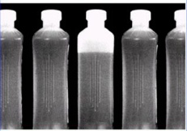

## Slide 6

目标为飞机的图像

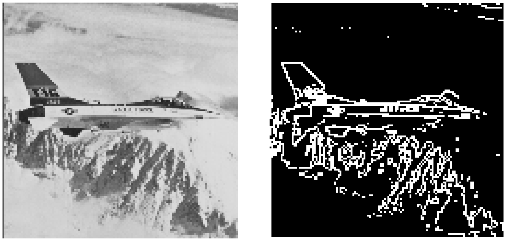

（a）原图像           （b）分割后的图像

## Slide 7

7.1.2  图像分割的集合定义

令集合R代表整个图像区域，对R的图像分割可以视为将R分成N个满足以下条件的非空子集：
（1）                                  （完备性）
（2）对于所有的i和j，i≠j ，有                   ；（独立性：子区域不互相重叠）
（3）对于i = 1, 2, …, N，有P(Ri) = TRUE； （单一性：每个子区域有独特的特性）
（4）对于i≠j ，有P(Ri∪Rj) = FALSE；（互斥性：不同子区域具有不同特性，没有公共特性）
（5）对于i = 1, 2,  …, N，Ri是连通的区域。 （子区域像素具有连通性）

## Slide 8

不连续性（突变性）：不同区域的交界(边缘)处像素灰度

值具有不连续(突变)性，据此先找到区域交界处的点、线(宽度
为1)、边(不定宽度)，再确定区域。

连续性：同一区域内像素一般具有灰度相似性，据此找到

灰度值相似的区域；区域的外轮廓就是目标的边缘。

像素灰度值的基本特性图

7.1.3 灰度图像分割依据

## Slide 9

根据灰度的不连续性和相似性，通常有两种分类方法：

7.1.4 图像分割的分类

边缘检测法

区域生成法

（1）边缘检测法：根据区域间的灰度不连续性，确定区域的边界或边缘的位置；

（2）区域生成法：利用区域内灰度的相似性，将像素点分成若干相似的区域。

## Slide 10

① 连通准则
② 阈值分割技术：
③ 边缘检测法：
梯度算子、拉普拉斯算子、拉普拉斯-高斯算子、方向算子、坎尼算子和边缘跟踪。
④ 区域生长法:

7.1.5 知识要点

## Slide 11

7.2  像素的邻域和连通性

1. 4邻域
对一个坐标为     的像素p，它可以有两个水平和两个垂直的近邻像素。它们的坐标分别是
这四个像素称为p 的4邻域。
互为4邻域的像素又称为4连通的。
2. 8邻域
取像素p四周的8个点作为相链接的邻域点，除掉p本身外，剩下的8个点就是p的8邻域。
互为8邻域的像素又称为8连通的 。

## Slide 12

根据连通性，可以定义图像的特征点和线。
边界点：如果目标点集S中的点p,有临点在S的补集SC中，那么p便是S的边界点。这种点的集合，便是S的边界，记为S’。
S的内部和内点：目标点集S和边界点集S’只差S-S’称为S的内部，处于S内部的点称为内点。
孤点：没有邻接点的点。
封闭曲线：如果连通域S的所有点都有两个临点，则称此连通域为封闭曲线。

## Slide 13

目标和背景的连通性定义必须取不同，否则会引起矛盾。

目标和背景连通性

1 表示目标，0 表示背景。定义目标为8连通，背景为4连通。可以将图像划分为背景和目标两个区域。
灰度为1的7个点可以连接成封闭环，中间的0变成一个孤点。
环外的为背景，目标与背景不相连通。

## Slide 14

【例7.1】根据4/8连通准则在二值图像中判断目标。

BW = [1  1  1  0  0  0  0  0;
1  1  1  0  1  1  0  0；
1  1  1  0  1  1  0  0；
1  1  1  0  0  0  1  0;
1  1  1  0  0  0  1  0;
1  1  1  0  0  0  1  0;
1  1  1  0  0  1  1  0;
1  1  1  0  0  0  0  0];
%给定的二值图像矩阵

L4 = bwlabel(BW,4)                %根据4连通准则判定目标
L8 = bwlabel(BW,8)                %根据8连通准则判定目标

## Slide 15

根据4连通准则，得到的目标是3个：
L4 = 1  1  1  0  0  0  0  0
1  1  1  0  2  2  0  0
1  1  1  0  2  2  0  0
1  1  1  0  0  0  3  0
1  1  1  0  0  0  3  0
1  1  1  0  0  0  3  0
1  1  1  0  0  3  3  0
1  1  1  0  0  0  0  0

根据8连通准则，得到目标是2个：
L8 =1  1  1  0  0  0  0  0
1  1  1  0  2  2  0  0
1  1  1  0  2  2  0  0
1  1  1  0  0  0  2  0
1  1  1  0  0  0  2  0
1  1  1  0  0  0  2  0
1  1  1  0  0  2  2  0
1  1  1  0  0  0  0  0

## Slide 16

7.3  图像的阈值分割技术

7.3.1  基本原理

若目标和背景具有不同的灰度集合，且两个灰度集合可用一个灰度级阈值T进行分割。

这样就可以用阈值分割灰度级的方法在图像中分割出目标区域与背景区域。

## Slide 17

这样得到的是一幅二值图像。

设图像为 f (x, y) ，其灰度集范围是[Z1, ZK ]，在Z1 和ZK 之间选择一个合适的灰度阈值T。

图像阈值分割方法：

## Slide 18

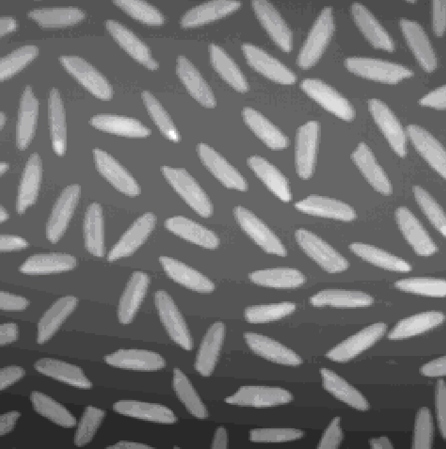

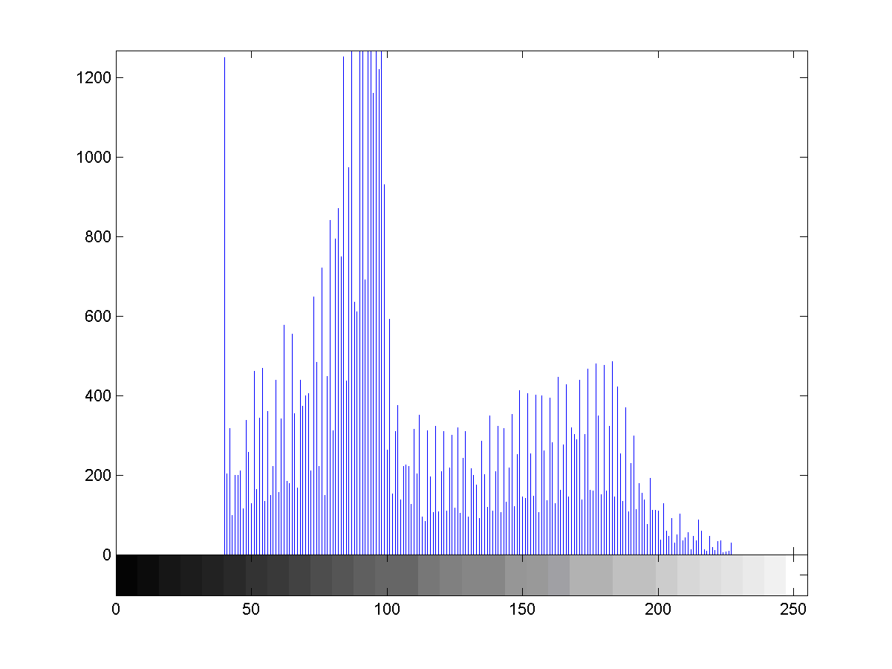

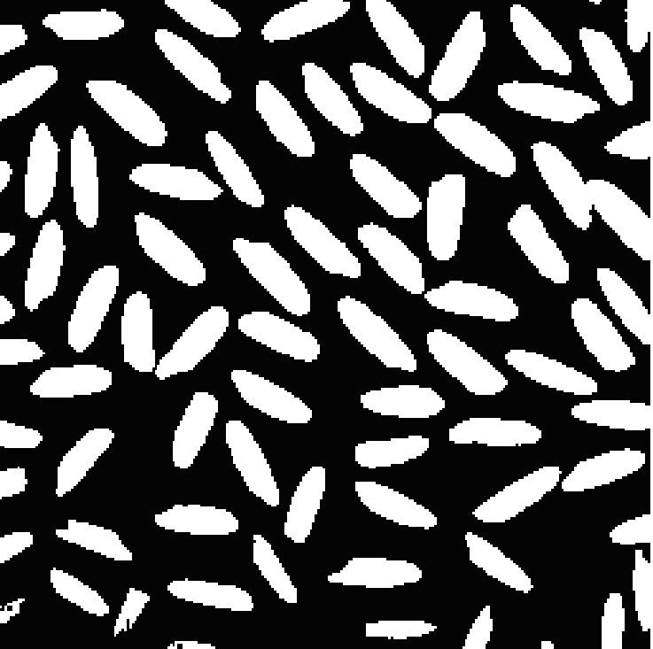

（a）原图像                 （b）直方图               （c）阈值分割的图像（T=110）

## Slide 19

全局阈值是最简单的图像分割方法。根据不同的目标，选用最佳的阈值。

1．直方图法

适用于目标和背景的灰度差较大，直方图有明显谷底的情况。

2．最大类间方差法

7.3.2  全局阈值分割

## Slide 20

1、直方图法

取直方图谷底的灰度值为阈值T。

依据：一般图像的边缘像素点灰度值对应于谷底。

缺点：会受到噪声的干扰。

改进：取两个峰值之间某个固定位置，如中间位置上。由于峰值代表的是区域内外的典型值，一般情况下，比选谷底更可靠，可排除噪声的干扰。

## Slide 21

通过直方图得到阈值

T

## Slide 22

2、判断分析法——最大类间方差法
Otsu于1978年提出的一种典型的图像分割方法。

C0类的概率和：

C0类的数学期望：

C0类的灰度均值：

C0类：  包含灰度级为[0,1,…,z]的像素。

假定某一阈值Z将图像各像素按灰度分成两类C0和C1 ，每个灰度级的概率为Pi 。

## Slide 23

C1类：包含灰度级为[z+1,z+2,…,K-1]的像素

C1类的概率和：

C1类的数学期望 ：

C1类的灰度均值：

## Slide 24

图像的总平均灰度为：
定义类间方差为：

从最小灰度值到最大灰度值遍历所有灰度z，使得上式中σ最大时的z即为分割的最佳阈值T 。

## Slide 25

最大类间方差法matlab实现：

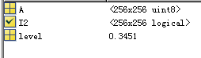

| clc;
clear    all  ;
A=imread( 'cameraman.tif'     );figure(1);
subplot(1,2,1),imshow(A);subplot(1,2,2),imhist(A);

%I=im2bw(A,110/255);% 分割为二值图像level     =graythresh(A);I2=im2bw(A,level);figure(2); |
| --- |

## Slide 26

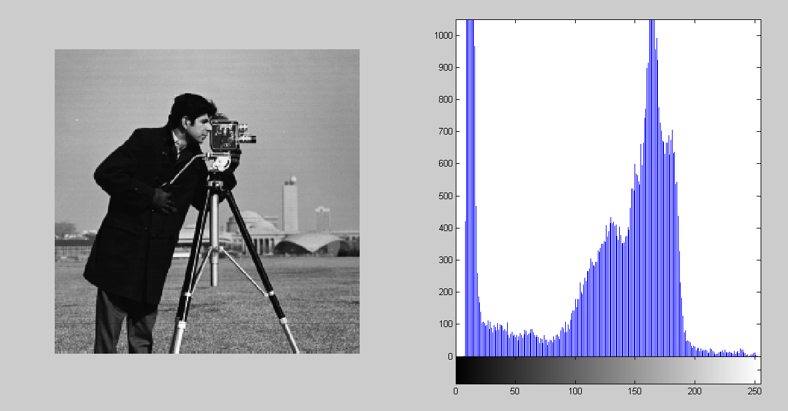

## Slide 27

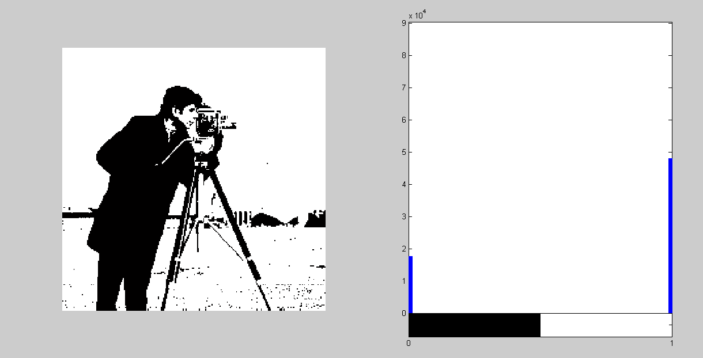

## Slide 28

7.3.3  局部阈值分割
当照明不均匀、有突发噪声或者背景灰度变化比较大的时候，可以对图像进行分块处理，对每一块分别选定一个阈值进行分割，这种与坐标相关的阈值称为自适应阈值的方法。
这类算法的时间复杂度和空间复杂度比较大，但是抗噪声的能力比较强 。
任何一种分割方法都有其局限性。
实际的算法只能根据实际情况选择方法和阈值。

## Slide 29

问题

1、边缘检测和区域生长法的分割依据？
2、图像的阈值分割依据？如何选择图像的分割阈值？

## Slide 30

定义：边缘定义为图像局部特性的不连续性(相邻区域之交界)
种类：大致分为阶跃式(包括灰度突变和渐变式,斜升斜降

式)，脉冲式和屋顶式。

（a）

（b）

（c）

（d）

几种类型边缘的截面图

（a）理想阶跃式；  （b）斜升、斜降式；

（c）脉冲式；

（d）屋顶式。

7.4.1边缘点检测的基本原理:

7.4  图像的边缘检测

## Slide 31

边缘特点
局部特性不连续性；
边缘位置的微分特性；
幅度和方向性(沿边缘方向灰度缓(不)变，垂直方向突变)

实现方法：
用差分、梯度、拉普拉斯算子及各种高通滤波处理方法对图像边缘进行增强，只要再进行一次门限化的处理，便可以将边缘增强的方法用于边缘检测。

边缘检测用途
将图像中各不同区域的边缘（边界）检测出来，以达到分割之目的。

## Slide 32

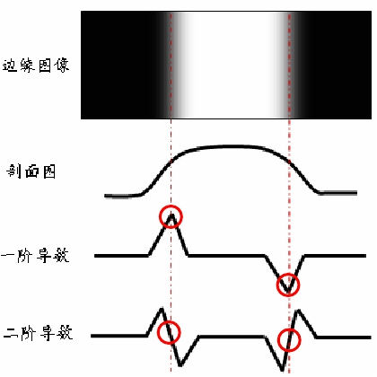

▓

边缘和导数（微分）的关系

## Slide 33

几种常用的边缘检测算子

Roberts算子
Prewitt算子
Sobel算子
Laplacian算子
Kirsch算子
LOG算子
Canny算子

## Slide 34

（7.2）

7.4.2  梯度算子

连续函数f(x,y)在(x,y)处的梯度为一个向量：
f = [f / x , f / y]
计算梯度的大小为：
G = [(f / x)2 +(f / y)2]1/2
近似为:    G  |fx| + |fy|   或   G  max(|fx|, |fy|)
梯度的方向角为：
φ(x,y) = tan-1(fy / fx)
数字图像的一阶梯度定义为：
可用下图所示的模板表示

## Slide 35

为了检测边缘点，选取适当的阈值T，对梯度图像进行二值化，则有：
这样形成了一幅边缘二值图像g(x,y)

特点：仅计算相邻像素的灰度差，对噪声比较敏感，无法抑制噪声的影响。

## Slide 36

Roberts算子

公式：
模板：
特点：
与梯度算子检测边缘的方法类似，对噪声敏感，但效果较一阶梯度算子略好

## Slide 37

Prewitt算子

公式
模板：
特点：
在检测边缘的同时，能抑止噪声的影响

## Slide 38

Sobel算子

公式
模板
特点：
对8邻域采用带权方法计算差分
能进一步抑止噪声
但检测的边缘较宽

## Slide 39

2. Prewitt算子
3. Sobel算子
通过算子检测后，还需作二值处理从而找到边界点。

1. Roberts算子

## Slide 40

I = imread('blood1.tif');
imshow(I);
BW1 = edge(I,'roberts');
%进行Roberts算子边缘检测，门限值采用默认值
BW2 = edge(I,'prewitt');
%进行Prewitt算子边缘检测，门限值采用默认值
BW3 = edge(I,'sobel');
%进行Sobel算子边缘检测，门限值采用默认值
figure,imshow(BW1,[]);
figure,imshow(BW2,[]);
figure,imshow(BW3,[]);

【例7.2】利用边缘检测算子对图像进行边缘检测。

## Slide 41

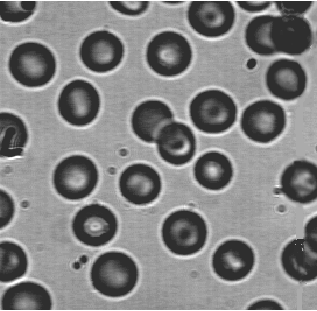

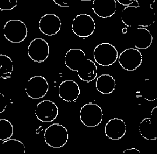

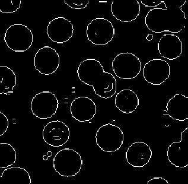

(a) 原图像

(c) Prewitt算子

【例7.2】利用边缘检测算子对图像进行边缘检测。

Sobel算子检测效果最好

(b) Roberts算子

(d) Sobel算子

## Slide 42

7.4.3  拉普拉斯算子

对于阶跃状边缘，其二阶导数在边缘点处出现过零交叉，即边缘点两旁的二阶导数取异号，据此可以通过二阶导数来检测边缘点。

Laplacian算子为二阶偏导：

对数字图像f(x,y)，用差分代替二阶偏导，则边缘检测算子:

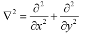

## Slide 43

Laplacian是二阶导数算子，也是借助模板来实现的。
对模板有一些基本要求：
模板中心的系数为正，其余相邻系数为负，且所有的系数之和为零。
常用的模板有：

## Slide 44

拉普拉斯算子

拉普拉斯算子的分析：
优点：
对细线和孤立点检测效果较好。
缺点：
对噪音的敏感，对噪声有双倍加强作用；
不能检测出边的方向；

注意：由于梯度算子和Laplace算子都对噪声敏感，因此一般在用它们检测边缘前要先对图像进行平滑。

## Slide 45

【例7.3】Robert、Sobel和Laplace算子的边缘检测。

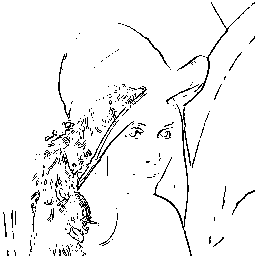

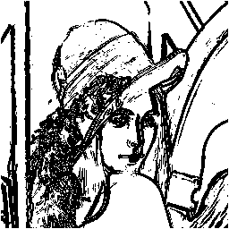

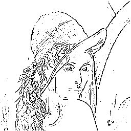

（a）Lena图像      （b）Robert算子检测结果 （c）Sobel算子检测结果  （d）Laplace算子检测结果

各种算子的检测结果

## Slide 46

由于Laplacian算子对噪声比较敏感，为了减少噪声影响，可先对图像进行平滑，然后再用Laplacian算子检测边缘。
平滑函数能反映不同远近的周围点对给定像素具有不同的平滑作用，因此，平滑函数采用正态分布的高斯函数，即：

7.4.4  LOG算子

其中σ是方差。

## Slide 47

用h(x,y)对图像f(x,y)的平滑可表示为：
对图像g(x,y)采用Laplacian算子进行边缘检测，可得：
这样，利用二阶导数算子过零点的性质，可确定图像中阶跃边缘的位置。

## Slide 48

由于的平滑性质能减少噪声的影响，所以当边缘模糊或噪声较大时，利用      检测过零点能提供较可靠的边缘位置。
在该算子中，σ的选择很重要， σ小时平滑不明显，边缘位置精度高，但边缘细节变化多； σ大时平滑作用大，但细节损失大，边缘点定位精度低。应根据噪声水平和边缘点定位精度要求适当选取σ。

Marr算子(LOG算子)

## Slide 49

clc;
clear all;
I=imread('cameraman.tif');
h1 = [0 -1 0;-1 4 -1;0 -1 0];
h2 = [-1 -1 -1;-1 8 -1;-1 -1 -1];
J1 = imfilter(I,h1);
J2=imfilter(I,h12);
J3=edge(I,'log');%可用sobel ,prewitt,roberts,canny等边缘检测算子
subplot(2,2,1),imshow(I);
subplot(2,2,2),imshow(J1);
subplot(2,2,3),imshow(J2);
subplot(2,2,4),imshow(J3);

## Slide 50

(a)原图像;
(b)、(c)分别是
4邻域和8邻域
的Laplacian检
测结果;
(d)LoG检测结
果。

(a)

(b)

(c)

(d)

## Slide 51

常用的LOG算子卷积模板

常用的laplace算子卷积模板

## Slide 52

7.4.5  Canny边缘检测算子
Canny检测原理：
用高斯滤波器平滑图像后求一阶导数作为检测算子的梯度来计算，边缘出现在梯度的局部极大值处。
Canny 边缘检测优点：
低误判率；
高定位精度；
抑制虚假边缘；

## Slide 53

MATLAB程序：
I = imread('camerman.tif');
imshow(I);
BW5 = edge(I,‘ canny’); % 边缘检测函数（检测方法有sobel ,prewitt,roberts,log,canny）
figure,imshow(BW5,[]);

## Slide 54

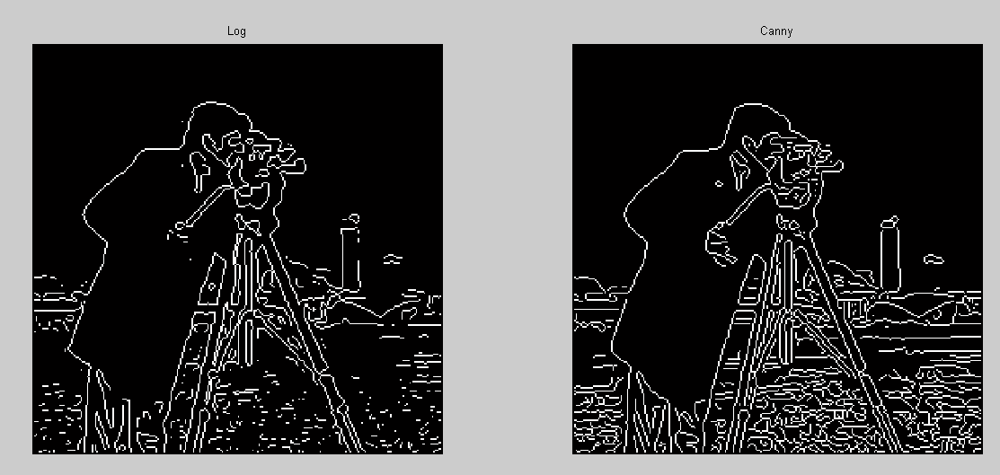

## Slide 55

matlab边缘检测的函数

BW = edge(I,‘sobel’,thresh,direction)  ; % prewitt
BW = edge(I,‘roberts’,thresh);
BW = edge(I,‘log’,thresh,sigma);
BW = edge(I,‘canny’,thresh,sigma);

## Slide 56

算子性能比较

|  | 梯度 | Robert | Prewitt
Sobel | Lap | Log | Canny |
| --- | --- | --- | --- | --- | --- | --- |

## Slide 57

例子

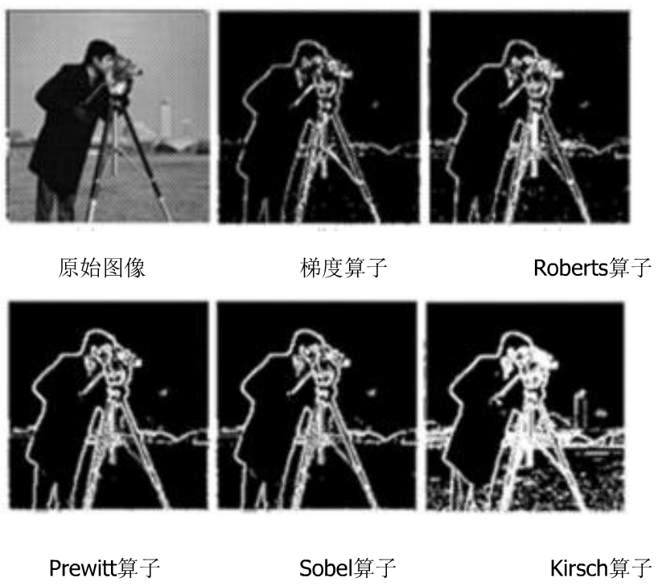

## Slide 58

7.4.6  方向算子

我们可设计一系列对应不同方向边缘的方向梯度模板集，称为方向匹配检测模板。

用其中的每一个方向的模板分别与图像卷积，其最大模值就是边缘点的强度，最大模值对应的模板方向就是边缘点的方向。

若事先并不知道哪个方向有边缘，但需要检测边缘，
并确定边缘的方向。

这种检测边缘点并确定其方向的方法就称为方向梯度法或方向匹配模板法。

## Slide 59

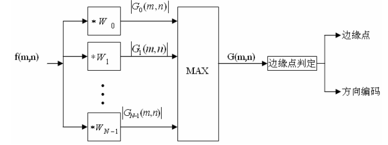

方向梯度法检测边缘点的过程图

边缘梯度的定义式为：

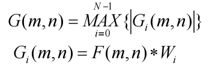

## Slide 60

相对于梯度算子的优点：
不仅仅只考虑水平和垂直方向，还可以检测其他方向上的边缘。
缺点：但计算量将大大增加。
常用的有8方向Prewitt模板、Sobel模板，Kirsch（3×3）模板。

方向算子优缺点

## Slide 61

1.  8方向Prewitt梯度模板
将Prewitt的平均差分梯度模板旋转，就可得到如图
所示的8方向模板梯度。
其中的模板方向表示灰度由小变大的方向，比如“东”就表示灰度由西向东突变。
有了方向梯度模板，就可求得各方向的梯度值，然后求得大梯度，再进行取阈值判定，就可得到边缘点及其方向。

## Slide 62

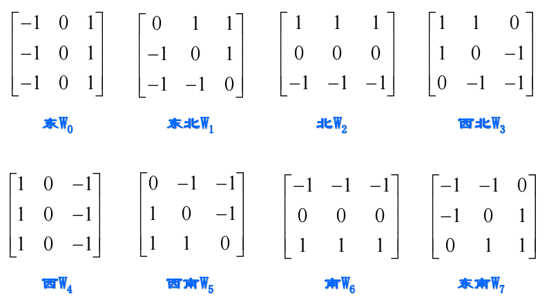

8方向Prewitt梯度模板

## Slide 63

2.  8方向Sobel梯度模板

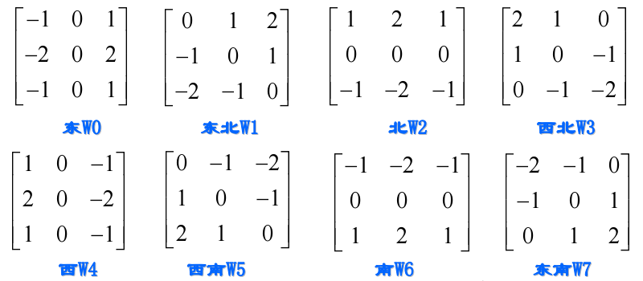

8方向Sobel梯度模板

## Slide 64

3.Kirsch方向梯度
为了使边缘点检测算法既能抑制噪声，又能很好地保持边缘,细节，Kirsch提出了一个 3×3  的非线性算子。下图是利用Kirsch  梯度算子生成的8方向梯度模板，利用它们可获得性能优于平均差分和加权平均差分的边缘点检测结果。
常用的有8方向Kirsch(3*3)模板，如下图所示，方向间夹角为45°。

## Slide 65

3×3 Kirsch算子的八方向模板

## Slide 66

Sobel方向算子的matlab实现

clc;clear all
bw1=imread('cameraman.tif');
t=[0.1 0.5 1.0 1.5 2.0].*10^5 ;     %设定阈值
bw=double(bw1);
[m,n]=size(bw);
g=zeros(m,n);
d=zeros(1,8);
%利用sobel算子进行边缘提取
for i=2:m-1
for j=2:n-1
d(1) =(bw(i-1,j+1)-bw(i-1,j-1)+2*bw(i,j+1)-2*bw(i,j-1)+bw(i+1,j+1)-bw(i+1,j-1))^2;
d(2) =(bw(i-1,j-1)-bw(i-1,j+1)-2*bw(i,j+1)+2*bw(i,j-1)-bw(i+1,j+1)+bw(i+1,j-1))^2;
d(3) =(bw(i-1,j)+2*bw(i-1,j+1)-bw(i,j-1)+bw(i,j+1)-2*bw(i+1,j-1)-bw(i+1,j))^2;
d(4) =(bw(i,j-1)-bw(i-1,j)-2*bw(i-1,j+1)-bw(i,j+1)+2*bw(i+1,j-1)+bw(i+1,j))^2;
d(5) =(bw(i-1,j-1)+2*bw(i-1,j)+bw(i-1,j+1)-bw(i+1,j-1)-2*bw(i+1,j)-bw(i+1,j+1))^2;
d(6) =(bw(i+1,j-1)+2*bw(i+1,j)+bw(i+1,j+1)-bw(i-1,j-1)-2*bw(i-1,j)-bw(i-1,j+1))^2;
d(7) =(2*bw(i-1,j-1)+bw(i-1,j)+bw(i,j-1)-bw(i,j+1)-bw(i+1,j)-2*bw(i+1,j+1))^2;
d(8) =(bw(i,j+1)+bw(i+1,j)+2*bw(i+1,j+1)-2*bw(i-1,j-1)-bw(i-1,j)-bw(i,j-1))^2;
g(i,j) = max(d);
end
end

## Slide 67

%显示边缘提取后的图象
figure(5)
for k=1:5
for i=1:m
for j=1:n
if g(i,j)>t(k)
bw(i,j)=255;
else
bw(i,j)=0;
end
end
end
subplot(1,5,k)
imshow(bw,[])
title([‘Sobel' '  ' num2str(t(k))])
end

## Slide 68

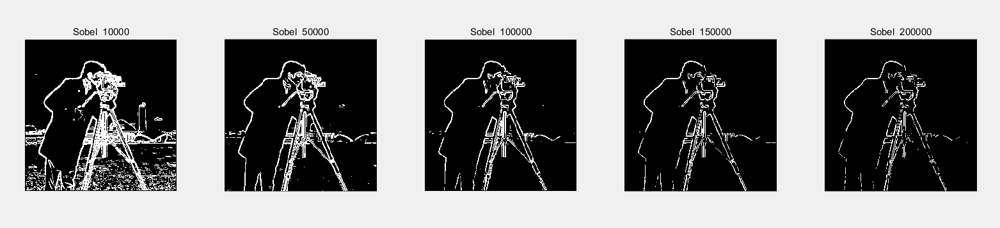

## Slide 69

7.4.7  线检测模板

利用方向梯度模板的基本思想，可以设计检测不同方向线的方向模板。线检测模板如下所示：

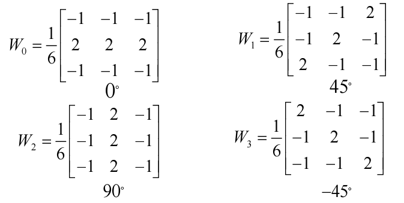

不同方向的线检测模板

## Slide 70

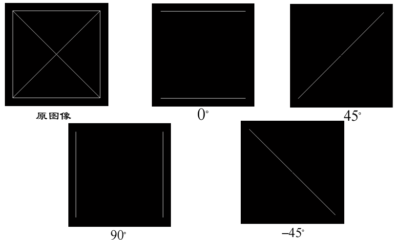

基于线检测模板的检测示例

## Slide 71

图像处理模板特点

1. 平滑模板特点

模板内系数全为正（表示求和、平均=>平滑）；
模板内系数之和为1:①对常数图像f(m,n)≡c，处理前后不变；
②对一般图像，处理前后平均亮度不变。

2. 锐化模板特点
模板内系数有正有负，表示差分运算；
模板内系数之和为1:①对常数图像f(m,n)≡c，处理前后不变；
②对一般图像，处理前后平均亮度不变。

3. 边缘检测模板特点
模板内系数有正有负，表示差分运算；
模板内系数之和为0:①对常数图像f(m,n)≡c，处理后为0；
②对一般图像，处理后为边缘点。

## Slide 72

7.5  边缘跟踪
上述方法仅得到处在边缘上的像素点。
由于噪声、不均匀照明会产生边缘间断以及引入虚假边缘，使得图像像素很少能完整的描绘一条边缘。
因此典型的做法是在使用边缘检测算法后，紧跟着使用连接过程，将边缘像素组合成有意义的边缘。

## Slide 73

边缘跟踪的方法

7.5.1 局部边缘连接法;
7.5.2 光栅扫描跟踪法；
7.5.3 Hough变换法。

## Slide 74

将边缘点连成边缘线的最简单的方法是依据事先确定的准则，把相似的边缘点连成线。该方法以局部梯度算子处理后的梯度图像作为输入，连接过程分为两步。

第一步：选择可能位于边缘线上的边缘点。

第二步：对相邻的候选边缘点，根据事先确定的相似准则判定是
否连接。如果在相邻的小邻域内的两个候选点的梯度和方向差值
都在某阈值之内，则这两点被认为属于同一边缘线，可以连接起来。相似准则定义为：

7.5.1 局部边缘连接法

## Slide 75

该方法是基于边缘的局部特性进行边缘连接，所以容易受噪声或干扰的影响。

其中G1(m,n)和G2(m,n)分别为边缘点(m,n)和(i,j)的梯度模值(m,n) 和φ1(m,n)和φ2(i, j)分别为两边缘点的方向（角度）值。

## Slide 76

7.5.2 光栅扫描跟踪

具体步骤：
(1)确定一个比较高的检测阈值d，把高于或等于该阈值的像素作为检出点。称该阈值为“检测阈值” 。
(2)用检测阈值d对图像第一行像素进行检测，凡高于或等于d的点都接受为检出点，并作为下一步跟踪的起始点。
(3)选取一个比较低的阈值作为跟踪阈值，该阈值可以根据不同准则来选择。例如，取相邻对象点之灰度差的最大值作为跟踪阈值，有时还利用其他参考准则，如梯度方向、对比度等。
(4)确定跟踪邻域。取像素(i，j)的下一行像素(i+1，j-1)，(i+1，j)，(i+1，j+1)为跟踪邻域。

## Slide 77

光栅扫描跟踪

(5)扫描下一行像素，凡和上一行已检测出来的对象点相邻接的像素，其灰度差小于或等于跟踪阈值的，都接受为对象点，反之去除。
(6)对于已检测出的某一对象点，如果在下一行跟踪领域中，没有任何一个像素被接受为对象点，那么，这一条曲线的跟踪便可结束。如果同时有两个，甚至三个邻域点均被接受为对象点，则说明曲线发生分支，跟踪将对各分支同时进行。如果若干分支曲线合并成一条曲线，则跟踪可集中于一条曲线上进行。一曲线跟踪结束后，采用类似上述步骤从第一行的其他检出点开始下一条曲线的跟踪。

## Slide 78

光栅扫描跟踪

(7)对于未被接受为对象点的其他各行像素，再次用检测阈值进行检测，并以新检出的点为起始点，重新使用跟踪阈值程序，以检测出不是从第一行开始的其他曲线。
(8)当扫描完最后一行时，跟踪便可结束。

## Slide 79

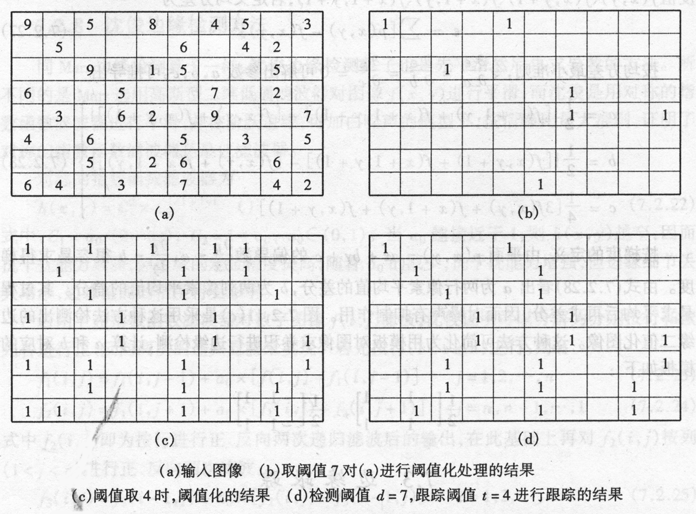

光栅扫描跟踪

扫描方式从下到上？

## Slide 80

Matlab中二值图像的边缘跟踪实现：

clc;clear   all;
I1=imread('e2.bmp³);
I2=im2bw(I1);
I=1-I2;
subplot(1,2,1);imshow(I,[]);
s=size(I);
subplot(1,2,2):background=zeros(s);imshow(background);
for   row=2:55:s(1)
for   col=1:s(2)
if   I(row,col) break; end;end  %寻找第一个非零像素(跟踪起始点),坐标为 [row,col]
contour=bwtraceboundary(I,[row,col],’W’,8,100,’clockwise’);
if (~isempty(contour )) %发现跟踪起始点
hold  on;plot(col,  row ,’gx’,  ‘LineWidth’,  2);% 绿 色X标记跟踪起始
hold  on;plot(contour(:,2),contour (:,1),’w’,’LineWidth’,2);%     画出边界
else
hold  on;plot(col,row, ’r*’,  ‘LineWidth’, ‘2);% 红色*标记无跟踪起始end;end

## Slide 81

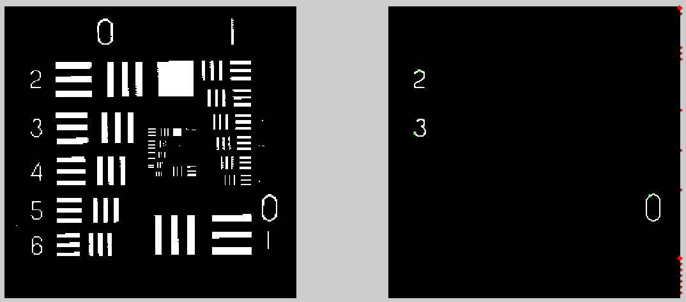

## Slide 82

Matlab中二值图像的边缘跟踪实现：

clc;clear   all;
I1=imread('e2.bmp³);
I2=im2bw(I1);
I=1-I2;
subplot(1,2,1);imshow(I,[]);
s=size(I);
subplot(1,2,2):background=zeros(s);imshow(background);
for   row=2:5:s(1)
for   col=1:s(2)
if   I(row,col) break; end;end  %寻找第一个非零像素(跟踪起始点),坐标为 [row,col]
contour=bwtraceboundary(I,[row,col],’W’,8,100,’clockwise’);
if (~isempty(contour )) %发现跟踪起始点
hold  on;plot(col,  row ,’gx’,  ‘LineWidth’,  2);% 绿 色X标记跟踪起始
hold  on;plot(contour(:,2),contour (:,1),’w’,’LineWidth’,2);%     画出边界
else
hold  on;plot(col,row, ’r*’,  ‘LineWidth’, ‘2);% 红色*标记无跟踪起始end;end

## Slide 83

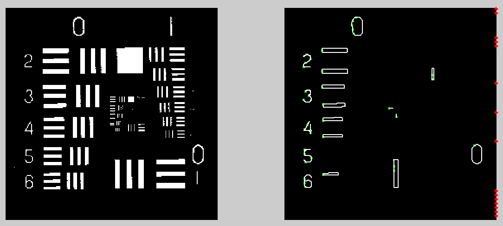

## Slide 84

7.5.3  霍夫变换

霍夫（Hough）变换方法是利用图像全局特性而直接检测目标轮廓，将图像的边缘像素连接起来的常用方法。
基本原理
1、对边界上n个点的点集，找出共线的点集和直线方程。

## Slide 85

霍夫变换基本原理：

2、  x，y 平面上任一条直线y=a1x+b1,对应在参数空间a,b 平面都有一个点。

3、 过x，y 平面上一个点（x0,y0）的所有直线，,对应在参数空间a,b 平面上的一条直线b=-ax0+y0。

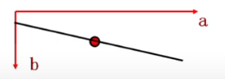

## Slide 86

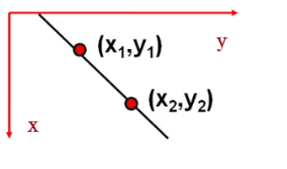

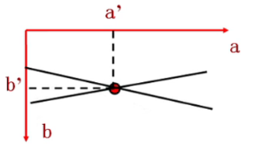

4、如果点(x1,y1),(x2,y2)共线，那么这两点在参数a,b平面将有一个交点，这个交点坐标即共线方程的系数。

5、直线上共线的点越多，参数空间的交点也越多，交点坐标就对应了直线的方程。

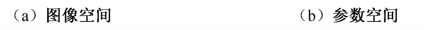

## Slide 87

通过霍夫变换，可以将图像空间中直线的检测问题转化为参数空间中点的检测问题。而参数空间中点的检测只要进行简单的累加统计就可以完成。

## Slide 88

霍夫变换步骤

霍夫变换的具体步骤如下：
在参数空间ab平面中建立一个二维的累加数组A。假设斜率a和截距b的取值范围分别为[amin,amax]和[bmin,bmax],则累加数组A初始化为0。
对图像空间中的每一个边缘点，让a从amin到amax取值，根据参数空间b=-xia+yi，得到对应的b值。将对应的数组元素A(a,b)进行累加。计算结束后，根据A(a,b)的值确定在(a,b)处共线点（交点）的数量。根据A(a,b)的最大值所处的位置（a’,b’）,就可以找到图像空间中的边缘点共线的直线方程。

## Slide 89

参数空间中的累加数组

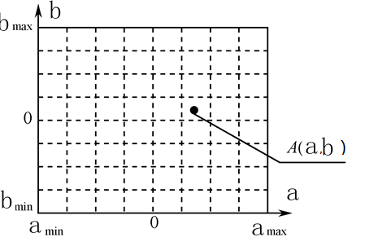

## Slide 90

2．极坐标系中的霍夫变换
如：当直线接近垂直时，直线的斜率接近无穷大，解决这一问题的方法是采用极坐标的点法式直线方程。
极坐标的点法式直线方程为：

## Slide 91

可以证明，与直角坐标系中霍夫变换不同的是，极坐标系将图像空间的XY上的点映射为 平面的正弦曲线。
取值范围为[-90°，90°]

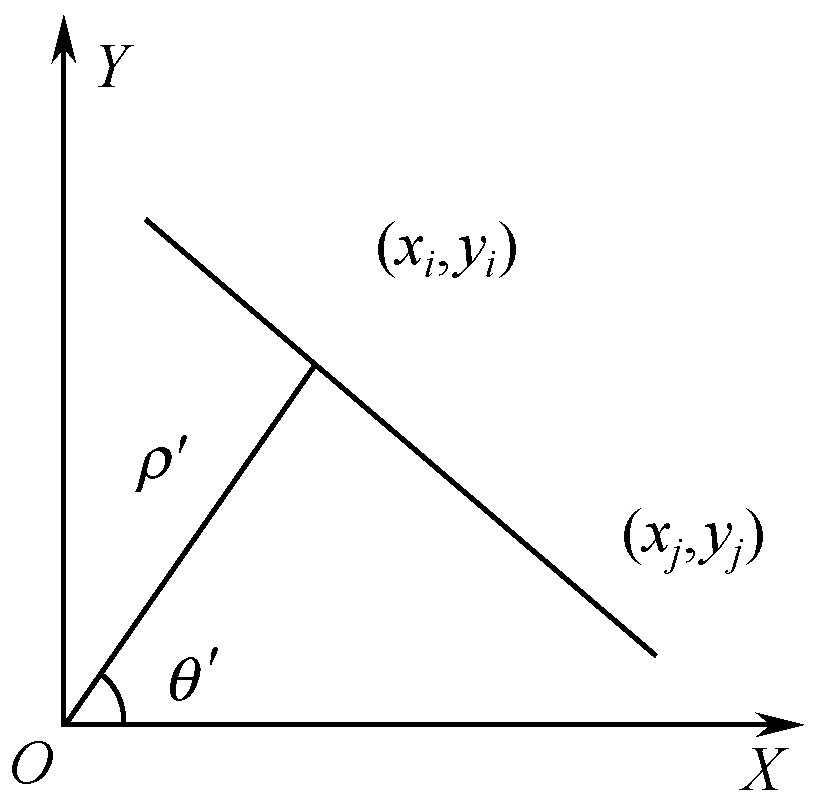

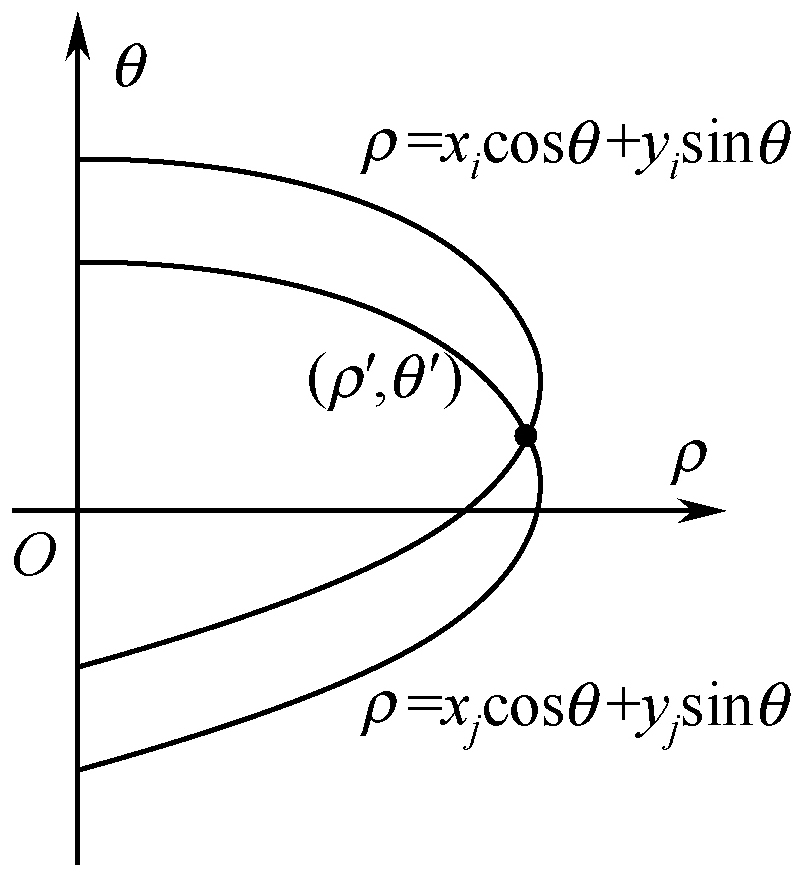

图7.19  直线的极坐标表示              图7.20  参数空间对应的曲线

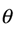

## Slide 92

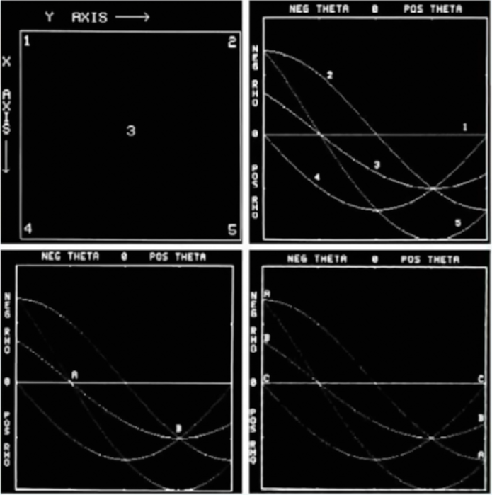

1这点映射为幅值为0的正弦的特殊情况。

## Slide 93

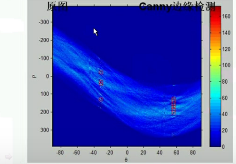

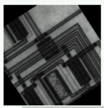

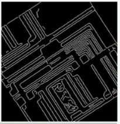

## Slide 94

https://www.cnblogs.com/php-rearch/p/6760683.html

## Slide 95

Matlab中二值图像的霍夫变换：

clc;clear  all;
I =imread('e2. bmp );
rotI =imrotate (I,33,' crop'   );
BW=edge(rotI,'canny’);
[H,T,R]=hough(BW);
imshow(H,[],XData',T,’YData',R, 'InitialMagnification','fit');
xlabel('\theta),ylabel('\rho');
axis   on,axis  normal,hold   on;
P=houghpeaks(H,5,'threshold’,ceil(0.3*max(H(:))));
x =T(P(:,2));y=R(P(:,1));
plot(x,y,'s','color','white');%Find    lines    and    plot    them
lines=houghlines(BW,T,R,P,'FillGap’,5,’MinLength’,7);
figure,imshow(rotI),hold on
max_len   =0;

## Slide 96

for k =1:length(lines)
xy =[lines(k).point1;lines(k).point2];
plot(xy(:,1),xy(:,2),‘LineWidth’,  2,'color',’green’);
%Plot  beginnings  and  ends of  lines
plot(xy(1,1),xy(1,2), ’x’, ’LineWidth’   ,2,’Color',   ‘yellow’);
plot(xy(2,1),xy(2,2), ’x’,'LineWidth’,2,'Color',       'red');
%Determine    the     endpoints     of    the     longest     line     segment
len =norm(lines(k).point1-lines(k).point2);
if   (len >max_len)
max_len          =len;
xy_long         =xy;       end;end
%highlight    the    longest    line    segment
plot(xy_long(:,1),xy_long(:,2),'  LineWidth’,2,'Color','blue')

## Slide 97

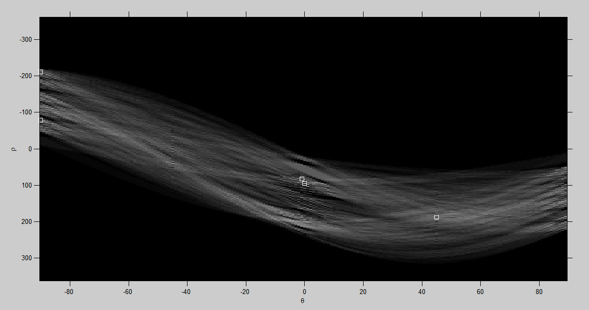

## Slide 98

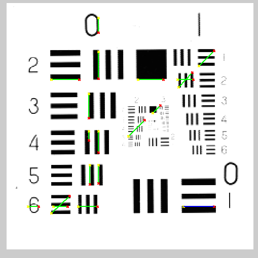

## Slide 99

c l c;clear     all  ;
I  =imread( e2.bmp² );
rotI    = imrotate(I,33  ,’ crop’  );
BW     =edge(I,’ canny ’  );
[H,T,R]=hough(BW);
imshow(H,[],’ XData’   ,T,’ YData ’  ,R,    ’ InitialMagnification’,' ’ fit’   );
xlabel(’ \theta’     ),ylabel(’ rho’ );
axis  on,axis     normal,hold   on;
P=houghpeaks(H,5,’  threshold',  ceil(0.3*max(H(:))));
x  =I(P(:,2));y=R(P(:,1));
plot(x,y,  ’ s’ ,’ color’ , ’  white’  );
%Find    lines    and    plot    them
lines  =houghlines(BW,I,R,P,’ FillGap’ ,2,’ MinLength’ ,  10);
figure,imshow(I),hold on max_len      =0;

k   =1:length(lines)
xy  =[lines(k).point1:   lines(k).point2];
plot(xy(:,1),xy(:,2),’  LineWidth’ ,   2,’  color’ ,’ green’ );
%Plot    beginnings     and     ends     of    lines
plot(xy(1,1),xy(1,2),  ’ x’ ,’ LineWidth’  ,2,’ color’ , ’ yellow’ );
plot(xy(2,1),xy(2,2),  ’ x ’ , ’ LineWidth ’ ,2, ’ color ’ , ’ red ’ );

## Slide 100

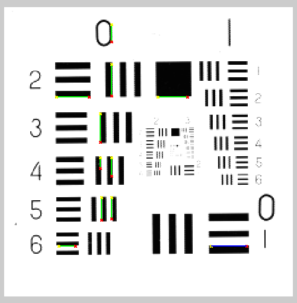

## Slide 101

c l c;clear     all  ;
I  =imread( e2.bmp² );
rotI    = imrotate(I,33  ,’ crop’  );
BW     =edge(I,’ canny ’  );
[H,T,R]=hough(BW);
imshow(H,[],’ XData’   ,T,’ YData ’  ,R,    ’ InitialMagnification’,' ’ fit’   );
xlabel(’ \theta’     ),ylabel(’ rho’ );
axis  on,axis     normal,hold   on;
P=houghpeaks(H,3,’  threshold',  ceil(0.3*max(H(:))));
x  =I(P(:,2));y=R(P(:,1));
plot(x,y,  ’ s’ ,’ color’ , ’  white’  );
%Find    lines    and    plot    them
lines  =houghlines(BW,I,R,P,’ FillGap’ ,2,’ MinLength’ ,  10);
figure,imshow(I),hold on max_len      =0;

k   =1:length(lines)
xy  =[lines(k).point1:   lines(k).point2];
plot(xy(:,1),xy(:,2),’  LineWidth’ ,   2,’  color’ ,’ green’ );
%Plot    beginnings     and     ends     of    lines
plot(xy(1,1),xy(1,2),  ’ x’ ,’ LineWidth’  ,2,’ color’ , ’ yellow’ );
plot(xy(2,1),xy(2,2),  ’ x ’ , ’ LineWidth ’ ,2, ’ color ’ , ’ red ’ );

## Slide 102

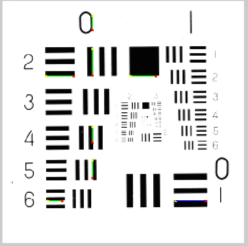

## Slide 103

使用霍夫变换进行边缘跟踪

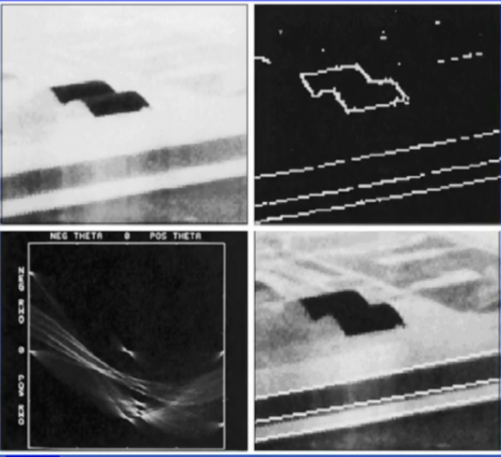

图a是一幅航拍的红外线图像。
图b 是使用sobel算子得到的梯度图像。
图c是梯度图像的霍夫变换。
图d 是依据判定准则判断为相连的像素集合。
准则（1）3个具有最高计数的累加器。
（2）像素间隙小于5个。

## Slide 104

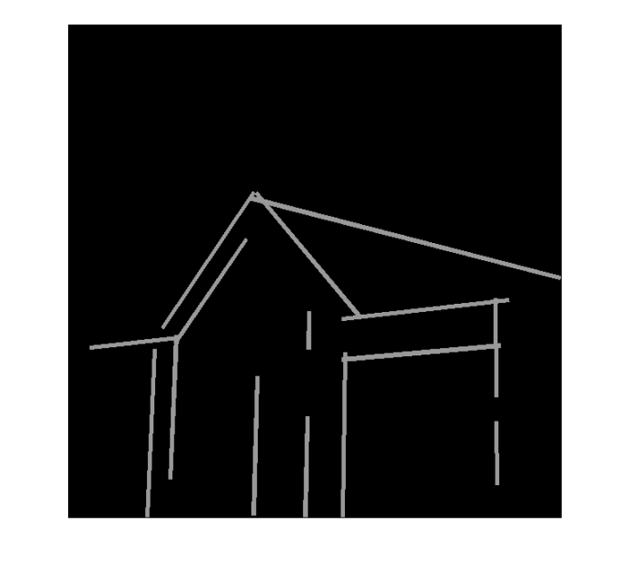

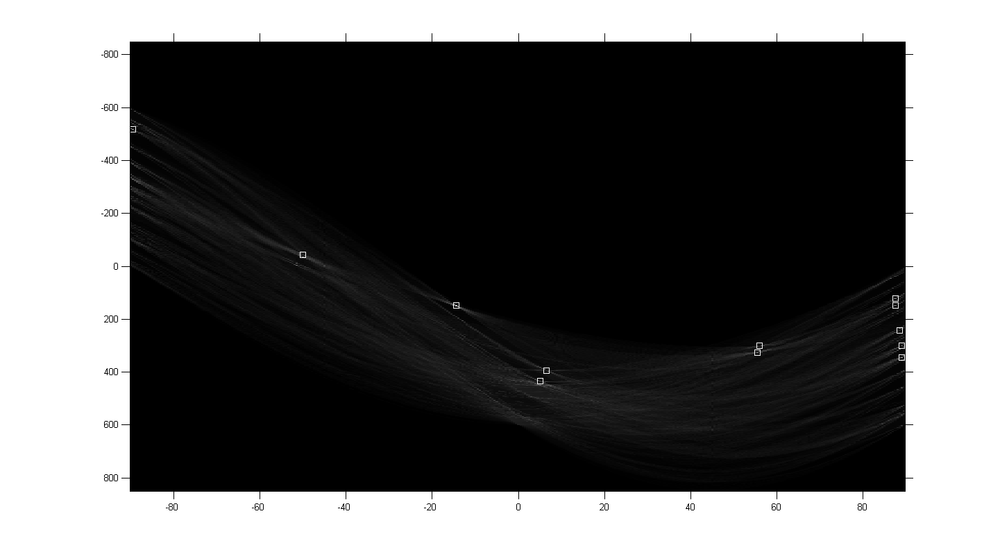

Hough变换

检测结果

## Slide 105

8.6 区域生长法

8.6.1  原理和步骤
将具有相似性质的像素集合起来构成区域。
在实际应用区域生长法时需要解决三个问题：
① 选择一组能正确代表所需区域的种子像素；
② 确定在生长过程中将相邻像素包括进来的准则，即区域生长准则；
③ 制定让生长过程停止的条件或规则。

## Slide 106

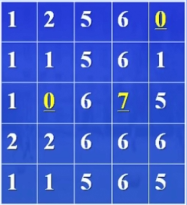

①选择种子：要根据所解决的问题性质。
如图：目标较暗，背景较亮，那灰度级为0可作为目标种子，7可作为背景种子。

## Slide 107

②相似准则：假设是像素灰度与初始种子点的灰度差值小于等于4。
不考虑连通性，分割结果为：

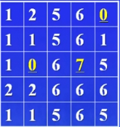

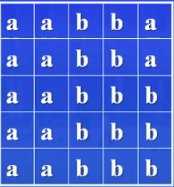

结果只有一个对象，这是不对的

## Slide 108

考虑连通性和相似性，分割结果如下：

生长像素与种子像素满足8连通

②区域生长选定准则必须考虑连通性（邻接性），否则得到的分割结果也许没有意义。

## Slide 109

③区域生长的另一个问题是描述终止规则。一般来说，在没有像素满足某个区域的生长条件时，区域生长停止。
区域生长的步骤：
确定种子点，并将种子点作为增长点；
确定生长准则，判断增长点的领域内是否有满足相似性的像素，如果有，将像素合并，如果没有，到步骤4.
以新合并的像素点为增长点，返回步骤2.
是否满足终止条件，如果是，则结束，如果不是，则返回步骤1

## Slide 110

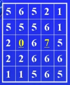

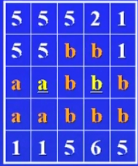

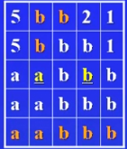

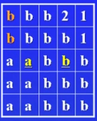

如果只要求分割一个对象，现在分割可以结束了。

如果要分割出所有可能的对象，或要求每个像素都要在一个区域中，那就要对剩余的像素再确定种子点。

## Slide 111

区域生长在焊接中的应用

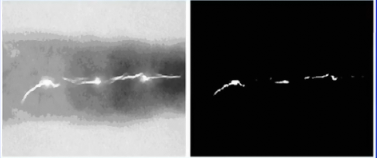

左图显示了一幅焊缝的X射线图像

用区域生长的方法将有缺陷的焊接区域分离出来。

① 确定种子点：
从图中可以看出，表现出有缺陷焊缝的像素趋于白色（255），我们以灰度值为255的点作为种子点。
图b 为从a中提取出的种子点。

## Slide 112

②区域生长选定准则：
任何像素与种子像素的灰度级绝对值之差小于等于65；
要添加入某个区域的像素必须与此区域中至少一个像素是连通的。

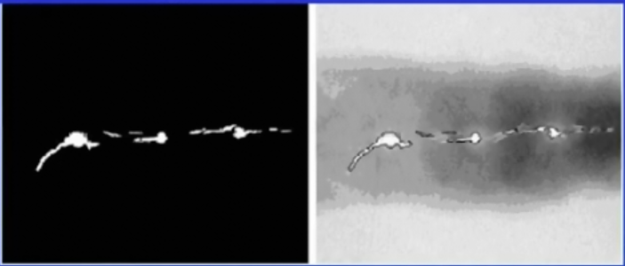

左图：为种子点采用选定准则生长的区域。
右图：将边界叠加到原图中

## Slide 113

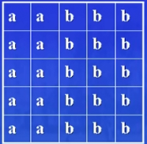

生长选定准则：有时对于相似性的判断可以考虑增长历史。
对于下图，相似性准则定义为：待选像素与增长点之间的灰度绝对值之差小于等于4，而不是与初始种子点灰度绝对值之差小于4.

## Slide 114

区域生长的matlab程序

clc;
clear  all;
I=imread('cameraman.tif²);
if  isinteger(I)
I=im2double(I);
end
figure,imshow(I)
[M,N]=size(I);
[y,x]=getpts;         %单击取点后，按enter 结束
x1=round(x);
y1=round(y);
seed=I(x1,y1); %获取中心像素灰度值
J=zeros(M,N);
J(x1,y1)=1;

## Slide 115

区域生长的matlab程序

count= 1; %待处理点个数
threshold=0.15;
while   count>0
count=0;

for   i=1:M                        %遍历整幅图像
if   J(i,j)==1                  %点 在“栈” 内
if   (i-1)>1(i+1)<M&(j-1)>1(j+1)<N   %3*3邻域在图像范围内
for   u=-1:1          %8-邻域生长

for  v=-1:1
if    J(i+u,j+v)==0&abs(I(i+u,j+v)-seed)<=threshold
J( i +u ,j+v)=1;
count=count+1;     % 记录此次新生长的点个数
end
end
end
end
end
end
end
end
subplot(1,2,1),imshow(I);title(‘original image’)subplot(1,2,2),imshow(J);title(‘segmented  image');

## Slide 116

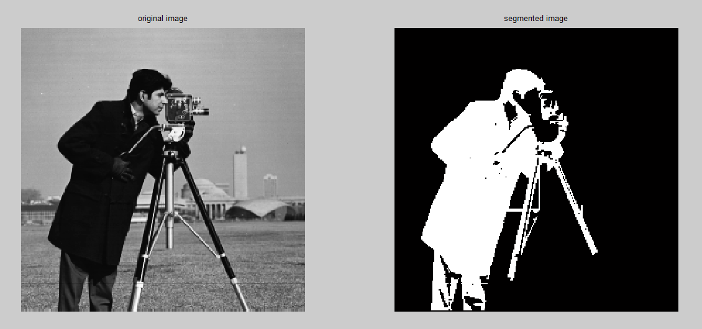

threshold=0.15

## Slide 117

threshold=0.02

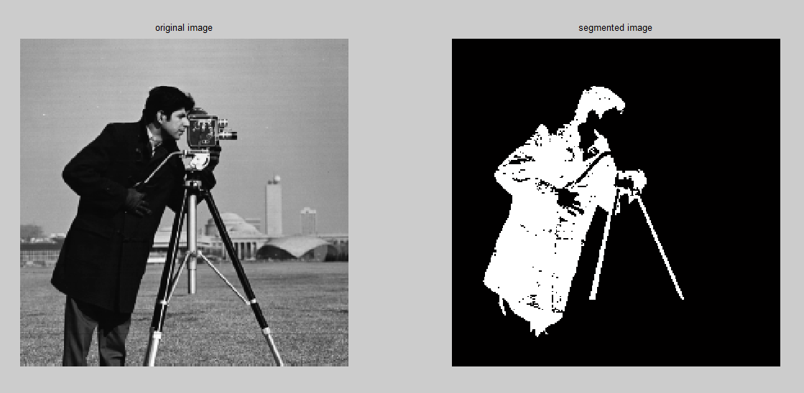

## Slide 118

threshold=0.4

## Slide 119

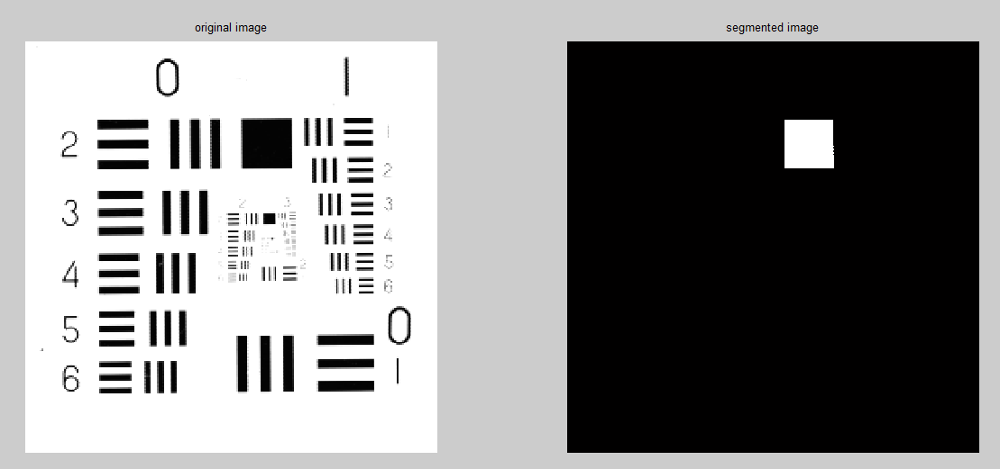

## Slide 120

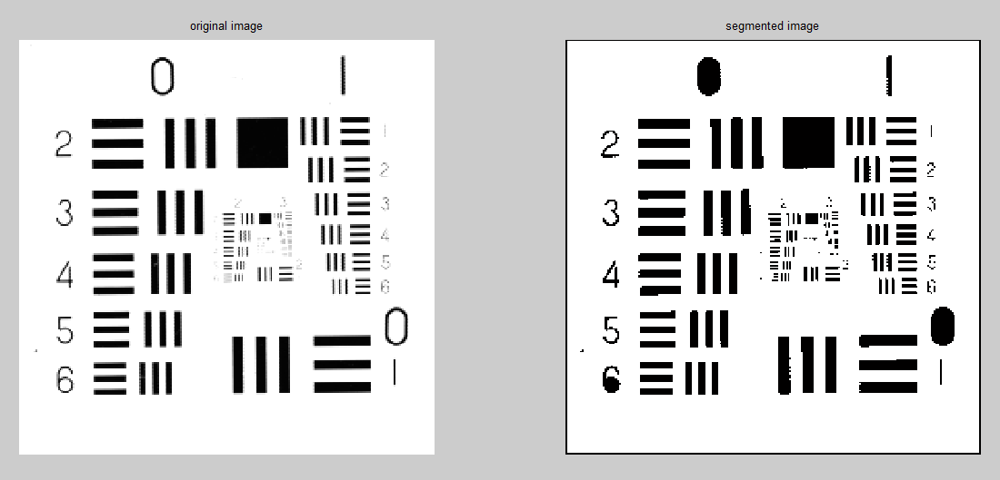

## Slide 121

## Slide 122

问题

1、图像的区域生长法分割步骤？

## Slide 123

如下图像，请用基于区域灰度差进行区域生长的方法，对图像进行分割。已知目标种子像素灰度值为0，背景种子像素灰度值为7，灰度差值T=3。
1、写出区域生长的生长步骤，
2、找出图像中所有目标。

| 1 | 0 | 4 | 3 | 0 |
| --- | --- | --- | --- | --- |

## Slide 124

（1）区域生长步骤如下：
选择种子点：目标和背景的种子点需要有明显的差异；
确定生长准则：定义一个相似性准则，用于判断待生长像素与已生长区域的相似性。
区域生长：从种子点开始，按照生长准则，将与种子点相似的相邻像素逐步合并到已生长区域中；不断重复步骤3，直到没有满足生长准则的新像素可加入到已生长区域为止。
重复生长过程：多区域生长与合并：如果图像中存在多个不同的目标区域，可能需要选择多个种子点进行区域生长。

根据连通性准则，目标像素之间要满足8邻接关系，因此该生长结果有3个目标，1个背景。

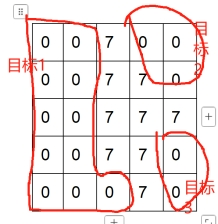

## Slide 125

本章小结

图像分割是图像理解和分析的前提。
分割的算法很多，大致分为阈值分割，边缘检测和区域生长。
（1）阈值分割和边缘检测法：根据区域间的灰度不连续性，确定区域的边界或边缘的位置；
（2）区域生成法：利用区域内灰度的相似性，将像素点分成若干相似的区域。

## Slide 126

作业：
8.3，8.5, 8.7，8.8,  8.9,  8.12
