# 第06章 图像编码与压缩1

## Slide 1

第6章  图像编码与压缩

## Slide 2

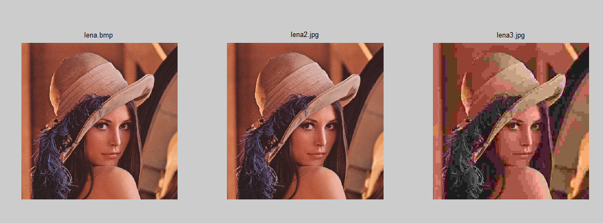

## Slide 3

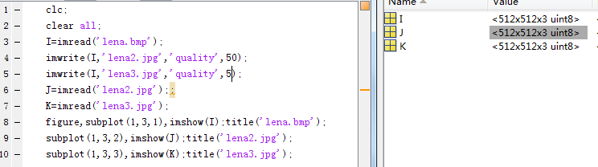

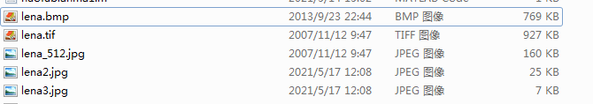

## Slide 4

知识要点

●信息论中的有关概念
信息，信息量（数据量），信息熵，冗余度
●编码方法
统计编码
预测编码
变换编码
●静态图像压缩标准
JPEG压缩编码

## Slide 5

6.1  概述

数据压缩的必要性：

图像作为信息的重要表现形式，数据量大，带宽宽。
一方面：需要增加信道，但这很有限，因为信道的增加永远
赶不上信息的爆炸式增长，况且还要受环境的限制。
另一方面：必须减少图像的数据量，已达到压缩图像数据的
目的。

## Slide 6

6.1  概述

数据压缩的基本思想：

以较少的数据量表示信源以原始形式所代表的信息。
目的在于节省存储空间、提高传输效率等。

## Slide 7

数据压缩系统组成图

## Slide 8

6.1.2  图像编码压缩的必要性

图像信号的数据量V (volume) （byte，B） :
V  w · h · d/8
w、h、d 分别表示width（pel）、height（pel） 、depth（bit）。
Image Size is w·h。

## Slide 9

6.1.3  图像编码压缩的可能性

数据冗余：代表无用信息或重复表示了其他数据已经表示过
的信息的数据称为数据冗余。
三种数据冗余：
像素间冗余；
编码冗余；
心理视觉冗余。
减少或消除其中一种或多种冗余时，就实现了图像压缩。

## Slide 10

编码冗余：对于相同灰度级的图像，采用不同的编码方法，就可能得到不同的平均码长，由此引出编码的冗余。

像素间冗余： 由于像素间存在相关性，那么对于任一给定的像素值，原理上都可以通过它的相邻像素值预测得到，这就带来了像素间冗余。

心理视觉冗余：人观察图像是基于目标物特征而不是像素，这就使得某些信息显得不重要，可以忽略。则表示这些可忽略信息的数据就是心理视觉冗余。

## Slide 11

编码冗余举例：
变长编码与自然编码的对比

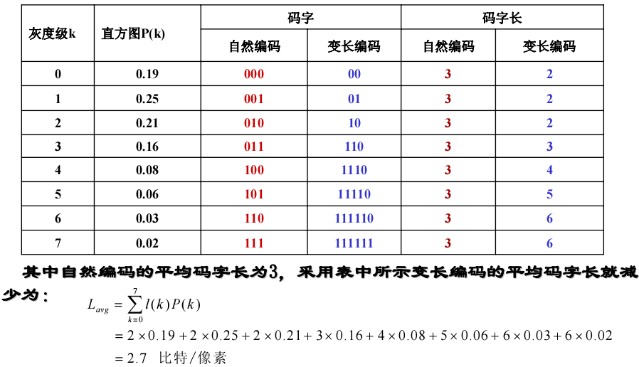

## Slide 12

6.1.4 图像编码压缩技术评价指标

①图像熵：
如果一幅图像像素的灰度级为                  ，
若   出现的概率为     ，则图像熵定义为：
图像熵表示图像像素灰度级的平均比特数。

## Slide 13

6.1.4 图像编码压缩技术评价指标

②平均码长：
对图像灰度进行编码后，平均码字长度简称平均码长，即码字长度的数学期望。
根据香农的信息保持编码定理：要保持信源全部信息，须满足：

否则会产生信源的编译码失真。

## Slide 14

③图像冗余度：
④图像编码效率：
可见，当平均码长接近像素级平均比特数H(x)时，冗余度接近为0，编码效率接近1，这正是高效编码追求的目标。

## Slide 15

⑤图像压缩比：
压缩比是衡量数据压缩方法的压缩程度的指标：

## Slide 16

⑥保真度评价：对图像的失真程度或质量进行评价，以便将图像失真限定在给定范围内。
（1）   均方误差MSE
f(x,y)指原图像，g(x,y)为压缩后重建图像
（2）  信噪比SNR：指压缩前图像信号方差与解压缩后重建图像误差方差的比值。定义：

## Slide 17

SNR越大，压缩过程引入的失真越小，图像质量越高。
（3）峰值信噪比PSNR：

## Slide 18

主观评价

主观评价：对于最终作为人的视觉感受使用的视觉图像，一般也采用主观评价的方法，如综合评价法：不同的观察者对给出的图像进行评价，然后将评价结果加以平均，作为综合评价的结果。

| Score | 评价 | Notes |
| --- | --- | --- |

## Slide 19

6.1.5  数据压缩方法的分类

1 .无损压缩（Lossless Compression）:

特点：压缩解压过程，无信息损失，主要用于图像存档，但压缩比有限。也称无失真，无损，可逆型编码。

Huffman编码

Shannon-Fanno编码

算术编码

统计编码

## Slide 20

6.1.5  数据压缩方法的分类

2 .有损压缩（Lossy Compression）:

特点：牺牲部分信息，来获取高压缩比，通过忽略人的视觉不敏感的次要信息来获取高的压缩比。
应用：数字电视，多媒体，图像传输等。

预测编码

变换编码

## Slide 21

问题

1. 图像数据间存在的冗余有哪些？
2. 图像的压缩方法可以分为哪几类？分别有什么特点？

## Slide 22

6.2  统计编码

基本原理

根据信源的概率分布特性，分配具有惟一可译性的可变长码字，概率大的信号对应的码字短，概率小的信号对应的码字长。以此降低平均码字长度。

## Slide 23

6.2.1  Huffman编码

1、前缀码（Prefix Code）
前缀码的构造采用根节点的概率为1二进制码树，这是典型的二叉树数据结构。实际的编码一般是全树的子树，如Huffman编码。

4层树结构编码

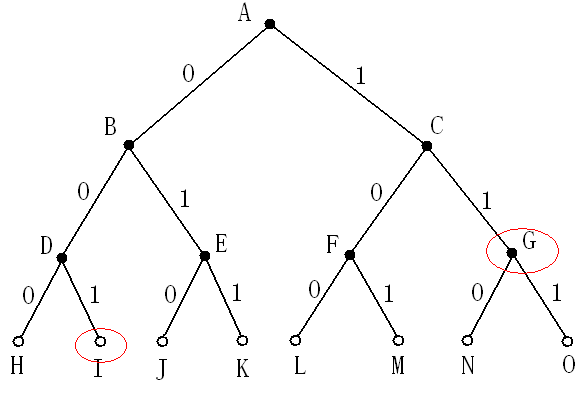

## Slide 24

2、前缀码特点

任意一个码字只与一种信号存在对应关系，任意一个码 字都不是其他码字的前缀。

如一组图像的符号集合：

设定的码子集合：

若一前缀码为0101111100，则译码输出的信号为：

前缀码保证译码的唯一性和“即时性”。

## Slide 25

Huffman编码算法

①  将图像的灰度等级按概率大小进行降序排序。

② 在灰度级集合中取两个最小概率相加，合成一个概率。

③ 新合成的概率与其他的概率成员组成新的概率集合并排序。

④ 在新的概率集合中，仍然按照步骤②～③的规则，直至新的概率集合中只有一个概率为1的成员。这样的归并过程可以用二叉树结构描述。

⑤ 从根节点按前缀码的编码规则进行二进制编码。

## Slide 26

编码过程举例

第1行和第2行列举了一个信源的统计特性

| 符号集{xi} 才 | x1 | x2 | x3 | x4 | x5 | x6 |
| --- | --- | --- | --- | --- | --- | --- |
【例6.1】：

## Slide 27

Huffman编码示意图

| 符号集{xi} | x1 | x2 | x3 | x4 | x5 | x6 |
| --- | --- | --- | --- | --- | --- | --- |

## Slide 28

练习

第1行和第2行列举了一个信源的统计特性，写出下列信源符号霍夫曼编码过程。

| 符号集{ai} | a1 | a2 | a3 | a4 | a5 | a6 | a7 |
| --- | --- | --- | --- | --- | --- | --- | --- |

## Slide 29

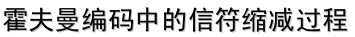

二叉树码字分配过程？

## Slide 30

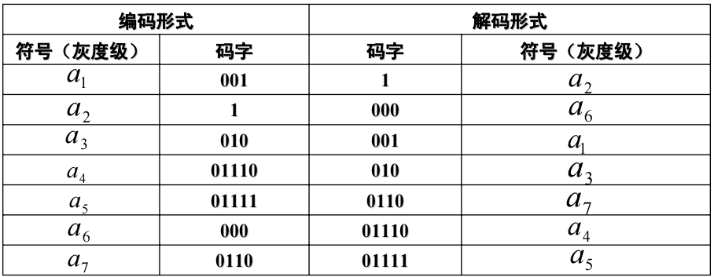

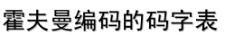

## Slide 31

| 信源 | a1 | a2 | a3 | a4 | a5 | a6 | a7 |
| --- | --- | --- | --- | --- | --- | --- | --- |
Huffman编码：

## Slide 32

计算与编码性能相关的参数：

（1）：信源的熵

（2）：平均码字长度

（3）：编码效率

## Slide 33

计算与编码性能相关的参数：

（4）：冗余度

（5）：压缩比

霍夫曼编码是无失真编码中效率较高的一种编码方法，在分配码字过程中，随机赋“0”和“1”的不同，结果会使码字不唯一，而码字长和平均码字不会改变，它也是唯一可解码的。但缺点是：信源缩减过程复杂，运算量大。为克服这个缺点，也提出了一些改进方法。

## Slide 34

具体编码方法:

6.2.2  香农-费诺编码法

（1）将信符Xi按照出现概率从大到小排序。

（2）将X分成两个子集：

## Slide 35

要求：

（3）给两个子集赋不同的码元值，如 X1 中的符号赋“0”，X2中的符号就赋“1”，也可以反过来。

（4）重复步骤（2），步骤（3），直到每个子集仅含一个信源为止。

## Slide 36

香农-费诺编码举例：

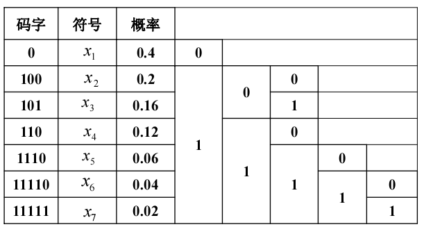

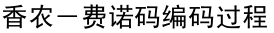

编码过程如下：

## Slide 37

| 符号集{xi} | a1 | a2 | a3 | a4 | a5 | a6 | a7 |
| --- | --- | --- | --- | --- | --- | --- | --- |
香农-费诺编码平均码长=霍夫曼编码平均码长=2.38
：

## Slide 38

数字图像的的霍夫曼编码：

clear;clear all;
I1 = imread('lena.bmp');
I=rgb2gray(I1);
[M,N] = size(I);
I1 = I(:); % 将图像灰度矩阵按列排列，得到列向量
P = zeros(1,256);
for i = 0:255
P(i+1) = length(find(I1 == i))/(M*N);
end      %获取各符号的概率；

## Slide 39

k = 0:255;
dict = huffmandict(k,P); %生成字典
enco = huffmanenco(I1,dict); %编码
deco = huffmandeco(enco,dict); %解码
Ide = col2im(deco,[M,N],[M,N],'distinct'); %把向量重新转换成图像块；
subplot(1,2,1);imshow(I);title('original image');
subplot(1,2,2);imshow(uint8(Ide));title('deco image');

## Slide 40

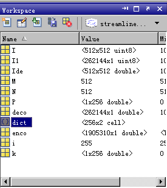

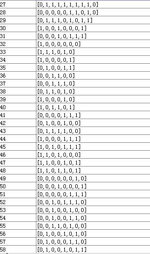

## Slide 41

## Slide 42

练习

| 符号集{xi} | x1 | x2 | x3 | x4 | x5 | x6 | x7 |
| --- | --- | --- | --- | --- | --- | --- | --- |
第1行和第2行列举了一个信源的统计特性，写出下列信源符号香农-费诺编码过程，求出压缩效率和压缩比。

## Slide 43

6.2.3  算术编码

算术编码是一种无损压缩方法，也是一种熵编码的方法。和其它熵编码方法不同的地方在于，其他的熵编码方法通常是把输入的消息分区为符号，然后对每个符号进行编码，而算术编码是直接把整个输入的消息编码为一个数，一个满足(0.0 ≤ n < 1.0)的小数n。然后用n的二进制位数来表示信息流的编码。

## Slide 44

算术编码的基本原理是将被编码的信息流（称为消息）表示成实数0和1之间的一个编码区间。消息越长，编码表示它的区间就越小，表示这一小区间所需的二进制位数就越多。

6.2.3  算术编码

## Slide 45

（1）按照各信源信号出现的频率，将[0, 1)这个区间分成若干段，
每个信号源就会有自己对应的初始区间了,用[l,h)表示；

算术编码步骤：

（2）将[0, 1)这个区间设置为初始编码区间，用[L(0),H(0))表示；

（3）按照待处理的信号，每读入一个信号，根据编码区间迭代公式，得到新的编码区间[L(i),H(i))；

（4）依次迭代，不断重复进行步骤3，直到最后信号中的信源信号全部读完为止；

（5）迭代完成后，从编码区间选一个实数作为最终的算术编码。

## Slide 46

设要编码的信息流为bcadc,信息流中每个符号出现的概率如下：

算术编码步骤：

| 信源符号 | a | b | c | d |
| --- | --- | --- | --- | --- |
[0,0.2)

[0.2,0.5)

[0.5,0.9)

[0.9,1)

## Slide 47

定义编码区间为[ L(i)  ,  H(i) )，当前信号源的初始区间为[l,h);编码区间迭代公式为：

b信源出现后，根据迭代公式，编码区间更新为:

c信源出现后，根据迭代公式，编码区间更新为:

## Slide 48

a信源出现后，根据迭代公式，编码区间更新为:

d信源出现后，根据迭代公式，编码区间更新为:

## Slide 49

至此输入信息流“bcadc”被编码为一个实数区间[0.3728,0.37376)

最后c信源出现后，根据迭代公式，编码区间更新为:

将该区间用二进制形式可表示为：

将信息流的算术编码可表示为：

## Slide 50

【例6.2】根据信源的概率分布进行算术编码。已知信源的概率分布为
求二进制序列01011的算术编码。

算术编码举例

## Slide 51

解：步骤如下：
（1）二进制信源只有x1 = 0和x2 = 1两种符号，相应的概率为pc = 2/5,   pe = 1- pc =3/5
（2）设L为区域左端起始位置，H为区域右端终止位置，l为子区的长度，则
符号“0”的子区为[0，2/5），子区长度为2/5 ;
符号“1”的子区为[2/5 ，1]，子区长度为3/5 。

算术编码举例

## Slide 52

| step | x | L | H |
| --- | --- | --- | --- |
信息流算术编码值 ？

算术编码举例

## Slide 53

算术编码举例

0.22144 转化成二进制：0.00111
0.256转化为二进制：     0.0100001

信息流算术编码值为：01

## Slide 54

练习

已知下列信源符号的概率分布如下：
求序列CADACDB的算术编码。

| 信源符号 | A | B | C | D |
| --- | --- | --- | --- | --- |

## Slide 55

算术编码：

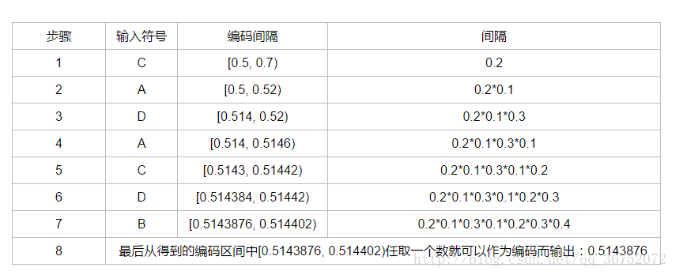

如何进行解码？

## Slide 56

算术编码的解码步骤如下：

（1）根据待解码的数据，判断该数据所在的区间，输出该区间对应
的信号源；
（2）重复步骤1；为了正确的进行解码，需要事先知道解码后的
信源的长度。
下面结合一个实例来说明算术解码的具体步骤。

## Slide 57

| step | 编码区间 | 判决 | 解码 |
| --- | --- | --- | --- |
算术编码举例

[0 1)

0.25 在[0 1)区间的前40%

[0 0.4)

0.25在[0 0.4) 区间的后60%

[0.16 0.4)

0.25在[0.16 0.4) 区间的前40%

[0.16 0.256)

0.25在[0.16 0.256) 区间的后60%

[0.1984 0.256)

0.25在[0.1986 0.256) 区间的后60%

0

1

0

1

1

## Slide 58

## Slide 59

如下列举了一个信源的统计特性。
请写出霍夫曼编码过程（信符缩减过程和二叉树码字分配过程）。计算平均码长，编码效率，压缩比。
请写出香农-费诺编码过程。

| 符号集{ai} | a1 | a2 | a3 | a4 | a5 | a6 |
| --- | --- | --- | --- | --- | --- | --- |
练习

## Slide 60

练习

根据信源的概率分布进行算术编码。已知信源的概率分布为
求二进制序列01011的编码及解码过程。

## Slide 61

6.3  预测编码

预测编码的基本思想：
在某种模型的指导下，根据过去的样本序列推测当前的信号样本值，然后用实际值与预测值之间的误差值进行编码。
如果模型与实际情况符合得比较好且信号序列的相关性较强，则误差信号的幅度将远远小于样本信号。

## Slide 62

6.3.1  预测编码基本原理

对实际值与预测值之间的误差值进行编码
差分脉冲编码调制
Differential Pulse Code Modulation
DPCM

## Slide 63

DPCM系统的组成

预测编码可分为：线性预测编码、非线性预测编码

## Slide 64

6.3.2  线性预测编码

假设经扫描后的图像信号x(t)是一个均值为零、方差为
的平稳随机过程。线性预测就是根据前N-1个像素的线性组合，即选择系数ai（i  1，2，…，N 1）使预测值
N-1是线性预测的阶数；round 表示四舍五入或者取最接近的整数的运算的函数；ai是预测系数。
并且使差值en的均方值为最小。
预测信号的均方误差（MSE）定义为
E{(en) 2} = E{(xn - x′n) 2}

## Slide 65

设计最佳预测的系数ai，采用MMSE

最小均方误差准则。可以令
定义xi和xj的自相关函数
R(i,j)= E{xi，xj}
R(i,j)=R(i-j)
写成矩阵形式为Yule-Walker方程组

若R（i）已知，该方程组可以用递推算法来求解ai。

## Slide 66

通过分析可以得出以下结论：

图像的相关性越强，压缩效果越好。
预测阶数并非越大越好。当某个阶数已使E{eN eN 1}  0时，即使再增加预测点数，压缩效果也不可能继续提高。

## Slide 67

常用预测器方案

前值预测：用x0同一行的最近邻近像素来预测，如x1
一维预测：用x0  同一行的前若干邻近像素来预测，如下图中的x1、x5。
二维预测：用x0  同一行的前面所有邻近像素和前几行的取样值来预测，如下图中的 x1、x2、x3、x4、x5、x6、x7等。
三维预测：在二维预测的基础上，利用上帧或前几帧的邻近取样值作为x0 的取样值，主要应用在视频图像的压缩。

## Slide 68

常用预测器方案

## Slide 69

例：预测编码的对比

结论：随着预测器阶数的增加误差减少了

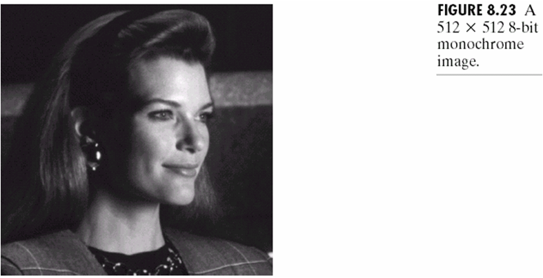

2阶

3阶

4阶

1阶

## Slide 70

6.4  变换编码

6.4.1  变换编码的基本原理

采用正交变换对图像进行处理 ，可将空域高度相关的像素灰度值，变为弱相关或不相关的频谱系数，经正交变换后，并没有丢失图像的信息，总的能量保持不变，但重新分配。

图像经过正交变换后，实现了能量集中，使得大部分系数为0或很小的值，这些值可以进行不很精确的量化（或完全丢弃），几乎不会产生多少图像失真。

正交变换能够获得高压缩比的原因：

## Slide 71

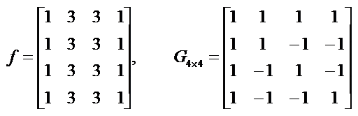

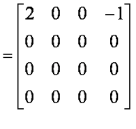

6.4  变换编码

## Slide 72

6.4.2  变换编码的系统结构

变换编码系统

编码过程：子图像分解；变换；量化；编码。

子图像分解

正交变换

量化

编码

输入
图像

压缩
图像

解码

逆变换

图像融合

压缩
图像

解压
图像

## Slide 73

利用正交变换压缩编码时，若对全尺寸图像直接计算，计算量比较大，硬件难以承受，需要划分子图像后进行计算。

图像分块大小的选择应该使得相邻子图像之间的相关性
保持在某个可接受的程度。一般图像在相邻的20个像素之间存在相关性，因此一般选择n=8或者n=16。

6.4.3  变换编码的实现

子图像分解：

## Slide 74

常用的正交变换包括：DFT变换，DCT变换，沃尔什-哈达码变换，他们的去相关性低于K-L变换，但存在快速算法，并且具有固定的变换矩阵，因而比K-L应用更加广泛。

2. 变换方法选择：

6.4.3  变换编码的实现

## Slide 75

系数的选择相当于滤波，即选择的系数保留，未选择的令系数为0。

6.4.3  变换编码的实现

3. 变换系数的选择：

G (u,v)=F  (u,v)P(u, v)

## Slide 76

3.1 区域法：
区域法是选取特定区域的变换系数进行量化编码，区域外的系数被舍弃。

3. 变换系数的选择：

6.4.3  变换编码的实现

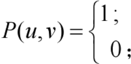

(u,v)∈选定区域
else

## Slide 77

区域选择越大，图像失真就越小，但压缩比会降低；反之区域越小，则失真越大，但压缩比会提高。区域大小的选择，应根据变换后频域能量的集中程度。能量越集中，区域越小；反之，能量越分散，区域越大。

区域法特点：

6.4.3  变换编码的实现

## Slide 78

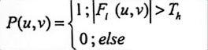

3.2 阈值法：
阈值法采用最大幅值原则，根据实际情况设定适当幅度的阈值，若变换系数超过该阈值，则保留系数进行编码，否则补零。选择滤波器为：

6.4.3  变换编码的实现

## Slide 79

在选取的过程中，不仅大部分低频成分被保留下来了，某些超过阈值的高频成分也被保留下来，这样在一定程度上保留了恢复图像的轮廓和细节。缺点是需要对选择系数的位置进行编码，编码占用比特数比较多，这样会降低有效的压缩比。

阈值法特点：

6.4.3  变换编码的实现

## Slide 80

算法说明

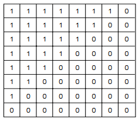

（a）区域选择滤波器

（b）阈值选择滤波器

系数选择滤波器设计举例：

## Slide 81

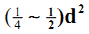

将带小数的系数转化为整数，并使大数值转化为小数值，量化导致了有损压缩。量化后的数值可以分配码字，分配码字原则：方差大的分配长码字，方差小的分配短码字。
为了将所有变换系数按幅值从大到小的顺序排序，通常采用从低频到高频的Z字形扫描（可以使连续的0值最多），一般只保留       个系数，对保留的系数进行编码。

4. 系数的量化和编码：

6.4.3  变换编码的实现

## Slide 82

算法说明

（c）Z形扫描编码顺序

Z型数据扫描举例：

## Slide 83

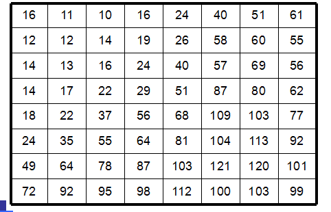

(d)亮度量化表

量化步长设计举例：

人眼对低频分量比对高频分量的图像更敏感，低频分量
包含了图像的大部分信息。

## Slide 84

总结：变换编码压缩步骤

图像首先被细分为8*8的图像块，这些像素块进行从左 到右，从上到下的处理顺序。
2.计算块的正交变换系数。
3.对变换系数进行选择和线性均匀量化。
4.使用Z型编排，形成一个量化系数的一维序列。
5.非零的AC系数采用变长编码原则进行编码；DC系数相对于前面子图像的DC系数进行编码（预测编码）。

## Slide 85

说明：
512×512大小的灰度图像
先将原图分割为8×8大小的子图像，然后用DFT,WHT 和DCT的一种，表示每一个子图像
将得到所有系数的50%去掉，即丢掉32个系数
对截取的系数阵列进行逆变换，保留32个系数

变换编码举例：

## Slide 86

DFT还原图像

WHT还原图像

DCT还原图像

rmsDFT=1.28

rmsWHT=0.86

rmsDCT=0.68

丢掉的32个系数，对复原图像质量的视觉影响很小

变换编码举例：

## Slide 87

结论
DCT的信息压缩能力比DFT和WHT的能力要强
DCT在信息压缩能力和计算复杂性之间提供了很好的平衡，因此，许多变换编码系统都是以DCT变换为基础的。如：静态图像的JPEG标准。

变换编码举例：

## Slide 88

6.5 二值图像编码

只有“白”（用“0”表示）和“黑”（用“1”表示）两个灰度级称之为二值图像（binary image）。

如：由文字组成的文档文件、表格、工程图纸等

## Slide 89

跳跃空白编码 (skip blank coding )

跳跃空白编码 ：将图像的每一条扫描线分成若干等长的段，每段有m个像素，一般m=8～12。
这些扫描线段的组成可能出现二类情况：

（1）全是“0”像素。
这种线段称为“空白块（blank）”，常表示二值图像的背景成分。
编码时“空白块”用码字“0”表示。“空白块”
（2）全是“1”像素或由“0”、“1”像素混合而成。
编码时，这种线段用“1”加直接编码表示。

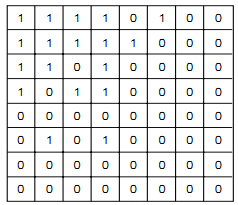

## Slide 90

游程长度编码（RLC）

游程编码分为定长游程编码和变长游程编码两类。
定长游程编码：是指编码的游程所使用的位数是固定的，一旦灰度相同且连续的个数超过了固定位数所能表示的最大值，则转入下一轮游程编码。
变长游程编码则是指不同范围的游程使用不同位数来进行编码。

## Slide 91

游程编码适合于二值图像编码，原因是由于二值图像的每一行 （列）都是由若干个黑白像素段交替出现的，对应着“0”和“1”两种符号，“1”符号对应“白”游程，“0”符号对应“黑”游程。这些符号连续出现，形成了“0”游程和“1”游程。

## Slide 92

例如，对于一个二元序列	0000001111100011001
对应的游程序列为 653221，由于设定为从“0”开始，故可很容易的恢复出原始的二元序列。

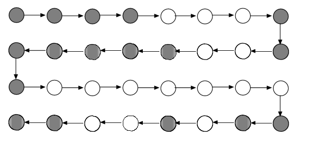

一维游程编码用于图像数据的扫描模式

## Slide 93

6.6  图像压缩编码标准

在静态图像压缩编码标准中，比较著名的有JPEG、JBIG等标准。
视频可看成是一幅幅不同但相关的静态图像的时间序列。
静态图像的压缩技术和标准可以直接应用于视频的单帧图像。
介绍：
适用于静态图像的JPEG标准

## Slide 94

2．JPEG基本系统

每个单独的彩色图像分量的编码算法：

② 根据最佳视觉特性构造量化表，设计自适应量化器并对DCT的频率系数进行量化。

③ 为了增加连续的0系数的个数，对量化后的系数进行Z字形重排。

④ 对量化系数进行编码，进一步压缩数据量。

⑤ 形成JPEG数据流。

① 将量化精度为8位(256个灰度级)的待压缩图像分成若干个88样值子块，做基于88子块的DCT。

## Slide 95

JPEG编/解码器算法框图

## Slide 96

上述算法的几点说明

（1）量化
—最佳的亮度量化表

由于人眼对低频分量比对高频分量的图像更敏感，低频分量包含了图像的大部分信息，因此左上角的量化步长比右下角的量化步长小。

## Slide 97

亮度量化表

| 16 | 11 | 10 | 16 | 24 | 40 | 51 | 61 |
| --- | --- | --- | --- | --- | --- | --- | --- |

## Slide 98

色度量化表

| 17 | 18 | 24 | 47 | 99 | 99 | 99 | 99 |
| --- | --- | --- | --- | --- | --- | --- | --- |

## Slide 99

DCT系数的Z字形排列

量化后的系数要Z字型重新编排，目的是为了增加连续“0”系数的个数。

## Slide 100

8×8图像块经过DCT变换之后得到的DC直流系数有两个特点，一是系数的数值比较大，二是相邻8×8图像块的DC系数值变化不大。根据这特点，JPEG算法使用了差分脉冲调制编码（DPCM）技术，对相邻图像块之间量化DC系数的差值（Delta）进行编码。

直流系数的编码

## Slide 101

量化AC系数的特点是1×64矢量中包含有许多“0”系数，并且许多“0”是连续的，因此使用非常简单和直观的游程长度编码(RLE)对它们进行编码。
JPEG使用了1个字节的高4位来表示连续“0”的个数，而使用它的低4位来表示编码下一个非“0”系数所需要的位数，跟在它后面的是量化AC系数的数值。

交流系数的编码

## Slide 102

在JPEG有损压缩算法中，使用霍夫曼编码器来减少平均码字长度。使用霍夫曼编码器的理由是可以使用很简单的查表（Lookup Table）方法进行编码。压缩数据符号时，霍夫曼编码器对出现频度比较高的符号分配比较短的代码，而对出现频度较低的符号分配比较长的代码。这种可变长度的霍夫曼码表可以事先进行定义。

熵编码

## Slide 103

JPEG编码的最后一个步骤是把各种标记代码和编码后的图像数据组成一帧一帧的数据，这样做的目的是为了便于传输、存储和译码器进行译码，这样的组织的数据通常称为JPEG位数据流（JPEG bitstream）。

位数据流

## Slide 104

本 章 小 结

掌握  数字图像编码统计编码方法：霍夫曼编码，香农-费诺编码，算术编码。
熟悉  预测编码方法：差分脉冲编码调制
熟悉：正交变换编码的原理，编码步骤。
了解：JPEG编码压缩标准。
作业：5.3， 5.9，  5.19，
