# 第07章-图像复原1

## Slide 1

练习

| 符号集{xi} | x1 | x2 | x3 | x4 | x5 | x6 | x7 |
| --- | --- | --- | --- | --- | --- | --- | --- |
第1行和第2行列举了一个信源的统计特性，写出下列信源符号香农-费诺编码过程，求出压缩效率和压缩比。

## Slide 2

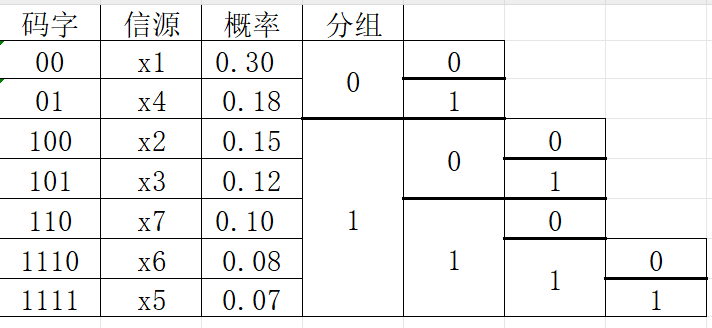

## Slide 3

计算与编码性能相关的参数：

（1）：信源的熵

（2）：平均码字长度

（3）：编码效率

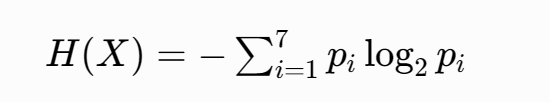

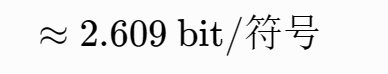

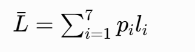

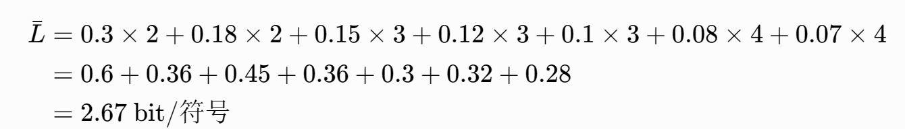

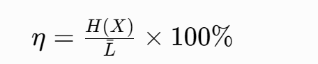

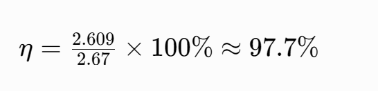

## Slide 4

计算与编码性能相关的参数：

（4）：压缩比

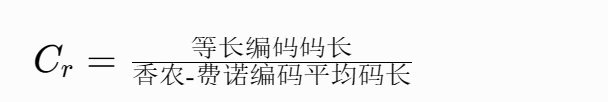

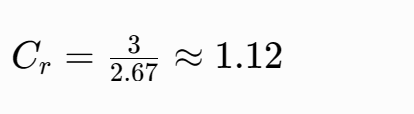

## Slide 5

第七章 图像复原

图像退化与复原的基本概念
图像退化模型
图像复原方法

## Slide 6

第七章 图像复原

图像退化与复原的基本概念
图像退化模型
图像复原方法

## Slide 7

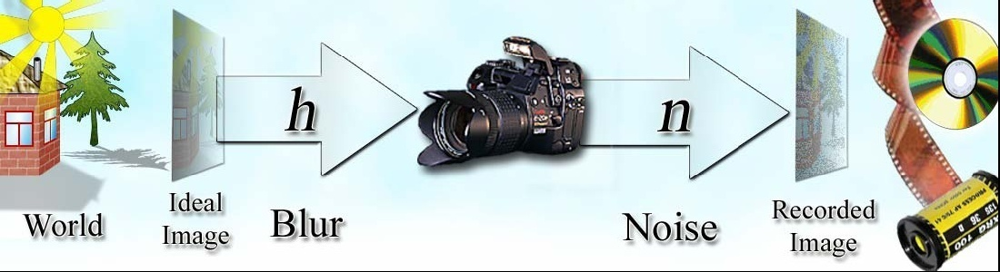

图像退化的原因

采集过程

成像器材的固有缺陷；
成像系统的散焦；

成像设备与物体的相对运动；
噪声、外部干扰等。

引起退化的因素

## Slide 8

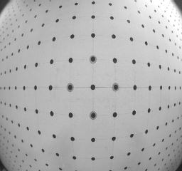

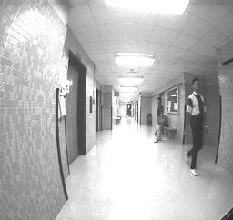

桶形畸变-负畸变

枕形畸变-正畸变

摄像机导致的几何畸变

## Slide 9

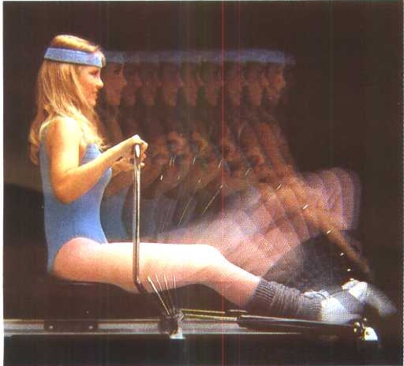

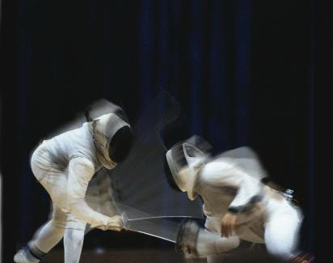

Fencing

Fitness

运动模糊（效果图）

## Slide 10

Noisy image

## Slide 11

图像退化（Degradation）

一、图像退化与复原概述

图像复原为图像退化的逆过程，是将退化的过程加以估计，建立退化数学模型，补偿退化过程造成的失真。

在图像退化确知的情况下，图像复原是有可能进行的，这属于反问题(Inversion problem)求解。

图像复原（Restoration）

成像过程中的“退化”，是指由于成像系统各种因素的影响，使得图像质量降低。

## Slide 12

一、图像退化与复原概述

实际情况经常是退化过程并不知晓，这种复原属于盲目复原。
由于图像模糊的同时，噪声和干扰也会同时存在，这也为复原带来了困难和不确定性。

图像恢复存在的困难

## Slide 13

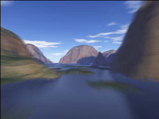

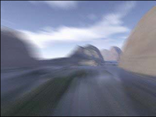

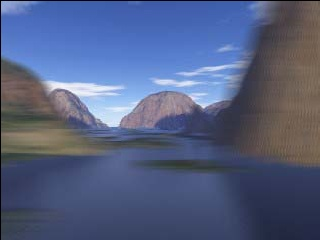

退化（正问题: g = h*f+n）

复原（反问题: h*f+n = g）

近似

惟一性

多解性

一、图像退化与复原概述

理想图
(Scene)

观测图
(CCD)

系统（模型）

## Slide 14

|  | 图像增强
Image enhancement | 图像恢复
Image restoration |
| --- | --- | --- |
图像复原与图像增强的异同

一、图像退化与复原概述

## Slide 15

主要内容

图像退化与复原的基本概念
图像退化模型
图像复原方法

## Slide 16

线性系统(Linear System)

0

二、图像退化模型

(Additivity property)

(Homogeneity property)

连续图像退化模型：

## Slide 17

H—线性运算算子。
根据冲击函数的性质，f(x,y)可写成：
若输入为f(x,y)，响应为g(x,y)，则:

二、图像退化模型

## Slide 18

(1)如果线性成像系统的冲击响应是理想的，即Hδ(x-α,y-β)=δ(x-α,y-β)，那么
形成的图像g(x,y)就和原始图像一样，不产生模糊。

二、图像退化模型

## Slide 19

(2)若冲激响应不是理想的，h(x,y)是成像系统的冲激响应 (在光学系统中称点扩展函数-PSF)。
通常把成像系统考虑成为线性移不变系统，即

二、图像退化模型

## Slide 20

(3)退化的另一种现象,噪声污染,假定噪声是加性的,那么退化模型为：
其傅氏变换：

二、图像退化模型

空间域的卷积等同于
频率域的乘积

## Slide 21

从前述的线性移不变性系统的退化过程，可以看出：

二、图像退化模型

## Slide 22

离散图像退化模型的表示

（1）离散卷积形式:

二、图像退化模型

## Slide 23

退化模型向量空间表示

(2) 矩阵形式 :

H是分块循环矩阵。

## Slide 24

(3) 如果考虑噪声，设n是M×N维噪声向量，则退化模型为：

退化模型向量空间表示

确定退化的PSF(h或H)及噪声模型很重要。

## Slide 25

退化参数的确定
退化函数估计(点扩展函数PSF)
噪声(方差,性质)

二、图像退化模型

## Slide 26

图像观察(Image Observation)
实验估计(by Experiment)
建模估计(Estimation by Modeling)

估计方法

退化函数估计

## Slide 27

对于一幅模糊图像，首先提取包含简单结构的一小部分图像，然后根据这部分图像中目标和背景的灰度级，就可以估计一幅不模糊的图像，该图像与观察到的子图像具有相同的大小和特性。
假设系统为移不变的，从这一函数特性我们可以推出针对整幅图像的 H(u,v)，它必然与 Hs(u,v) 具有相同的形状。

1. 图像观察法

## Slide 28

可以使用与获取退化图像的设备相似的设备，那么利用相同的系统设置，就可以由成像一个脉冲（小亮点）得到退化函数的冲激响应。需要注意的是，这个亮点必须尽可能的亮，以达到减少噪声干扰的目的。这样由于冲激响应的傅立叶变换是一个常量，有
其中与之前一样，表示观察图像的傅立叶变换；A为常量，表示冲激强度。

2. 试验估计法

## Slide 29

在图像退化的多年研究中，对于一些退化环境已经建立了数学模型。其中有些是利用引起退化的物理环境来建立退化模型的。
（1）例如Hufnagel和Stanley提出的基于大气湍流物理特性的退化模型：
其中k是常数，与湍流性质有关。

3. 数学建模法

## Slide 30

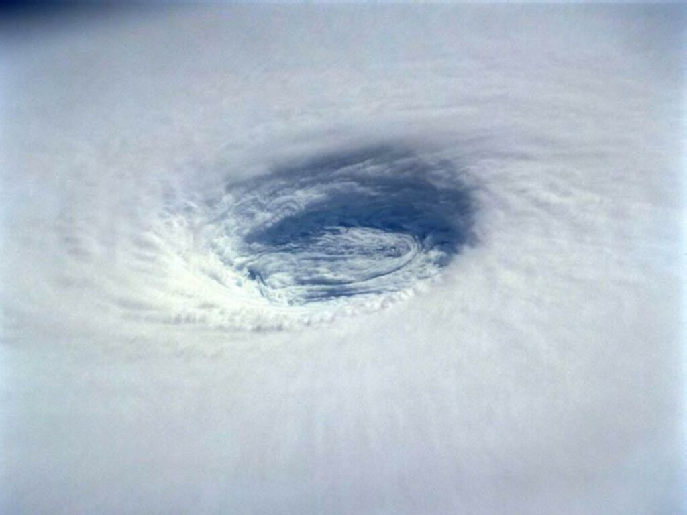

Atmospheric turbulence (大气湍流)

## Slide 31

Atmospheric turbulence (大气湍流)

## Slide 32

(2) 光学散焦

其中，d是散焦点扩展函数(PSF)的直径，J1(•)是第一类贝塞尔函数。

3. 数学建模法

## Slide 33

设T为快门(曝光)时间，x0(t)，y0(t)是位移的x分量和y分量(或相机的运动速度) 。则模糊图像为：

(3) 照相机与景物相对运动

3. 数学建模法

## Slide 34

求其傅立叶变换为：

3. 数学建模法

## Slide 35

则可以得到运动模糊的变换函数为：

若为匀速运动，即

3. 数学建模法

## Slide 36

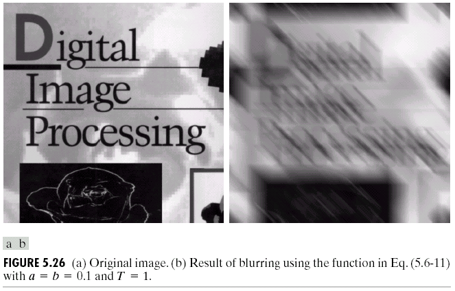

Original image

Motion blurred image
a = b = 0.1, T = 1

运动模糊的例子

## Slide 37

噪声及来源

退化参数的确定

光学图像的噪声主要来源于图像的获取和传输过程。
图像获取的数字化过程，如图像传感器的质量和环境条件。
图像传输过程中传输信道的噪声干扰，如通过无线网络传        输的图像会受到光或其它大气因素的干扰。

## Slide 38

常见噪声
􀀹 高斯噪声
􀀹 均匀分布噪声
􀀹 脉冲噪声（椒盐噪声）
瑞利噪声
􀀹 伽马（爱尔兰）噪声
􀀹 指数分布噪声

噪声及来源

## Slide 39

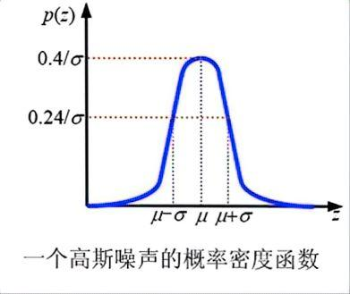

电子设备或传感器产生的噪声。

噪声及来源

(1) 高斯噪声-Gaussian

噪声灰度常用概率密度函数（PDF）来刻画。

## Slide 40

(2) 均匀噪声-Uniform noise

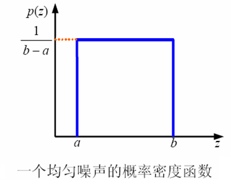

随机数发生器。

噪声及来源

## Slide 41

(3) 脉冲（椒盐）噪声－Impulse( Salt& Pepper)
噪声脉冲可以是正的或负的。
一般假设a和b都是“饱和”值：灰度的最大和最小值。

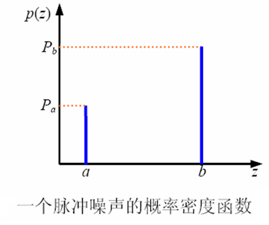

噪声及来源

## Slide 42

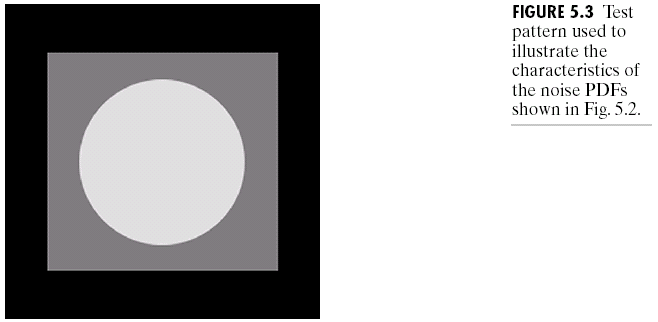

噪声模型

## Slide 43

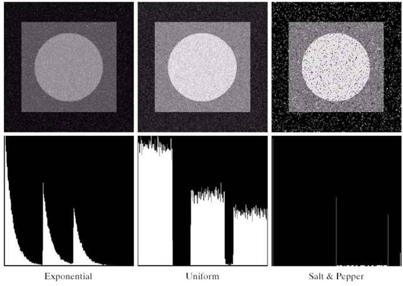

噪声模型

## Slide 44

主要内容

图像退化与复原的基本概念
图像退化模型
图像复原方法

## Slide 45

图像复原的基本原理

三、图像复原方法

由退化模型得：

最小均方误差准则：

无约束情况：

## Slide 46

图像复原的基本原理

三、图像复原方法

有约束情况：

令Q为     的线性算子，有约束最小二乘复原就是要使     最小。这类最小化问题，可用Lagrange算子来处理，设    为拉格朗日乘子，寻找使下面的准则函数最小的   ：

## Slide 47

图像复原的基本原理

三、图像复原方法

，得到：

由极值条件：

式中：

注：适当选择这一参数，使约束条件满足，即可求得最佳估计。

不同Q对应不同的复原方法

## Slide 48

逆滤波(Inverse filtering)

维纳滤波(Wiener filter)

约束最小平方滤波
(Constrained least squares filter)

三、图像复原方法

经典的图像复原方法

## Slide 49

假定退化图像遵从以下模型：

在不考虑噪声的情况下，

写成 ：

3.1 逆滤波

## Slide 50

该复原方法取名为逆滤波。

3.1 逆滤波

逆滤波复原属于图像的无约束复原。

## Slide 51

逆滤波模型

3.1 逆滤波

## Slide 52

实际应用时的缺点：
(1)无噪声情况
若在频谱平面对图像信号有决定影响的点或区域上，H(u,v)的值为零，那么G(u,v)的值也为零，故不能确定这些频率处的F(u,v)值，也就难以恢复原始图像f(x,y)。

3.1 逆滤波

## Slide 53

G(u,v) =F(u,v) H(u,v)+N(u,v)
仍采用逆滤波器P(u,v)=1/H(u,v)作恢复滤波器。

(2) 有噪声情况

3.1 逆滤波

## Slide 54

3.1 逆滤波

## Slide 55

Original image

Blurred image

Inverse filtered

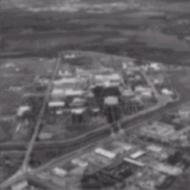

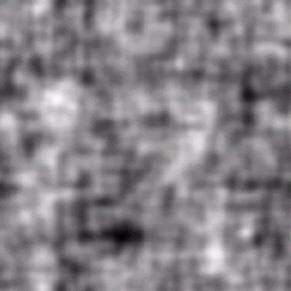

3.1 逆滤波

复原例子：

## Slide 56

%-------------------------用均值滤波器模糊图像，并且添加椒盐噪声-------------------------
clc;         clear all;
color_pic=imread('lena.bmp');  %读取彩色图像
gray_pic=rgb2gray(color_pic);    %将彩色图转换成灰度图   double_gray_pic=im2double(gray_pic);   %将uint8转成im2double型便于计算
[width,height]=size(double_gray_pic);      %获取图像大小
H=fspecial('average',9);  %生成9x9均值滤波器,图像更模糊
degrade_img1=imfilter(double_gray_pic, H, 'conv', 'circular');  %使用卷积滤波
degrade_img2=imnoise(degrade_img1,'salt & pepper',0.05);  %添加椒盐噪声
subplot(2,2,2);imshow(double_gray_pic,[]);title('原灰度图');
subplot(2,2,3);imshow(degrade_img1,[]);title('退化图像1');
subplot(2,2,4);imshow(degrade_img2,[]);title('退化图像2');

## Slide 57

## Slide 58

%-------------------------对退化图像1逆滤波复原-------------------------
fourier_H=fft2(H,width,height);  %注意此处必须得让H从9x9变成与原图像一样的大小此处为512x512，否则ifft2 ./部分会报错矩阵不匹配
fourier_degrade_img1=fft2(degrade_img1);    % 因为F(u,v)=G(u,v)/H(u,v)，restore_one=ifft2(fourier_degrade_img1./fourier_H);  %因为是矩阵相除要用./
subplot(1,2,1);imshow(im2uint8(degrade_img1),[]);title('退化图像1');
subplot(1,2,2);imshow(im2uint8(restore_one),[]);title('复原图像1');
%-------------------------对退化图像2直接逆滤波复原-------------------------
fourier_degrade_img2=fft2(degrade_img2); %相当于 G(u,v)=H(u,v)F(u,v)+N(u,v)
restore_two=ifft2(fourier_degrade_img2./fourier_H);% 逆滤波F(u,v)=G(u,v)/H(u,v)

## Slide 59

% -----------------------去掉噪声分量逆滤波复原-----------------------
noise=degrade_img2-degrade_img1;   %提取噪声分量
fourier_noise=fft2(noise);   %对噪声进行傅里叶变换
%G(u,v)=H(u,v)F(u,v)+N(u,v),解得F(u,v)=[G(u,v)-N(u,v)]/H(u,v)
restore_three=ifft2((fourier_degrade_img2-fourier_noise)./fourier_H);  figure('name','退化图像2逆滤波复原');
subplot(2,2,1);imshow(double_gray_pic,[]);title('原灰度图');
subplot(2,2,2);imshow(im2uint8(degrade_img2),[]);title('退化图像2');
subplot(2,2,3);imshow(im2uint8(restore_two),[]);title('直接逆滤波复原');
subplot(2,2,4);imshow(im2uint8(restore_three),[]);title('去掉噪声分量逆滤波复原');

## Slide 60

## Slide 61

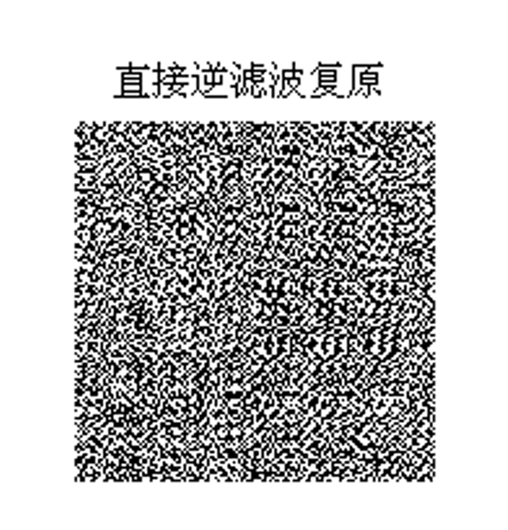

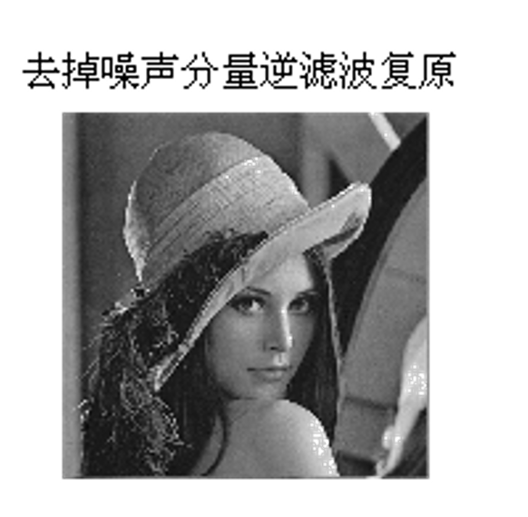

## Slide 62

非全尺寸逆滤波

%-------------------------生成大气湍流退化图像-------------------------
clear all;clc;
I = imread('cameraman.tif');
f = im2double(I);
subplot(2, 3, 1), imshow(f), title('原始图像')
F = fftshift(fft2(f));
[M, N] = size(F);
[u, v] = meshgrid(1:N, 1:M);
k = 0.0025;
H = exp(-k*((v-M/2).^2+(u-N/2).^2).^(5/6));  % 大气湍流退化模型
G = F.*H;
g = ifft2(ifftshift(G));
g = uint8(abs(g)*255);
subplot(2, 3, 2), imshow(g), title('退化图像')

## Slide 63

%-------------------------调用函数实现不同尺寸的逆滤波-------------------------
I1 = deconv(g, H,48 );       % 逆滤波复原半径48
subplot(2, 3, 3), imshow(I1), title('复原半径为48的图像')
I2 = deconv(g, H,78 );       % 逆滤波复原半径78
subplot(2, 3, 4), imshow(I2), title('复原半径为78的图像')
I3 = deconv(g, H,108 );       % 逆滤波复原半径108
subplot(2, 3, 5), imshow(I3), title('复原半径为108的图像')
I4 = deconv(g, H,128 );        % 逆滤波复原半径128
subplot(2, 3, 6), imshow(I4), title('复原半径为128的图像')

## Slide 64

%-------------------------不同尺寸的逆滤波的函数-------------------------
function I_new = deconv(g, H, thresh)
if size(g, 3) == 3,
g= rgb2gray(g);
end
g = im2double(g);
G = fftshift(fft2(I));
[M, N] = size(G);
F = G;
[x, y] = meshgrid(1:N, 1:M);
if thresh > M/2
F = G./(H+eps);
else
idx = (x-N/2).^2 + (y-M/2).^2 < thresh^2;
F(idx) = G(idx)./(H(idx)+eps);
end
I_new = ifft2(ifftshift(F));
I_new = uint8(abs(I_new)*255);

## Slide 65

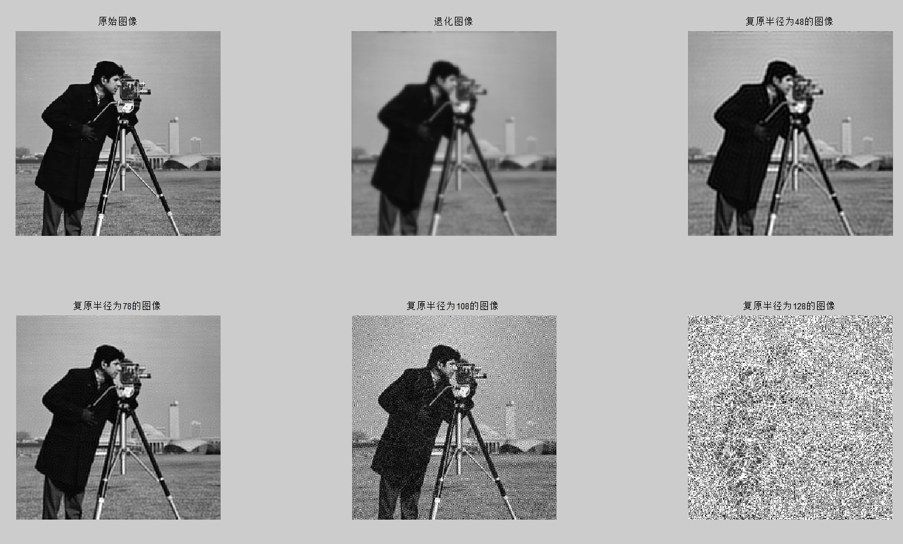

## Slide 66

Wiener滤波图像复原：

有约束复原：

令：

其中：

Sh — 噪声功率谱
Sf  — 原始图像的功率谱

3.2 维纳滤波

## Slide 67

这里： γ=1，为标准维纳滤波器；
γ=某个变量，为变参数维纳滤波器；

3.2 维纳滤波

## Slide 68

可简化为：

为获得好的估计,实际应用中，通常采用人工选择 k值。

3.2 维纳滤波

## Slide 69

% ------对一幅灰度图像进行运动模糊并叠加高斯噪声------
clc;        clear all;
gray_pic=rgb2gray(imread('lena.bmp'));  double_gray_pic=im2double(gray_pic);
[width,height]=size(double_gray_pic);
%-------------------------添加运动模糊以及噪声----------------------
H_motion = fspecial('motion', 18, 90);%运动长度为18，逆时针运动角度为90°
motion_blur = imfilter(double_gray_pic, H_motion, 'conv', 'circular');%卷积滤波
noise_mean=0;  %添加均值为0
noise_var=0.001; %方差为0.001的高斯噪声
motion_blur_noise=imnoise(motion_blur,'gaussian',noise_mean,noise_var);%添加均值为0，方差为0.001的高斯噪声
subplot(1,2,1);imshow(motion_blur,[]);title('运动模糊');
subplot(1,2,2);imshow(motion_blur_noise,[]);title('运动模糊添加噪声');

## Slide 70

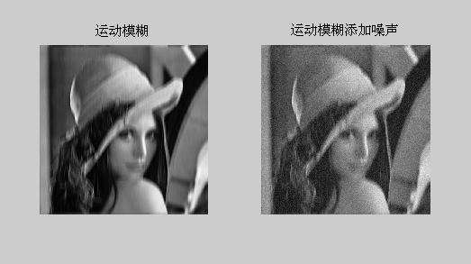

## Slide 71

%----------------------------matlab自带维纳滤波函数deconvwnr-------------------------
restore_ignore_noise = deconvwnr(motion_blur_noise, H_motion, 0);  %nsr=0,忽视噪声
signal_var=var(double_gray_pic(:));
estimate_nsr=noise_var/signal_var;   %噪信比估值
restore_with_noise=deconvwnr(motion_blur_noise,H_motion,estimate_nsr);  %信号的功率谱使用图像的方差近似估计
figure('name','函数法维纳滤波');
subplot(1,2,1);imshow(im2uint8(restore_ignore_noise),[]);title('忽视噪声直接维纳滤波(nsr=0)，相当于逆滤波');
subplot(1,2,2);imshow(im2uint8(restore_with_noise),[]);title('考虑噪声维纳滤波');

## Slide 72

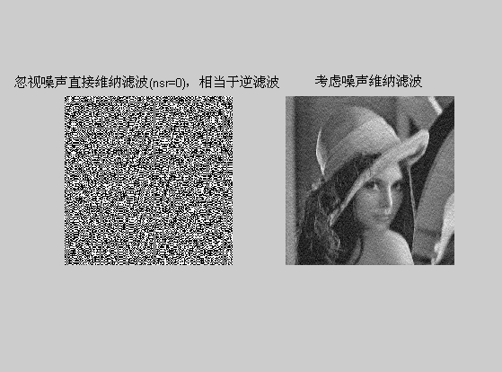

## Slide 73

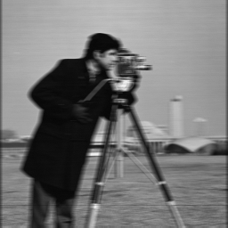

motion blurred image
at BSNR of 40dB

deblurred image after
wiener filtering
(K=0.01)

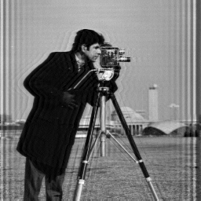

复原例子：

3.2 维纳滤波

## Slide 74

逆滤波和维纳滤波的比较
(a) 全尺寸的逆滤波结果
(b) 维纳滤波的结果 (交互选择K)

维纳滤波的结果非常接近原始图像,比逆滤波要好

复原例子：

3.2 维纳滤波

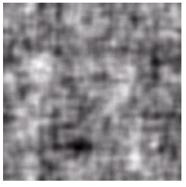

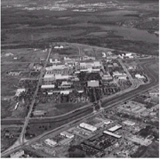

## Slide 75

约束最小平方滤波（Constrained least squares filter） ，也叫正则滤波（Regularized filter）。
是一种有约束条件下的迭代复原技术。

3.3 约束最小平方（正则）滤波

方法简介

## Slide 76

退化模型：

矩阵形式：

3.3 约束最小平方（正则）滤波

约束条件：找到一个最小准则函数

## Slide 77

将上式对    微分，并使结果为0，则有：

上式的傅立叶变换形式：

3.3 约束最小二乘（正则）滤波

式中,γ=1/a, P为Q的傅立叶变换。

## Slide 78

3.3 约束最小平方滤波

这样，可以得到一个约束最小平方滤波：

例如取：

P(u,v) 为p(x,y)的傅立叶变换，则可得到约束最小平方复原。

## Slide 79

讨论

(1) γ=0：则为逆滤波

(2) γ=1时：可得到Wiener滤波

3.3 约束最小平方滤波

## Slide 80

维纳滤波与约束最小平方滤波比较

(1) 都属于有约束复原，频域恢复公式类似。

(2) 后者在图像恢复时，不需要知道图像和噪声的功率谱函数。

(3) 后者带有平滑约束，可得到更符合人眼视觉效果的平滑图像，并且在噪声较大的情况下比维纳滤波法的效果明显要好。

3.3 约束最小二乘滤波

## Slide 81

约束最小二乘滤波

%---------------------------对图像进行运动模糊------------------------------------
clear all;
clc;
I =rgb2gray(imread('lena.bmp'));
[hei,wid] = size(I);
subplot(3,3,1),imshow(I);
title('Original Image ');
LEN = 50;
THETA = 11;
PSF = fspecial('motion', LEN, THETA);% Simulate a motion blur.
blurred = imfilter(I, PSF, 'conv', 'circular');
subplot(3,3,2), imshow(blurred); title('Blurred Image');

## Slide 82

% 添加加性噪声.
noise_mean = 0;
noise_var = 0.0001;
blurred_noisy = imnoise(blurred, 'gaussian', noise_mean, noise_var);
subplot(3,3,3), imshow(blurred_noisy)
title('Simulate Blur and Noise')
%自带 逆滤波 对已添加噪声图像 deconvwnr
deblurred4 = deconvwnr(blurred_noisy,PSF,0);
subplot(3,3,4), imshow(deblurred4); title('deconvwnr逆滤波 对 运动+噪声')
%自带 维纳滤波 对已添加噪声图像 deconvwnr
deblurred4 = deconvwnr(blurred_noisy,PSF,0.005); %0.005为噪声信号比
subplot(3,3,5), imshow(deblurred4); title('deconvwnr维纳滤波 对 运动+噪声')
%自带的 deconvreg 进行约束最小二乘滤波
subplot(3,3,6);
imshow(deconvreg(blurred_noisy, PSF,20)); %20 为噪声功率
title('deconvreg最小二乘滤波 对 运动+噪声');

## Slide 83

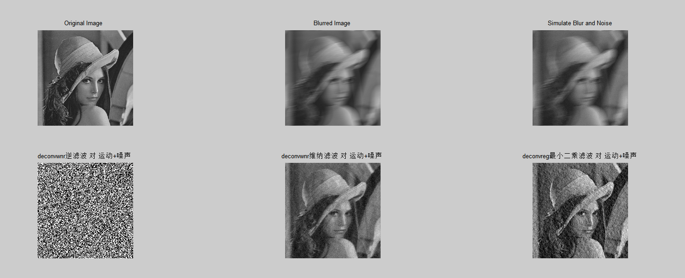

## Slide 84

维纳滤波与约束最小平方滤波比较

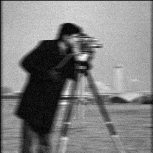

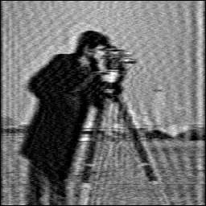

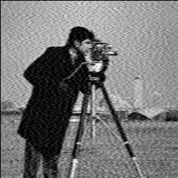

高斯噪声污染

维纳滤波

最小平方滤波

3.3 约束最小二乘滤波

## Slide 85

本章小结

主要介绍
图像复原的基本任务、图像退化的模型及各种原因、图像复原的常用方法。
要求掌握
图像退化模型、图像退化原因、图像复原的各种方法以及它们之间的相互关系。
作业
7.2 。
