# 第08章 数学形态学及其应用1

## Slide 1

第8章  数学形态学及其应用

内容提要:
8.1  概述
8.2  二值形态学
8.2.1  二值腐蚀
8.2.2  二值膨胀
8.2.3  二值开运算
8.2.4  二值闭运算
8.3   一些基本的形态学算法
本章小结

## Slide 2

8.1  概述

数学形态学（Mathematical Morphology）,新兴学科。
是法国和德国的科学家在研究岩石结构时建立的一门学科。
形态学的用途主要是获取物体的拓扑和结构信息，它通过物体和结构元素的相互作用，得到物体更本质的形态信息。
在图像处理中的应用主要是：
（1）对图像进行观察和处理，从而达到改善图像质量和目的；
（2）描述和定义图像的各种几何参数和特征，如面积，周长，连通度，颗粒度，骨架和方向性等。

## Slide 3

数学形态学的语言是集合论，他为图像处理的问题提供了有力的方法。
数学形态学的集合表示不同的图像对象。
例如：在二值图像中，所有黑色像素的集合是图像完整的形态学描述。

8.1  概述

## Slide 4

数学形态学的基于集合的观点

基本思想：
利用结构元素作为“探针”在图像中不断移动，在此过程中收集图像的信息、分析图像各部分间的相互关系，从而了解图像的结构特征。

## Slide 5

图8.1  数学形态学的方法

## Slide 6

8.1.1 几个基本概念

集合论的几个基本概念
A是Z²中的集合，如果a=(a1,a2)是A的元素，则我们将其写成a∈A。
a不是A的元素，则写成a ∉A。
如果集合A中的每个元素都是集合B的元素，则A称为B的子集。表示为A⊆B
两个集合A和B的并集表示为C=A∪B
两个集合A和B的交集表示为D=A∩B

## Slide 7

集合A的补集是不包含于集合A的所有元素的集合，定义为：
集合A与B的差，表示为A-B，定义为

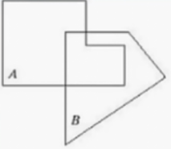

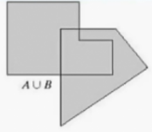

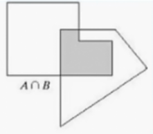

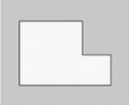

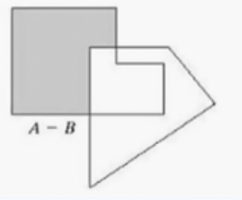

## Slide 8

另外广泛用于形态学的附加定义，集合B的反射     ，定义为：
将集合A平移到点Z=（Z1，Z2），表示为        ，定义为：

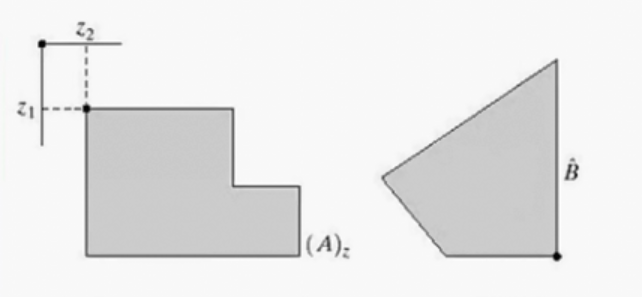

## Slide 9

图像的平移与反射

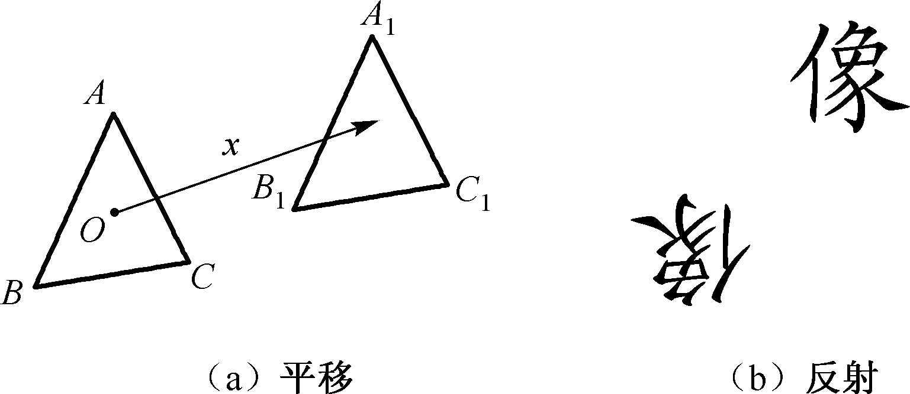

## Slide 10

8.2  二值形态学

二值图像是数字图像的重要子集，指灰度值只取两种值的图像。
两个灰度值可取为0（相应的点构成背景）和1（相应的点构成景物）。
二值形态学处理算法都是以膨胀,腐蚀这两种最基本的运算为基础的。
一般设集合A为图像集合，集合B为结构元素，数学形态学运算是用B对A进行操作。

## Slide 11

结构元素

结构元素与被处理的目标图像中抽取何种信息密切相关。
在考察目标图像各部分之间的关系时，需要设计一种“结构元素”。在图像中不断移动结构元素，就可以考察图像之间各部分的关系。
根据不同的图像分析目的，常用的结构元素有方形、扁平形、圆形等。
在多尺度形态学分析中，结构元素的大小可以变化，但结构元素的尺寸一般地要明显小于目标图像的尺寸。

## Slide 12

8.2.1 二值膨胀

A和B是Z²的集合，集合A被集合B膨胀表示：

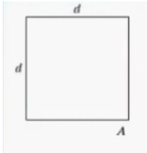

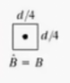

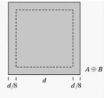

## Slide 13

集合A（输入图像）被集合B（结构元素）腐蚀:

8.2.2 二值腐蚀

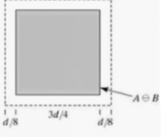

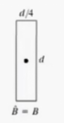

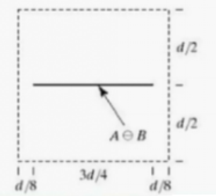

## Slide 14

腐蚀和膨胀操作的直观解释

腐蚀是对图像内部作滤波处理，而膨胀是利用结构元素对图像补集进行填充，因而它是对图像外部作滤波处理。
腐蚀具有收缩图像的作用，膨胀具有扩大图像的作用。
腐蚀的一种简单的用途是从二值图像中消除不相关的细节。

## Slide 15

原图图像包含边长为1，3，5，7，9，15个像素的正方形，假设要求保留最大的正方形，去除其他的正方形。

13*13大小的结构元素腐蚀

13*13大小的结构元素膨胀

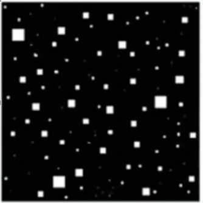

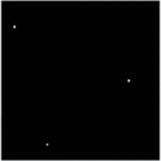

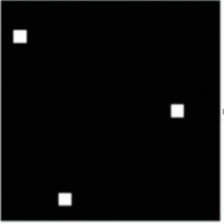

原图

## Slide 16

8.2.3  二值开运算

使用结构元素B对集合A进行开运算定义为：
使用结构元素B对集合A进行闭运算定义为：

膨胀与腐蚀运算，对目标物的处理有非常好的作用。缺点是：改变了原目标物的大小。
考虑到腐蚀与膨胀是一对对偶运算，将膨胀与腐蚀同时进行，便构成了开运算和闭运算。

## Slide 17

形态学开操作和闭操作的简单说明

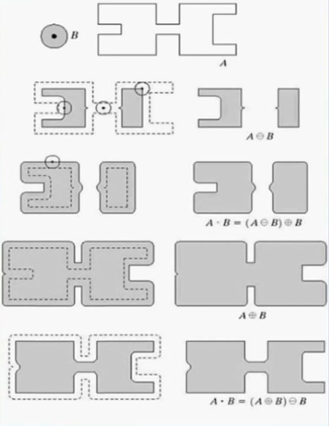

## Slide 18

开操作一般使对象的轮廓的变得光滑。断开狭窄的间断和消除细的突出物；
闭操作同样也可以使轮廓线更加光滑，但与开操作相反的是，他通常连接狭窄的间断和长细的鸿沟，消除小的孔洞，并填补轮廓线中的断裂。

## Slide 19

开操作的简单的几何解释：
假设我们将结构元素B看做是一个转球，A与B的开运算通过B中的点完成，即B在A的边界内转动，B中的点所能到达A的边界的最远点。
这也说明，用B对A进行开操作是通过求取B在A中的平移的并集得到的。就是说，开操作可以表示为：

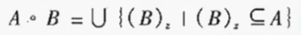

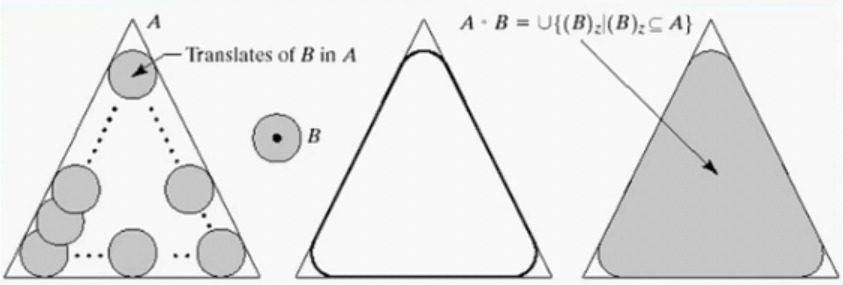

## Slide 20

利用圆盘作开运算

## Slide 21

闭操作也有相似的集合解释。
在边界的外部转动B，从几何上来讲，当且仅当对包含w的(B)Z 进行的所有平移都满足(B)Z ∩A≠∅时，点w 是A·B的一个元素。

## Slide 22

利用圆盘作闭运算

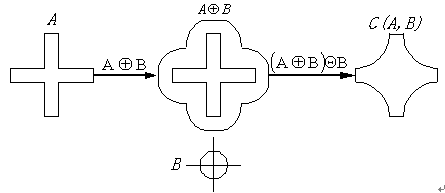

## Slide 23

8.3  一些基本的形态学算法

一、边界提取
图像的边缘线或棱线是图像中信息量最为丰富的区域。
提取边界或边缘也是图像分割的重要组成部分。
提取物体的轮廓边缘的形态学变换为：

## Slide 24

二值图像的边缘提取

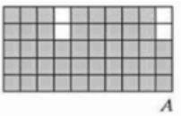

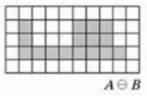

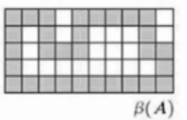

## Slide 25

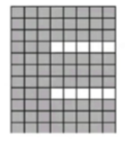

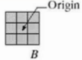

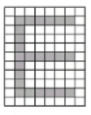

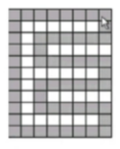

二值图像的边缘提取

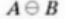

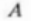

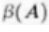

## Slide 26

二、形态滤波

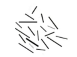

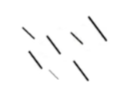

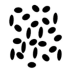

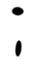

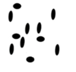

用不同方向结构元素提取方向向量

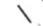

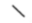

用不同形态结构元素提取特定结构目标

开运算

## Slide 27

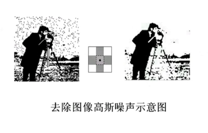

开运算

三、图像去噪

四、图像平移

## Slide 28

开运算去噪

clc;
clear  all  ;
I1 =imread(‘cameraman.tif’      );
I=imnoise(I1,‘gaussian’,0.05);
se  =strel(  'disk’ ,1);  %一个平面结构化元素
J =imopen(I, se);    %实现开操作
subplot(1,2,1);imshow(I),title  ( ‘原图加噪’)
subplot(1,2,2),imshow (J),title(   ' 开操作后的图像’);

## Slide 29

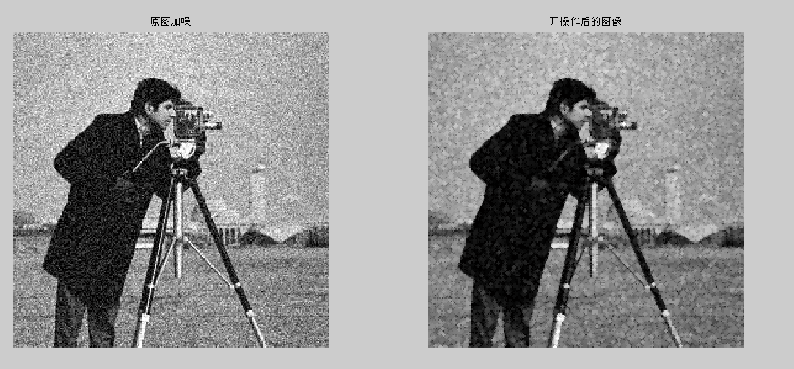

## Slide 30

图像平移的matlab程序

clc;
clear all;
I=imread('cameraman.tif');
se1=strel(1);
se=translate(se1,[50,140]);
J=imdilate(I,se);
subplot(1,2,1),imshow(I),title('原图');
subplot(1,2,2),imshow(J),title('移动图');
J2=imdilate(I,se,'notpacked','full');
figure(2),subplot(1,2,1),imshow(I),title('原图');
subplot(1,2,2),imshow(J2),title('移动图');

## Slide 31

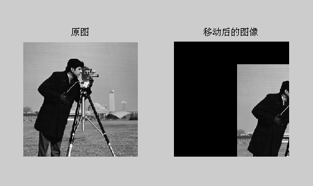

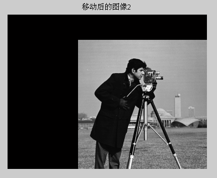

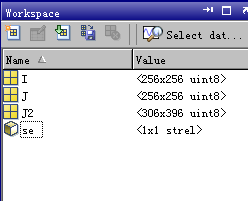

## Slide 32

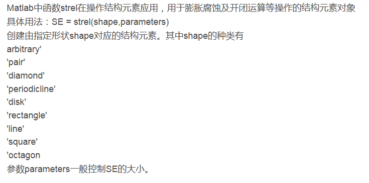

## Slide 33

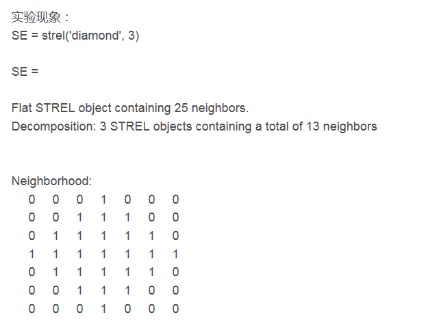

## Slide 34

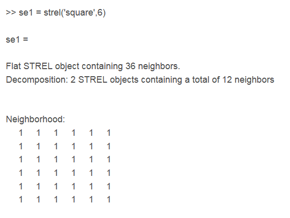

## Slide 35

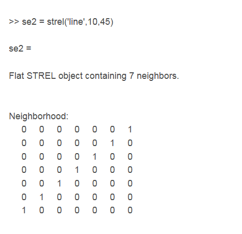

## Slide 36

本章小结

数学形态学是图像处理和图像分析的有力工具。
理解形态学的膨胀，腐蚀，开操作，闭操作。
了解形态学的基本形态学算法。
