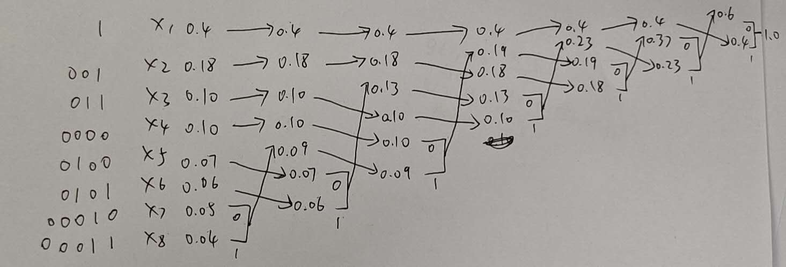

# 第06章 错题集

## 第06章 图像编码与压缩（霍夫曼、行程编码、JPEG）

- **题目**：【计算大题】已知某信源发出的 8 个信息符号 $X = \{x_1, x_2, x_3, x_4, x_5, x_6, x_7, x_8\}$，其概率分布为 $\{0.40, 0.18, 0.10, 0.10, 0.07, 0.06, 0.05, 0.04\}$。请对该信源进行最佳前缀霍夫曼（Huffman）编码。规则：合并中概率大的分支赋 `0`，概率小的分支赋 `1`。计算其平均码长、信源信息熵以及编码效率。
  - **用户答案**：用户选择主动放弃并索要答案（判定为错题）。
  - **正确答案**：
    - **第一、二步：树状归并与前缀赋码**：
      请直接参考手写树状合并与分配求解图，该图与试卷和作业中的求解步骤完全一致：

      

      具体各符号编码分配如下：
      - $x_1$: `1`
      - $x_2$: `001`
      - $x_3$: `011`
      - $x_4$: `0000`
      - $x_5$: `0100`
      - $x_6$: `0101`
      - $x_7$: `00010`
      - $x_8$: `00011`
    - **第三步：参数计算**：
      - 平均码长 $L_{avg} = 1 \times 0.40 + 3 \times (0.18 + 0.10) + 4 \times (0.10 + 0.07 + 0.06) + 5 \times (0.05 + 0.04) = \mathbf{2.61}$ bit/像素。
      - 信源信息熵 $H(X) = \mathbf{2.55}$ bit/像素。
      - 编码效率 $\eta = 2.55 / 2.61 \approx \mathbf{97.8\%}$。
  - **错因**：对霍夫曼编码树（二叉归并树）的画法、分支归并表格及最终从根到叶节点路径的回溯读码不够熟练。
  - **章节**：第06章
  - **日期**：2026-06-15